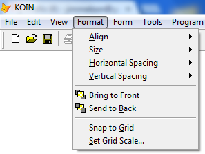
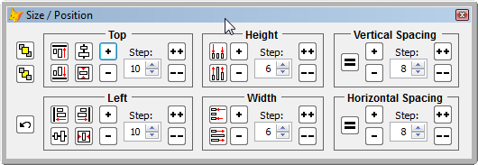

Thor TWEeT #2: 设置对象大小和位置
===
_本文档由 xinjie 于 2018-04-08 翻译_

本周的 Thor TWEeT 是**设置对象大小和位置**。

此工具为 FoxPro 系统菜单中的“格式”菜单提供增强的功能，如下所示：

**设置对象大小和位置**显示一个表单，其中包括格式菜单中的所有功能，但对齐网格和设置网格比例除外。 此外，

*   控制可以更改当前所选控件的顶部/左侧/高度/宽度，一次一个像素或指定的步长。
*   垂直和水平间距可以一次更改一个像素，也可以更改指定的步长。
*   有一个 un-do 按钮可以撤销表单获得焦点以来所做的任何更改。

表单的大小和位置从一个用户到另一个用户是保持不变的。 该表单也是可停靠的，并且随着表单宽度的变化，六个容器将自行重新排列，从而允许各种期望的对接组合。

感谢 Cathy Knight 的理念和设计。

参看 [所有Thor TWEeTs的历史](../TWEeTs.md) 和 [Thor 社区](https://groups.google.com/forum/?fromgroups#!forum/FoxProThor).
