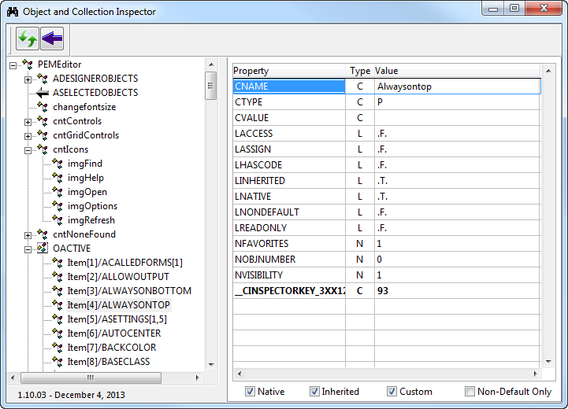

Thor TWEeT #5: _对象和集合检查器_
===
_本文档由 xinjie 于 2018-04-08 翻译_

处理对象和集合时，不需要很长时间就可以认识到没有简单的方法来查看对象的结构或属性或浏览集合的内容。

调试器中的监视窗口当然是查看对象的标准方式，但查看集合时根本没有任何内容。

为了填补这个空白，Tamar 创建了 **对象和集合检查器** （您可能已经在其他地方看到过）。

现在，**对象和收集检查员**是一个 Thor 工具，功能已经具有相当的提升。 如下所示，它显示一个 TreeView，显示一个对象的所有子项或一个集合中的项目，右侧显示所有属性的值。 双击属性将打开一个缩放框来编辑其值。

按如下所示运行此工具：

*   在代码窗口或命令窗口中，单击对象或集合的名称，然后调用该工具。
*   或者，将鼠标放在执行形式的对象上，或者在 IDE 中编辑的表单或类中，然后调用该工具。
*   或者，如果正在编辑表单或类，请调用该工具来检查当前选定的对象（即属性表中显示的对象）。
*   否则，请调用工具将文本粘贴到命令窗口中，以便提供对象或集合的名称

**注意**：不幸的是，由于这个工具被调用的方式，它不适用于 Thor 工具栏。

参看 [所有Thor TWEeTs的历史](../TWEeTs.md) 和 [Thor 社区](https://groups.google.com/forum/?fromgroups#!forum/FoxProThor).
