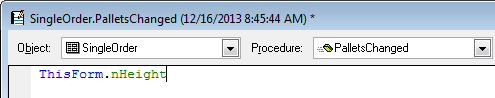
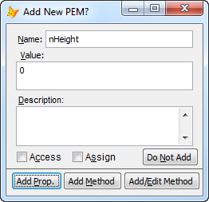
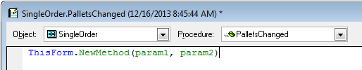

Thor TWEeT #7: 创建属性和方法（第2部分）
===
_本文档由 xinjie 于 2018-04-08 翻译_

[上星期的 TWEeT](Tweet_06.md) 讨论了熟悉的创建属性和方法的方法，这是一个两步过程，其创建和引用是独立完成的。

有一种可用的模式，可以在引用它们的同时创建属性和方法。

为此，请在代码窗口中为待创建的属性或方法创建一个引用（将光标立即置于名称后面）

然后调用工具**转向定义**。 这将打开添加新属性和方法的表单：

创建方法时，您也可以选择同时创建 LParameters 列表：

请注意，您不需要立即调用**转向定义**。 编写代码以创建属性或方法后，您可以随时撤销。 只需单击名称中的任意位置（但如果要创建 LParameters 列表，则需要在右括号之后单击），然后调用**转向定义**。

对此有几点建议：

*   我强烈建议尝试这种技术。 这是非常容易上瘾的。 这是我创建属性和方法的首选工具。 我一直花在创建[PEM 编辑器](https://github.com/VFPX/PEMEditor)上，我*很少*使用它来创建属性和方法。
*   这只是**转向定义**的重要功能之一。 有一天，在它自己的 TWEeT 中将会有更多解释。

表单属性也可以被其他属性引用，如 ControlSource 和 RecordSource 。 如果您使用[PEM 编辑器](https://github.com/VFPX/PEMEditor)编辑 ControlSource 或 RecordSource 属性，则当您单击保存时，您将自动获得创建新属性的机会。

对于所有这些用途，以下功能（不可用于标准“新建属性”和“新方法”）均可用：

*   如果名称包含任何大写字符，MemberData 将自动更新。
*   如果你正在创建一个新的属性：
    *   有一个选项可以根据属性名称的第一个字符（'c'= Character，'n'= Numeric等）设置属性的初始值。 Default = ON
    *   您可以创建一个[Plug-In](../Thor_add_plugins.md)来使用其他方法来分配初始值（例如使用第二个字符）
*   如果你正在创建一个新的方法：
    *   您可以立即打开它进行编辑。
    *   您可以创建一个[Plug-In](../Thor_add_plugins.md)，它将填充新创建的方法的标题。

参看 [所有Thor TWEeTs的历史](../TWEeTs.md) 和 [Thor 社区](https://groups.google.com/forum/?fromgroups#!forum/FoxProThor).
