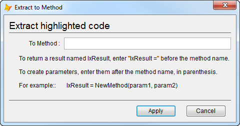

Thor TWEeT #8: 创建属性和方法（第3部分）
===
_本文档由 xinjie 于 2018-04-08 翻译_

这是TWEeTs系列中的第三个也是最后一个，展示了您可以创建属性和方法的各种方式。

还有一个 Thor 工具可以创建方法：**提取到方法**。

当您想要从当前代码窗口中删除并保存到新方法中的方法代码块（来自 VCX 或 SCX）时使用此工具。

这样做的步骤很简单：

*   突出显示要提取和移动的代码行
*   调用工具**提取到方法**。

这会弹出一个表单，您可以在其中输入要创建的方法的名称：

当您点击“应用”时，将执行以下步骤：

1.  新方法已创建。
2.  新方法的代码窗口打开
3.  您在原始方法中突出显示的代码将粘贴到新的代码窗口中。
4.  突出显示的代码将从原始代码窗口中删除。
5.  对新方法的引用被粘贴到原始代码窗口中。

还要注意出现的表单中的注释：

*   您可以为您创建的方法指定结果; 该方法的最后一行返回该结果，并且该结果也在原始代码窗口中分配。
*   您可以为您创建的方法指定参数; LParameters 语句插入新代码窗口的开始处，并且参数在原始代码窗口中用于调用。

**提取到方法**在 VCX 和 SCX 的代码窗口中工作，而不是 PRG。

参看 [所有Thor TWEeTs的历史](../TWEeTs.md) 和 [Thor 社区](https://groups.google.com/forum/?fromgroups#!forum/FoxProThor).
