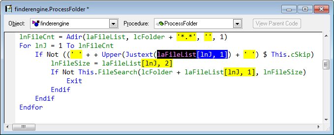
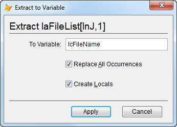
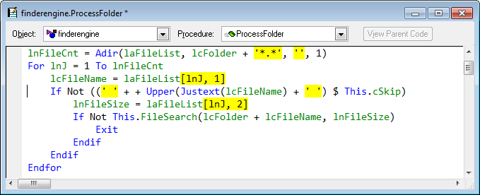
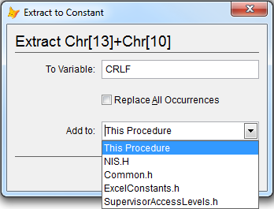
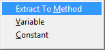

Thor TWEeT #9: 提取到变量和提取为常量
===
_本文档由 xinjie 于 2018-04-08 翻译_

在 [上星期的 TWEeT](Tweet_08.md) 中, 我展示了如何从代码窗口中突出显示一段文本并将其保存到新的方法中。

还有另外两个密切相关的工具：

*   **提取到变量**
*   **提取为常量**

使用**提取到变量**将一行代码中的文本替换为局部变量的引用，例如，在本示例中，`laFileList [lnJ，1]`被多次引用：

弹出的表单允许您输入新变量的名称，是否要替换所有出现的字符串（如果不是，只会突出显示的那个），以及是否应该运行工具“Create Locals”以添加 这个新的变量给你的LOCAL语句。

修改后的代码如下所示：

**提取到常量**以类似的方式工作，除了它会在当前代码窗口的顶部或应用于代码窗口的任何#Include文件中创建一个#Define语句：

我发现这三个相关的工具，**提取到方法/变量/常量**，具有相当大的价值，但我没有为使用它们中的任何一个而将快捷键分配给它们中的每一个。 相反，我使用了一个[Popup Menu](../Thor_create_popup_menu.md)，我为它使用一个快捷键（我选择了 Ctrl + E 来使用“提取”）。

有一个 Thor 工具可以创建这个弹出式菜单和其他一些菜单。 只需执行一次**创建示例菜单**并创建一些菜单; 请参阅 Thor 配置表单的第一页。

参看 [所有Thor TWEeTs的历史](../TWEeTs.md) 和 [Thor 社区](https://groups.google.com/forum/?fromgroups#!forum/FoxProThor).
