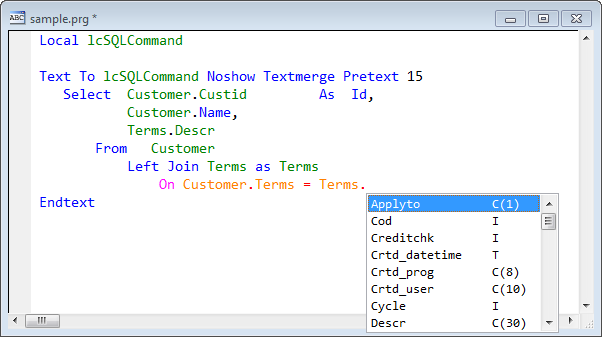
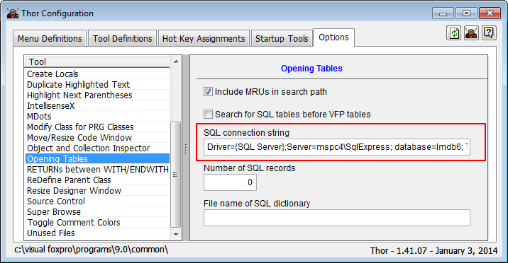
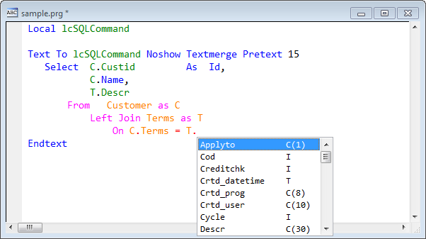
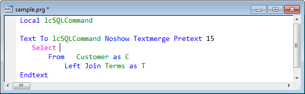
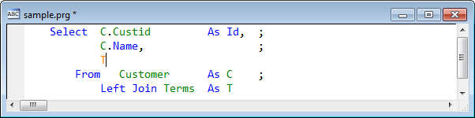

Thor TWEeT #10: <a href="https://github.com/VFPX/IntelliSenseX" target="_blank">IntellisenseX</a>: SQL Server 表中的字段名
---
_本文档由 xinjie 于 2018-04-08 翻译_

[IntellisenseX](https://github.com/VFPX/IntelliSenseX) 现在支持从 SQL Server 表中提取字段名，如下例所示：



您所看到的是名为“Terms”的 SQL 表中的字段名称的下拉列表。 您可能会想到，这看起来与 VFP 表中的列表完全相同。 你是完全正确的，因为 IntellisenseX 现在给你 FoxPro 表和 SQL 表的字段列表，并且都以**相同的**方式访问。

您只需按照以下几个步骤来激活它：

1.  打开Thor配置表单
2.  转到选项页面
3.  点击左侧的“打开表”
4.  在右侧输入您的连接字符串



即使您没有进一步阅读，你也知道在 SQL 表上如何使用 IntellisenseX ; 这篇文章中还有一个关于细节的讨论。

#### [IntellisenseX](https://github.com/VFPX/IntelliSenseX) 识别SQL语句中的别名

如下所示，根据需要处理SQL语句中的别名。



但是会出现意想不到的情况，因为在指定别名之前，您可能会在SQL语句的开头引用字段列表中的别名。 解决这个问题的方法是以一种内在的方式创建你的声明 - 也就是说，首先创建你的 FROM 和 JOIN 短语（或者至少尽可能多地创建别名），然后你就可以拥有 当指定字段列表时 IntellisenseX 的支持。



另请参阅示例以了解如何访问纯 VFP Select 语句中的别名（即，不在 Text / EndText 结构中）。

#### 无论如何，这是如何工作的？

当您调用 IntellisenseX 时，会经历很多循环来确定紧挨在“.”之前的名称是否是引用对象或打开表格/游标/视图。 如果这些都不适用，它会试图帮你一个忙，并为你打开表格/视图。 （从第一天起就是这样）。

使用你增加的一个连接字符串（如前所述），它也会尝试从你的SQL表中读取基本结构。 这样做时，它会创建一个游标（带有“_SQL4ISX_”，前缀为 SQL 表的名称），IntellisenseX 可以使用该游标。 （另请参阅下面关于这如何适用于其他工具的讨论，例如 [**超级浏览器**](../Thor_superbrowse.md).)

#### <a name="SQLDictionary"></a>什么是选项页面上提到的“SQL字典”？<!-- TBL: Check anchor -->


使用连接字符串（每次访问表）的另一种方法是创建一个本地 VFP 表，其中包含所有 SQL 表中所有字段的列表。 下面的声明创建了一个具有所需结构的表。 （您可以根据需要扩展前两个字符字段）。要创建此表，你可以使用 SQLTables（） 获取所有表名的列表，以及使用 SQLColumns（） 获取每个表的字段列表。

```foxpro
Create Table MySQLTableName ( ;  
    XTABNAME     C(40),       ;  
    FIELD_NAME   C(30),       ;  
    FIELD_TYPE   C(1),        ;  
    FIELD_LEN    N(3),        ;  
    FIELD_DEC    N(3))
```


#### 单一的连接字符串存在哪些不足?

目前没有办法可以很容易地在不同的 SQL 数据库之间切换，这需要多个连接字符串。 但是，可以通过执行以下命令以编程方式更改连接字符串：

    Execscript(_Screen.cThorDispatcher, 'Set Option=', 'Connection String', 'Opening Tables', NewConnectionString)

这可以用于 Thor 工具来选择要读取的数据库。

#### 这是否适用于其他工具？

还有一些其他工具（最明显的是[**超级浏览器**](Thor_superbrowse.md)），它使用与 IntellisenseX 相同子例程来打开表。 因此，如果您使用超级浏览器来帮助您创建 SQL 语句，那么您可以单击该表的名称（无论是VFP表还是SQL表），然后执行超级浏览器就可以了。

#### 如何在不属于 Text / EndText 结构的 SELECT 语句中使用别名？

当不在 Text / EndText 结构中时，使用 IntellisenseX 为 SELECT 语句中的别名提供字段名称的策略（如上所述）是相同的，但需要额外考虑一些问题。

在 Text / EndText 结构中，语句的末尾由关键字“EndText”清楚地标识。 然而，在一个普通的 VFP 声明中，没有这样清晰的结尾，所以 IntellisenseX 必须依靠使用分号来显示连续行。 因此，遵循的规则是假设你输入的那一行有一个分号（因为你还没有到达行的末尾），并且SELECT语句继续执行下列行，直到 达到了不以分号结尾。



参看 [所有Thor TWEeTs的历史](../TWEeTs.md) 和 [Thor 社区](https://groups.google.com/forum/?fromgroups#!forum/FoxProThor).
