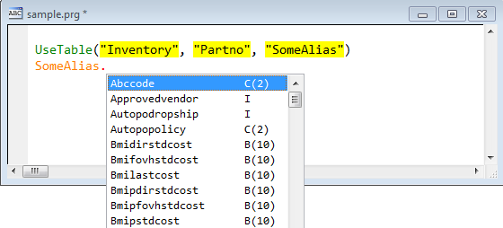
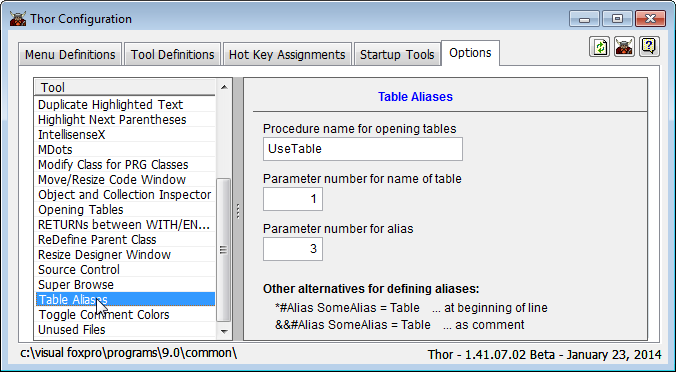
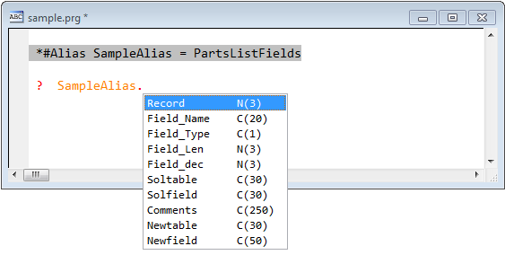

Thor TWEeT #11: <a href="https://github.com/VFPX/IntelliSenseX" target="_blank">IntellisenseX</a>: VFP 表的别名
===
_本文档由 xinjie 于 2018-04-08 翻译_

上星期的 [TWEeT #10](Tweet_10.md) 证明 IntellisenseX 可以识别 SELECT 语句中使用的表的别名。

IntellisenseX 现在还识别用于VFP表的别名，有三种不同的方式：

*   在使用 USE 或 UDF 打开表的**过程代码**中。
*   别名是在整个应用程序中使用的常量别名，并且可以由[Plug-In](../Thor_add_plugins.md)打开。
*   通过在代码中指定一个特殊指令来标识别名引用的文件

**在使用 USE 或 UDF 打开表的**过程代码**中**

IntellisenseX 现在可识别 USE 打开的表的别名（在同一过程中引用时）。 这是自动发生的，不依赖于 USE 命令中短语的顺序。

同样，只要表的名称及其别名作为参数传递给 UDF，IntellisenseX 就会识别由 UD F打开的表的别名。 在下面的例子中，UDF`UseTable`被调用，第一个参数是表的名字，第三个参数是别名。

为了达到此目的，您必须在 Thor 配置表单中记录 UDF 等的名称：

1.  打开 Thor 配置表单
2.  转到选项页面
3.  点击左侧的“表别名”
4.  填写 UDF 的名称和参数列表中的位置以获取表名和别名。

#### 别名是在整个应用程序中使用的常量别名

IntellisenseX 还支持别名在整个应用程序中引用同一个表的情况。

_在我自己的环境中，表格永远不会按名称引用。 它们总是由UDF打开（使用别名调用），该UDF使用元数据表来确定表的名称和文件夹。 因此，别名可以始终用于打开表。_

这是通过创建[Plug-In](Thor_add_plugins.md)“OpenTable”来处理的。 这个插件工作非常简单 - 它通过一个参数被调用，即（潜在的）别名。

如果该别名可用于打开所需的表，那么就打开它，并返回别名作为结果; 如果不是，则返回逻辑或空结果

所有这些工作都是在（最初是空的）过程 OpenMyTable 中完成的。 只需修改以适应您自己的环境。

#### 直接指定表而不是别名

最后一种选择是最不理想的 - 您可以在代码中添加指令来指定表，而不是别名引用的指令。 例如，您可以使用此方法，即在一个过程或方法中打开表并在另一个过程或方法中引用该表格。

有两个（非常相似的）指令：

    *#Alias SomeAlias = MyTable  … at the beginning of a line
    &&#Alias SomeAlias = MyTable  … at the end of a line

例如，

参看 [所有Thor TWEeTs的历史](../TWEeTs.md) 和 [Thor 社区](https://groups.google.com/forum/?fromgroups#!forum/FoxProThor).
