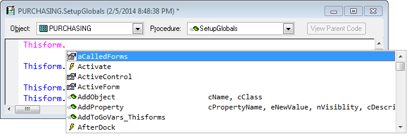
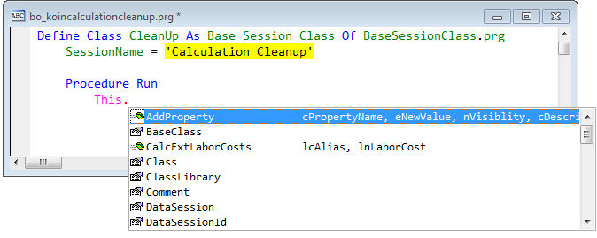
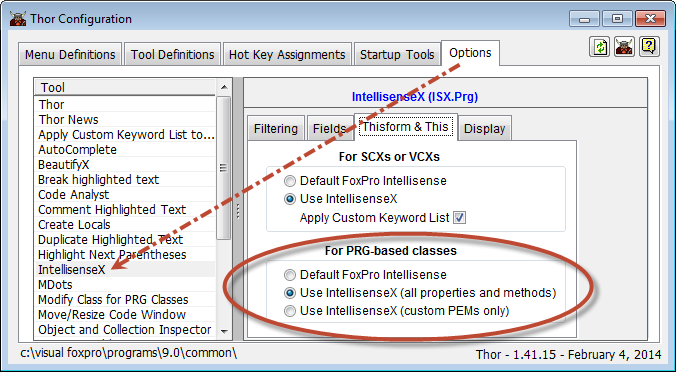
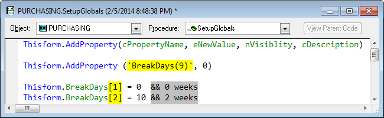
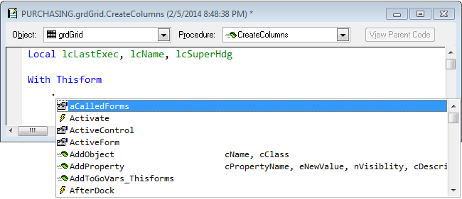
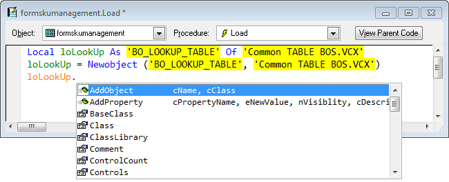
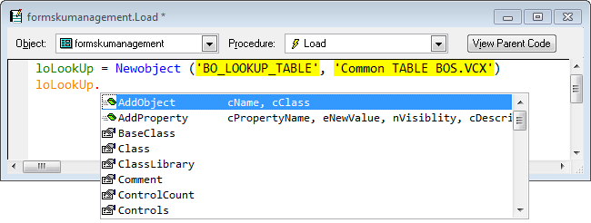
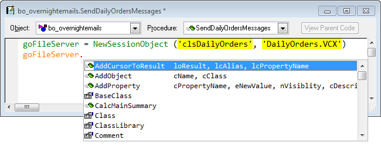
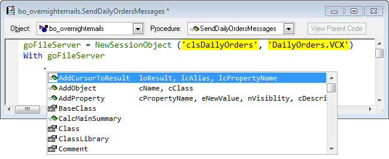

Thor TWEeT #14: IntellisenseX for Objects
===
_本文档由 xinjie 于 2018-04-08 翻译_

IntellisenseX 提供属性，事件和方法（PEM）的下拉列表，与默认 Intellisense 提供的类似，默认 Intellisense 提供的所有情况以及其他一些情况。

此 TWEeT 解决 IntellisenseX for Objects 的以下主题 ：

*   在 SCXs 和 VCXs 中
*   在 PRG 格式的类中
*   按 Ctrl-Enter 粘贴参数列表
*   在 WITH/ENDWITH 结构中
*   在 LOCAL 语句中
*   在 NEWOBJECT 或  CREATEOBJECT 之后
*   在创建对象的 UDF 之后
*   使用 loObject
*   使用自定义关键字列表

#### 在 SCXs 和 VCXs 中

在 SCXs 和 VCXs 中, IntellisenseX 为 THISFORM 或 THIS 引用的对象提供了一个下拉列表，这与给定我的默认 Intellisense 非常相似：

#### 在 PRG 格式的类中

IntellisenseX 为基于 PRG 的类提供了 THIS 和 WITH THIS 的下拉列表。

在 Thor Configuration表单上的选项页面，您可以指定想要查看的详细程度（仅限该类中的自定义属性和方法，或所有继承的属性和方法）

#### 按 Ctrl-Enter 粘贴参数列表

可以看出，显示有第二列，显示方法和事件的参数列表。

如果您从列表中选择一个项目并按下 Ctrl + Enter，参数列表将被插入您的代码中，如下所示。 当默认的 Intellisense 为参数提供快速信息窗口时，这不是必需的，但对于 IntellisenseX 在默认的 Intellisense 不提供帮助的情况下（如下所述）具有相当大的价值。

#### 在 WITH/ENDWITH 结构中

Intellisense在 WITH / ENDWITH 结构内部提供了默认 Intellisense 不支持的各种情况下的下拉列表，包括 WITH FORM，WITH THIS.PARENT 和嵌入的 WITH 结构。

#### 在 LOCAL 语句中

IntellisenseX 现在识别 LOCAL 语句中标识的对象（默认为 Intellisense）。

#### 在 NEWOBJECT 或  CREATEOBJECT 之后

即使没有相应的 LOCAL 语句，IntellisenseX 也可识别由 NEWOBJECT 或 CREATEOBJECT 创建的对象。 这在第一次编写程序时可能非常方便。

#### 在创建对象的 UDF 之后

IntellisenseX 还提供了一个[Plug-In](../Thor_add_plugins.md）（名为“NewObject”)，它允许识别何时调用了创建对象的 UDF。 在下面的示例中，我个人使用插件允许 Intellisense 识别我使用名为 NewSessionObject 的 UDF（恰好使用与 NEWOBJECT 相同的参数，但这不是必需的）。

具体使用这个插件,参看 [定制 IntellisenseX](Tweet_18.md).

#### 使用 loObject

最后，当你有上述任何一个例子定义的对象时，IntellisenseX 将在 WITH 后引用该对象，如下所示。

#### 使用自定义关键字列表

在呈现 SCX 和 VCX 中的属性，方法和事件名称时，IntellisenseX 的默认行为是使用 _MemberData 来使用正确的大小写来呈现名称。 这可能很慢。

对于基于 PR G的类，默认行为是使用类中自定义属性和方法的正确大小写，大写字母表示所有继承的属性和方法。

作为替代，您可以创建一个[自定义关键字列表](Tweet_16.md)，它是 IntellisenseX 和其他 Thor 工具使用的全局表。 这个表格包含了你想要表示名称大小写的所有“关键字”（字段名，属性名，对象名和其他任何类型的名称）的列表。 （例如，请参阅上面示例中的“CalcMainSummary”。）这为在整个应用程序中处理名称大小写提供了一致的方法。

参看 [所有Thor TWEeTs的历史](../TWEeTs.md) 和 [Thor 社区](https://groups.google.com/forum/?fromgroups#!forum/FoxProThor).
