Thor TWEeT #15:  别名字典
===
_本文档由 xinjie 于 2018-04-08 翻译_

自早期的 TWEet [IntellisenseX：VFP 表的别名](Tweet_11.md)以来，在处理表别名方面进行了一些改进。

我们已经看到的解决方案其实离事实真相还非常遥远。第一个示例显示<a href="https://github.com/VFPX/IntelliSenseX" target="_blank"> IntellisenseX </a>识别由USE语句创建的别名：

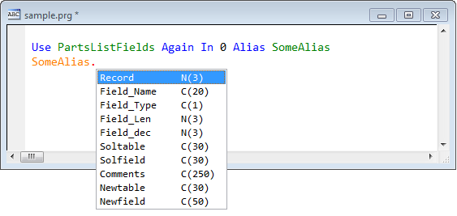

但是这个别名只能在与 USE 语句相同的过程中被 IntellisenseX 识别。 如果此表在表单的 LOAD 事件中打开，那么该别名将在此处可用 - 而不是其他方法。

**别名字典**具有同样的限制 – 要使它有意义，就必须在引用表的每个单独的方法中使用它。

由 _别名字典_ 提供的解决方案是一个表（由 Thor 维护），它包含表的**全局**定义 - （或对象，我们将在后面讨论）。

您可以通过执行 Thor 工具**浏览表/对象别名列表**，将记录添加到此表中，该工具就是这样做的 - 它会打开一个浏览窗口，您可以在其中添加记录（或编辑现有记录），如下所示：

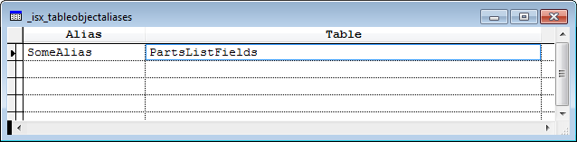

此后，每当您输入“SomeAlias”并像往常一样调用 IntellisenseX 时，通过按“.”（或[快捷键](Tweet_12.md)），它将打开表“PartsListFields”。

>请注意：这是“SomeAlias”真正的*全局*定义。 它与当前的表单，类，文件夹，项目或应用程序或其他任何内容无关。

对于表名称，您也可以输入完整路径或相对路径。

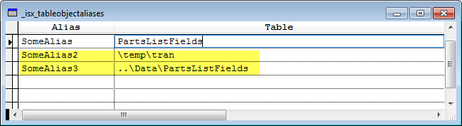

如前所述，您还可以向此表中添加与全局对象相对应的条目。 为此，您可以在表格字段中输入“=”，然后输入可执行表达式。

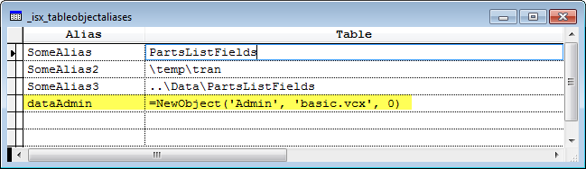

有几点值得注意的是：

*   在此示例中使用 NewObject（） 而不是 CreateObject（），因为 NewObject（） 接受第三个参数为零，因此 INIT 方法不会被触发。
*   如果使用 CreateObject（） 事实上会返回正确的对象，那么可以向 NewObject（） 提供一个空的（''）第二个参数。

有两种替代方法可以用来代替调用 NewObject（）：

*   您可以复制 LOCAL 语句并将其直接粘贴到表中。
*   你可以用大括号括起类名和类库名，例如{ClassName，ClassLib.VCX} 。如果要 CreateObject（） 实际上返回正确的对象，那么类库名是可选的。

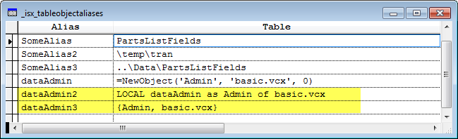

实际上，只要结果是下列之一，*任何*可执行表达式（以“=”开头）都可以工作：

*   一个对象
*   已打开的表的别名
*   Thor 可以打开的表的别名
*   一个包含名为'aList'数组的对象。 该数组最多可以有三列，数组的内容将填充下拉列表。

#### 别名字段中的嵌套对象

别名字段也可能包含对嵌套对象的引用。 例如，考虑下面的示例，其中 oData 实际上被理解为由 Jobs 表中的 Scatter 填充（在运行时）。

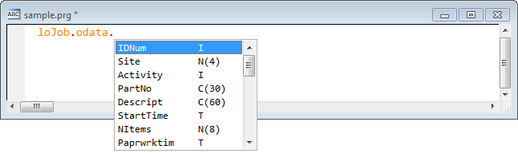

这可以通过下面键入的记录来实现。

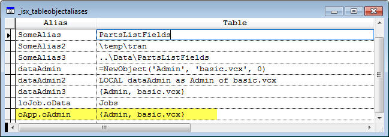

当在别名字段中使用嵌套对象时，上面描述可以在表格字段中使用的各种组合的所有讨论都同样适用。 下面我们定义了“oApp.oAdmin”，这样它将显示来自表字段中定义的Admin对象的属性列表。 （请注意，“dataAdmin”，“dataAdmin2” 或 “dataAdmin3” 的表格字段中的任何值都可以正常工作。）

#### 别名字段中的通配符

您也可以在别名字段中使用单个“*”作为通配符。

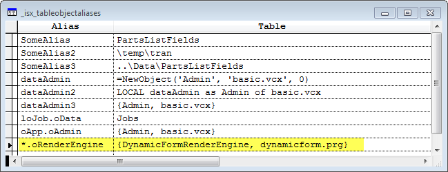

这允许您在任何时候查看这个特定对象的 PEM，而不管它是否拥有父对象。

最后，通配符表示的字符可以在表格字段中使用; 只需使用<*> （如下所示）

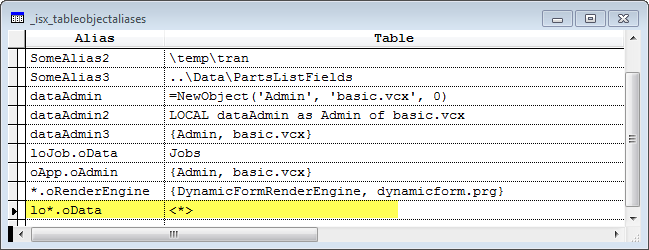

因此，在此示例中，“*”替换文本“PartsList”，以便显示PartsList表中的字段。

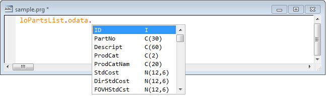

对于 Customer table ...也是如此。

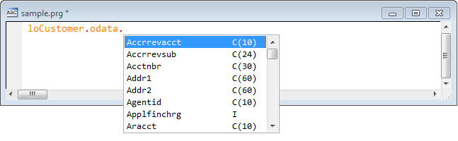

如果您碰巧为您的对象命名一致，您可以将提取的文本作为参数传递给您自己的 UDF，该 UDF 将作为结果返回对象。 （请注意必须使用<*>周围的引号）。

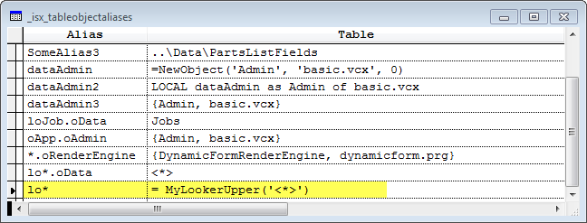

下面显示了'PartsList'是如何作为参数传递给我的 UDF “MyLookerUpper”的，它返回'PartsList'的对象。 如前所述，UDF“MyLookerUpper”应该使用第三个参数0调用 NewObject（），以使其在 INIT 不执行。

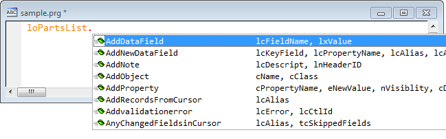

参看 [所有Thor TWEeTs的历史](../TWEeTs.md) 和 [Thor 社区](https://groups.google.com/forum/?fromgroups#!forum/FoxProThor).
