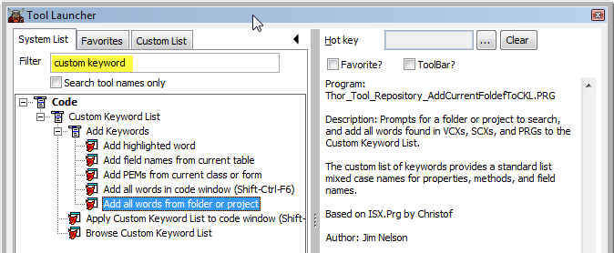
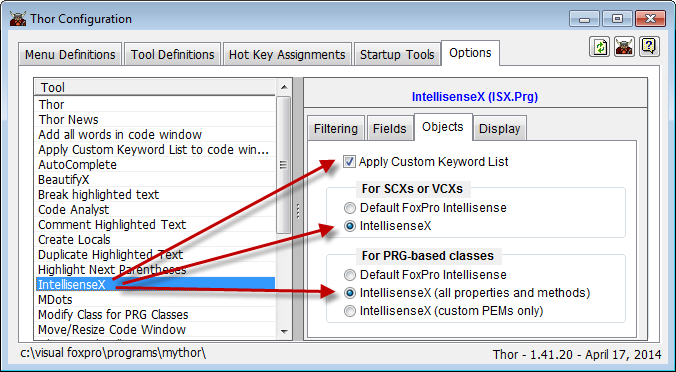
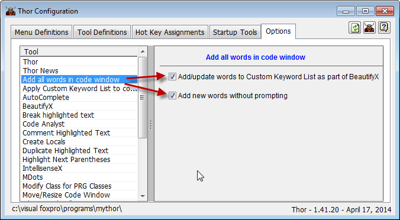
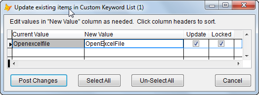

Thor TWEeT #19: [IntellisenseX](https://github.com/VFPX/IntelliSenseX) 的缺陷
===
本文档由 xinjie 于 2018-04-09 翻译

### (以及如何避免它们)

### … 自定义关键字列表 …

IntellisenseX 最严重的问题是，在 VCX 或 SCX 中获取属性和方法列表时，速度太慢。 在 VCX / SCX 中获取名称的正确大小写，需要在父类中解析 MemberData 的过程需要比每次进入 THISFORM 后都有人愿意等待的时间更长。

在基于 PRG 的类中工作时，父类是 FoxPro 基类以外的任何类型都有类似的问题。 没有好的方法来获取继承名称的正确大小写（基于 PRG 的类甚至不使用 MemberData），因此所有继承的自定义名称都以小写字母结尾。

这两个问题的解决方法是相同的 - 自定义关键字列表。 这只是一个简单的表，其中包含您的编程世界中所有单词的列表，其中每个单词都以您喜欢的大写/小写混合形式保存。 该表格可以很容易地创建，自动更新并应用于任何代码块。 这不仅可以消除上述问题，还可以确保您的文字始终保持一致（大写/小写相同）。

#### 入门

首先，通过运行 Thor Tool 创建自定义关键字列表： _添加来自文件夹或项目的所有单词_ 。（您可以通过在Thor 启动器中的“自定义关键字”上进行过滤来找到此工具。）



此工具将运行几分钟，因为它会扫描整个文件夹或项目以查找所有编程单词。 最终，会出现一张表单，向您显示找到的所有单词列表。 你可以对列表进行一些编辑，但对于初学者来说，建议是简单地保存所有内容。

接下来，进入Thor Configuration表单中 IntellisenseX 的选项页面，选择 IntellisenseX 将使用的自定义关键字列表的设置。



最后，将这些复选框标记为“在代码窗口中添加所有单词”选项，以便您创建的新单词，包括由[PEM 编辑器](https://github.com/VFPX/PEMEditor)创建的属性和方法， 或其任何相关工具都会自动添加到“自定义关键字列表”中。 即使你没有使用BeautifyX（但更多的是这个）。



执行这三个步骤后，你就可以开始使用了。

#### 以编程方式更新自定义关键字列表

您可以通过使用以下任何一个 Thor 工具随时以编程方式向此列表添加单词：

*   _Add all words from folder or project_
*   _Add all words in code window_
*   _Add PEMS from current class or form_
*   _Add fields names from current table_

如果遇到任何新单词，将打开一个表单以便于你应用新单词; 如果发现任何与表中已有单词相冲突的单词，将打开一个单独的表单供您选择要使用的单词。



#### “锁定”是什么意思？

有些词可能有不一致的用法 - “Openexcelfile”或“OpenExcelfile”或“OpenExcelFile”或？ 将单词标记为“已锁定”表示这是您的首选用法，您将永远不会再被问到可能发生的冲突。

#### 手动更新自定义关键字列表

您可以使用工具 _Add highlighted word_ 将单词直接添加或更新到自定义关键字列表（这也将其标记为锁定 - 您的首选用法）。

您还可以使用工具 _Browse Custom Keyword List_ 打开表并根据需要进行任何修改。 此表位于“My Tools”文件夹中。

```foxpro
_Screen.cThorFolder + 'Tools\My Tools\KeywordList.DBF'
```


#### 使用 BeautifyX

如果您还没有一直使用 Thor 工具 BeautifyX ，那么现在是时候改变了。它提供了广泛的功能，您可以选择适合您的功能 - 肯定会有的。

选项包括：

*   应用固有的美化
*   在操作符和逗号前后提供一致的间距，对齐分号和连续行的缩进
*   SQL-SELECT，SQL-UPDATE，SQL-DELETE 和 REPLACE 语句的高度可定制格式（有条件地在TEXT / ENDTEXT结构中）
*   运行 Thor 工具 “Create Locals’
*   为变量添加"."(译者注：例如 a = 1 转变为 m.a = 1)
*   检查 WITH / ENDWITH 之间的RETURN（这些会产生潜在的C5错误）
*   应用自定义关键字列表
*   添加单词到自定义关键字列表。

在您编写的所有代码上使用 BeautifyX 应该是您的一个好习惯。

参看 [所有Thor TWEeTs的历史](../TWEeTs.md) 和 [Thor 社区](https://groups.google.com/forum/?fromgroups#!forum/FoxProThor).
