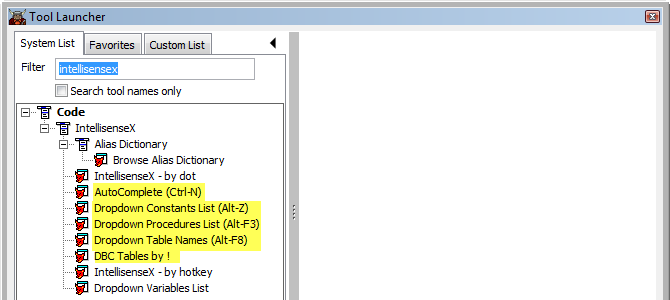
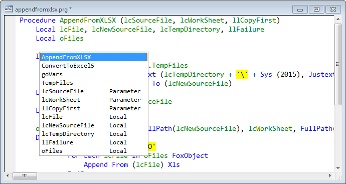
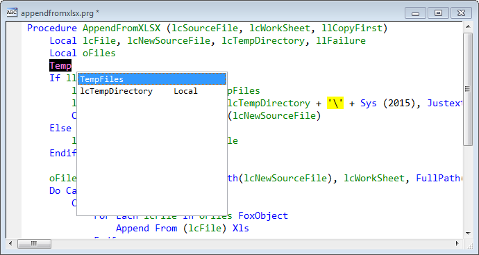
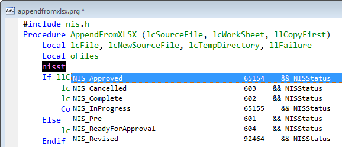

Thor TWEeT #22: 有关的 [IntellisenseX](https://github.com/VFPX/IntelliSenseX) 工具
===
本文档由 xinjie 于 2018-04-09 翻译

除[_IntellisenseX_](https://github.com/VFPX/IntelliSenseX)之外，还有许多 Thor 工具提供了可供选择的名称的下拉列表。 这些不是 FoxPro Intellisense 提供的熟悉列表（成员名称或字段名称），而是在您的 FoxPro IDE 中有意义的其他列表。 这些列表不是通过按点（如IntellisenseX）激活的，因此您需要以另一种方式访问它们（通过分配热键或将它们添加到Thor工具栏或菜单中）

这些工具可以在工具[启动器](../Thor_launcher.md)中找到:

这些工具提供的下拉列表是：

*   _AutoComplete_ – 当前过程中引用的所有名称，VFP关键字除外。 因此，变量，字段名称，表名和别名，过程，对象，属性和方法名称等等
*   _Dropdown Constants List –_ 在当前过程中定义的所有常量（#Define语句）以及在引用的#Include语句中定义的所有常量。
*   _Dropdown Procedures List –_ 当前项目中引用的所有过程和函数（如果有一个打开）或当前路径。
*   _Dropdown Table Names –_ 当前路径中的所有表。
*   _DBC Tables by ! –_ 在DBC中找到的所有表。

所有这些工具的工作方式基本相同。 当您调用它们时，您会看到一个可从中进行选择的下拉列表，就像您从IntellisenseX创建的下拉列表中进行选择一样。 以下示例演示 _AutoComplete_ 的用法，显示此过程中引用的所有名称。

您也可以在调用该工具之前开始输入名称的一部分，例如在本例中调用AutoComplete之前输入了“Temp”。

最后，如果您输入了足够的名称来唯一标识它（例如本例中的“New”，它仅与“lcNewSourceFile”匹配），则匹配即时粘贴而不显示弹出窗口。 当这变得熟悉时，它非常方便，减少了击键和键控错误。

关于这些工具中的每一个，有几点需要注意：

*   _AutoComplete_ – 有自己的插件允许您更改显示的名称或其顺序。 （我的个人版本可以识别我的约定，用于命名表和游标）。
*   _Dropdown Constants List –_ 下拉列表不仅显示匹配的已定义常量的名称，还显示它们的值以及同一行上的任何注释。 此外，匹配也是针对评论完成的。 例如，在下面的示例中，输入“nisst”会匹配注释中具有“NISStatus”（字段名称）的所有条目。

*   _Dropdown Procedures List –_ 显示程序和功能的名称，但不显示它们的参数。 尽管这是最初的意图，其中包括导致它变得如此缓慢的参数，但它毫无价值。 即使没有参数，它也可能非常缓慢。
*   _Dropdown Table Names –_ 有自己的插件来搜索不同的文件夹等。
*   _DBC Tables by ! –_ 这与其他不太一样，因为它为您输入'！'时分配了一个开启标签。 因此，您只能以这种方式使用此工具（例如，不能从菜单或Thor工具栏中使用）

参看 [所有Thor TWEeTs的历史](../TWEeTs.md) 和 [Thor 社区](https://groups.google.com/forum/?fromgroups#!forum/FoxProThor).
