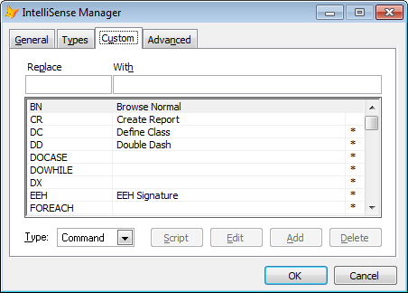
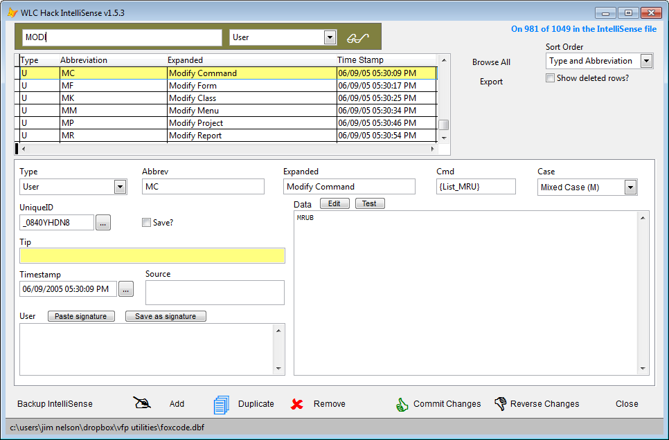
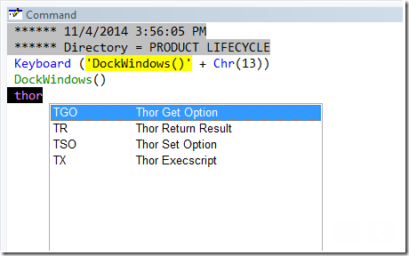
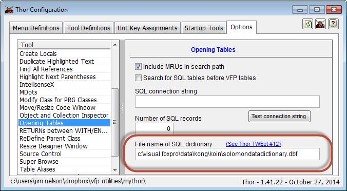
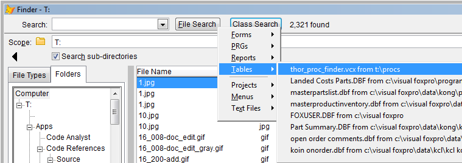

Thor TWEeT #24: 新的Thor工具
===
本文档由 xinjie 于 2018-04-09 翻译

在上个月向Thor 仓库添加了九个新工具：
*   _[Pack VCXs, SCXs, etc. from a project or folder](#T1)_
*   _[Hack Intellisense](#T2)_
*   _[Dropdown Intellisense Scripts](#T3)_
*   _[Keyboard Macro Expansion](#T4)_
*   _[Create SQL Data Dictionary](#T5)_
*   _[Browse SQL Data Dictionary](#T5)_
*   _[MRU Tables](#T9)_
*   _[Toggle PEM Editor Event Handler](#T8)_
*   _[Toggle Debugger](#T7)_

### <a name="T1"></a>Pack VCXs, SCXs, etc. from a project or folder

新工具 _Pack VCXs, SCXs, etc. from a project or folder_ 提示输入项目/文件夹，然后打包该项目/文件夹中找到的所有文件。

您可以直接通过调用 Thor 过程来绕过提示：

[1]  在当前项目中打包文件：

```foxpro
lcOption = ExecScript(_Screen.cThorDispatcher, 'Thor_Proc_PackProject', .T.)
```

[2]  在特定项目中打包文件：

```foxpro
lcOption = ExecScript(_Screen.cThorDispatcher, 'Thor_Proc_PackProject', cProjectName)
```

[3]  将文件打包到特定文件夹中：

```foxpro
lcOption = ExecScript(_Screen.cThorDispatcher, 'Thor_Proc_PackProject', cFolderName)
```


### <a name="T2"></a>Hack Intellisense

新工具 _Hack Intellisense_ 为原生 Intellisense 管理器（如下所示）提供了一个非常有用的替代方案，可用于处理您的定制 Intellisense 脚本。



我总是发现 Intellisense Manager 页面非常不透明，直到我放弃尝试添加任何新脚本为止。

工具 _Hack Intellisense_ 提供了一个不同的 UI 来更新你的 FoxCode 表，使得一切都更清晰。 它还提供了许多细节，包括：

*   通过文本或脚本类型过滤（我建议尝试“USER”过滤器）
*   排序
*   用于复制或删除脚本的按钮。
*   缓冲您的更改，以便您可以根据需要进行提交或恢复
*   备份你的 FoxCode 表。
*   可定制的签名
*   用于更复杂代码的“编辑”和“测试”按钮（在“DATA”字段中）



在这个工具可在短时间内学会使用，我已经更频繁地利用这些自定义脚本。

还有增强计划 _Hack Intellisense_ 以便于共享我们每次创建的脚本。 我会告诉你任何事态发展。

另请注意，上周发布的相关工具 _DropDown Intellisense Scripts_ 可帮助您查找并使用您创建的脚本，而无需使用此表单。

_Hack Intellisense_ 是由 Rick Schummer 编写的，Todd Landrum 和我自己做了一些调整。

### <a name="T3"></a>Dropdown Intellisense Scripts

宣布新工具, _Dropdown Intellisense Scripts_, 以帮助您查找和使用使用 Intellisense Manager 或新工具  _Hack Intellisense_  创建的 Intellisense 脚本。

此工具与其他一些“Dropdown”工具一样工作，作为 Intellisense 的一部分。 它提供了所有原生 Intellisense 脚本（包括您添加的任何内容）的下拉列表。

该过滤不仅适用于脚本缩写（下面示例中的“TGO”），还适用于其描述（如果有）。

从列表中选择任何项目都会导致该项目被扩展，就像正常的 Intellisense 扩展它一样。

这里还有一个新的窍门 - 它可以在文本行中的任何位置工作，而不像普通的 Intellisense，它只能在行的开头起作用。



### <a name="T4"></a>Keyboard Macro Expansion

新工具 _Keyboard Macro Expansion_ 是原生 Intellisense 的扩展。 原生 Intellisense 扩展自定义脚本，只能在命令窗口或代码窗口中的一行代码的开头。

因此，当我在命令窗口中输入**TO**（我的一个自定义 Intellisense 脚本）并按照空格进行操作时，Intellisense 将其展开为：

```foxpro
ExecScript(_Screen.cThorDispatcher, 'Get Option=', 'KEY', 'TOOL')
```

新工具 _Keyboard Macro Expansion_ 也扩展了 Intellisense 脚本，但不限于在行首。

如果我输入以下内容：

```foxpro
lcOption = TGO
```

然后调用这个新工具（我已将其分配给热键 Ctrl + I ），它将展开为：

```foxpro
lcOption = ExecScript(_Screen.cThorDispatcher, 'Get Option=', 'KEY', 'TOOL')
```
(这通过从原生 Intellisense 使用的 FoxCode 表中读取相同的定义来工作。)

 _Keyboard Macro Expansion_ 插件中提供了第二个扩展 (参看 [Plug-Ins](../Thor_add_plugins.md)). 该插件提供了 FoxCode 表的替代方案，以便您可以通过编程方式评估要替换的单词并根据需要替换它。 插件中的示例代码演示了如何来做这些。

```foxpro
loAnything
```
变为

```foxpro
Local loAnything as Anything of Anything.prg
```
### <a name="T5"></a>Create SQL Data Dictionary

### <a name="T6"></a>Browse SQL Data Dictionary

Intellisense 和`超级浏览器`都可以从SQL表中访问字段名称，参看[Thor TWEeT 10](Tweet_10.md).

访问这些字段名称的自然方法是使用连接字符串来访问 SQL Server 数据库。

或者，您可以创建包含所有表及其字段的名称的[SQL 字典](Tweet_10.md＃SQLDictionary)，即使SQL数据库不可用，IntellisenseX也将使用这些字段名称。


SQL数据字典的名称在Thor配置表单中输入（并注意错字！）



### <a name="T9"></a>MRU Tables

新工具 _MRU Tables _ 提供 MRU 表的下拉列表; 所选表格以 _超级浏览器_ 打开

请注意，所有打开表的 Thor 工具（包括“超级浏览”，“转到定义”等）都会将它们打开的任何表添加到表的系统 MRU 列表中

此 MRU 下拉列表也可从 Finder 中“文件搜索”命令按钮的右键单击上下文菜单中获得。



### <a name="T8"></a>Toggle PEM Editor Event Handler

`PEM编辑器`如果打开，则提供设计时的事件处理。 最常见的用法是在调整控件大小时对锚定属性进行评估，以便表单或类在运行时调整大小。 有关详情，请参阅`PEM编辑器`帮助文件。

### <a name="T7"></a>Toggle Debugger

除了一个可以在热键上使用的工具之外，这件工具没有什么神奇之处。

参看 [所有Thor TWEeTs的历史](../TWEeTs.md) 和 [Thor 社区](https://groups.google.com/forum/?fromgroups#!forum/FoxProThor).
