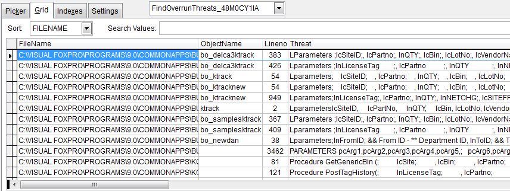

Thor TWEeT #26: 三个新的 Thor 工具
===
本文档由 xinjie 于 2018-04-09 翻译

**Thor 仓库**最近添加了三个新工具。

*   _[Split a Procedure File](#T1)_
*   _[Find Buffer Overrun Threats](#T2)_
*   _[Compress Parameters List](#T3)_

### <a name="T1"></a>Split a Procedure File

工具 _Split a Procedure File_ 将PRG文件中的所有程序和功能拆分为单独的PRG文件。 

它首先提示输入过程文件的名称，然后提示要创建新PRG的文件夹。

请注意，这为程序和函数创建了新的RPG，但对类没有任何作用。

感谢 Tamar Granor 为此所做的贡献。

### <a name="T2"></a>Find Buffer Overrun Threats

如 [TWEeT＃23：缓冲区溢出](Tweet_23.md)中所述，在某些表单和类上使用`PEM 编辑器`或 IntellisensesX 时，可能会遇到缓冲区溢出错误。 这个不寻常的错误，会像C5错误一样摧毁你的会话，这是由长 Parameter 或 LParameter 语句引起的。

工具 _Find Buffer Overrun Threats_ 使用子文件夹搜索项目或文件夹，查找可能导致缓冲区溢出错误的语句。 注意这里使用了“可能”这个词; 很难确定发生这些错误的具体情况，因为 PRG 中的规则与 VCX 中的规则不同，并受到内部注释的影响。

运行此工具的结果是一个光标，使用 _超级浏览器_ 显示。



要测试游标中确定的任何威胁是否实际上会生成缓冲区溢出，请运行以下命令：

```foxpro
oObject = Newobject(‘yourclass’, ‘yourclasslib’, 0)
 
?Amembers(laArray, oObject, 3)
```

### <a name="T3"></a>Compress Parameters List

使用工具 _Compress Parameters List_ 修复导致缓冲区溢出错误的任何长参数列表。

导航到问题代码，突出显示整个参数语句，然后运行此工具。 它将删除语句中的所有不必要的字符（包括空格，制表符，CR，LF，分号和行尾注释）。

参看 [所有Thor TWEeTs的历史](../TWEeTs.md) 和 [tThor 社区](https://groups.google.com/forum/?fromgroups#%21forum/FoxProThor).
