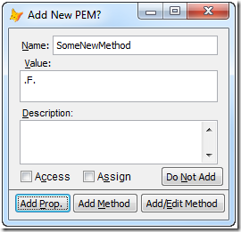

Thor TWEeT #27: 转到定义
===
本文档由 xinjie 于 2018-04-09 翻译

_转到定义_ 是最有用的 Thor 工具之一，同时也是最容易使用的工具之一。 如果它作为一个单独的 VFPX 项目而不是简单地与`PEM编辑器`和 Thor 一起出现，它肯定会获得它应得的更广泛的认可和使用。

它允许您指向代码中的任何用户定义的名称，然后转到（即显示和/或编辑）其定义。 它也可以用来在表单或类中创建新的方法和属性。

它的机制很简单：

1.  点击名称（在名称前面，内部或之后）。
2.  运行 _转到定义_ .（建议：使用方便的快捷键;我用F12）

此表列出了可以搜索的所有不同类型的名称：

类型或名词|采取的操作
---|---
方法或事件|打开编辑方法; 如果没有本地非默认代码，还会打开一个包含该方法所有继承代码的txt文件。
对象|如果可能的话，选择该对象以显示在`PEM编辑器`和属性窗口中。 在某些情况下，这会失败：如果对象隐藏在其他对象之外或者不可见，或者它位于页框的不同页面上。
属性|与选择对象相同，它也尝试在`PEM编辑器`表格中选择该属性。 这仅适用于`PEM编辑器`表单打开的情况，也可能因为表格中生效的过滤器而失败。
DODEFAULT|打开包含该方法的所有继承代码的文本文件。
PRG|打开 PRG.
PRG 中的过程和函数|打开PRG并高亮显示PROC或FUNC的开始
常量 (#Define …)|打开 #Include 文件, 并高亮显示该常量
表单|打开表单
报表|打开报表
完全高亮的文件名|打开文件进行编辑; 应该适用于所有文件扩展名。
类名|打开类，无论是在 VCX 还是 PRG 中
CREATEOBJECT 或 NEWOBJECT|打开类，无论是在 VCX 还是 PRG 中
LOCAL loObject as someclass of somelibrary|打开类 (当你点击在 “LOCAL” 时)
{{ loObject = { someclass, someclasslibrary } }}|打开类 (当你点击在 “loObject” 上时)
Define Class xxx as xxxParent (of xxxLibrary)|打开父类 xxx（当您单击“Define”时）

如果要搜索除正在编辑的表单或类以外的文件，则搜索活动项目中的文件（如果有的话）; 如果没有活动项目，则搜索路径中的所有文件。

#### 创建新的属性和方法

_转到定义_ 也可以用来创建新的属性和方法。 当光标位于潜在的新属性或方法的名称中时，只需调用**转到定义**即可，并且打开用于创建新属性或方法的表单。

_个人说明：我非常依赖这个工具。 实际上，我用它来创建大部分新的属性和方法，很少再使用PEM编辑器。_

参看 [所有Thor TWEeTs的历史](../TWEeTs.md) 和 [Thor 社区](https://groups.google.com/forum/?fromgroups#!forum/FoxProThor).
