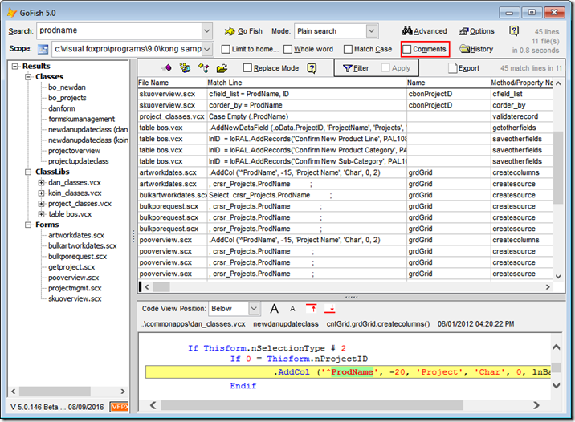

安装在 VFPX 发布的工具
===
_本文档由 xinjie 于 2018-04-08 翻译_

有许多工具可以直接从 VFPX 下载：

### Thor 仓库

Thor 设计的初衷是为了使 VFP 社区成员可以共享有价值的工具。PRG工具的结构使这种共享变得异常简单。

`Thor 仓库`是这些工具的目录。随着开发者不断提交新的工具，它也会不断的增长。在初始阶段，它大约包含十几个工具。

要注册库中的工具，请将 ZIP 文件中的 PRG 复制到文件夹 **Thor\Tools**

[点击这里查看 Thor 仓库](Thor_repository.md) 

### 来自 PEM 编辑器的工具

PEM Editor Version 7，现在重新命名为`具有 IDE 工具的 PEM 编辑器`，它包含可以通过 Thor 访问的超过30个工具，其中一部分是 PEM Editor Version 6 中包含的，其余的是全新开发的工具。这些工具可以从 PEM 编辑器主页下载。

PEM 同时"发布" 一对儿用于简单的构建更多工具的对象。`Thor 仓库`中超过一半的内置工具使用了它们。

通过执行以下命令安装`PEM 编辑器`时，将自动从`PEM 编辑器`注册工具（如果Thor正在运行）：
```foxpro
    Do PEMEditor.APP
```
[点击这里查看带有IDE工具的 PEM 编辑器 7](https://github.com/VFPX/PEMEditor)

### GoFish5

GoFish 5 是一款用于快速搜索 Visual FoxPro 源代码的高级代码搜索工具。 如果 Thor 已经在当前的 IDE 会话中运行，它可以与 Thor 集成，如下所示：



[点击这里查看 GoFish4](https://github.com/mattslay/GoFish)
