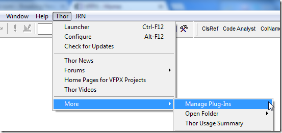
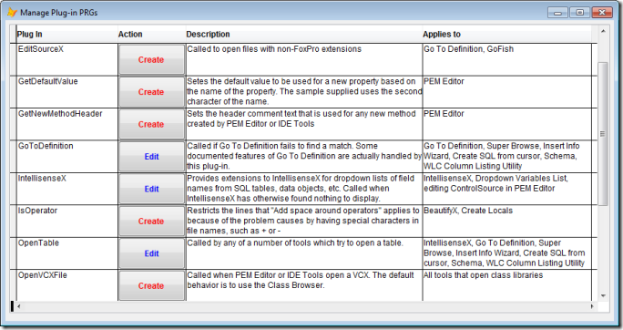
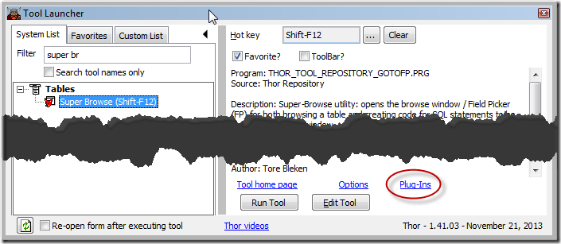

PRG插件
===
_本文档由 xinjie 于 2018-04-08 翻译_

Thor 提供了大量 PRG 插件，它们允许您自定义各种 Thor 工具的操作。 它们可以替换 VFP 现有的操作或为其添加新的操作方法。

您可以从 Thor 菜单访问所有插件的列表：

这将打开一个表单，您可以从中创建或修改已有的插件：

当您选择其中一个插件单击“创建”时，将为您打开一个样本 PRG，其中包含描述参数，结果等的注释。

如果您保存它（Ctrl + S 或 Ctrl + W），它将被保存到您的“My Tools”文件夹中，之后将由 Thor 工具访问它。 PRG名称也将保存在您的[MRU PRG列表](https://groups.google.com/forum/?fromgroups#!topic/FoxProThor/_hyu9XVSQ3A)中，因此您可以从此处编辑插件的命令行。（请注意，PRG的名称不一定与表中显示的名称相同）。

您可能会发现仅显示适用于特定 Thor 工具的插件会更方便。 从`工具启动器`或`Thor 配置表单`中，选择该工具，然后单击表单右下方的Plug-Ins链接，如下所示。 上图显示的表单将被打开，但其中仅显示适用于此工具的插件。 请注意，此链接仅在该工具有可用插件时才会显示。

可用的插件PRG列表：

**插件** |**描述**
---|---
AfterComponentInstall|在安装组件后（在 Thor\Tools\Components 文件夹中），在“检查更新”期间调用。 允许您将组件重新安装到您的应用程序通常使用它的位置
AutoRenameControl|设置自动重命名时控件的新名称。 “常规的”新名称作为参数提供，因此可以在可接受的情况下使用。
BeforeComponentInstall|与 AfterComponentInstall 配合使用
BuildProject|提供 Finder 中使用的 Build Project 对话框。
CloseControlStructure|设置粘贴的文本作为控制结构中的代码的结束行（IF/ENDIF，TRY/CATCH 等），其中可能包括来自代码的开始行的文本，并且可能取决于有多少行代码。
[CreateLocalsStatements](#CreateLocalsStatements)|作为“Create Locals”的一部分创建 LOCAL 语句; 它将允许您确定 LOCAL 语句的顺序和格式以及要在 LOCAL 语句中显示哪些变量。
EditSourceX|打开带有非FoxPro扩展名的文件
FormatFieldPicker|为已在[超级浏览器](Thor_superbrowse.md)中选择的字段创建“字段选择器”字符串.
GetDefaultValue|根据属性的名称设置用于`PEM 编辑器`创建的新属性的默认值。 提供的示例使用名称的第二个字符。
GetNewMethodHeader|设置用于由`PEM 编辑器`或 IDE Tools 创建的任何新方法的标题注释文本
GoToDefinition|如果`转到定义`无法找到匹配的结果，则被调用。`转到定义`的某些功能实际上由该插件处理。
[IntellisenseX](#IntellisenseX)|为 IntellisenseX 提供对 SQL表，数据对象等字段名下拉列表的扩展。当 IntellisenseX 另外找不到任何内容时显示。
IsOperator|防止`在操作符前后添加空格`因文件名中包含特殊字符而导致问题（例如 + 或 - ）
[OpenTable](#OpenTable)|可以被任何尝试打开表的工具所调用。
OpenVCXFile|当`PEM 编辑器`或 IDE 工具打开 VCX 时被调用。默认行为是使用类浏览器。
SetGridHighLighting|为`PEM 编辑器`中 Grid 的行设置高亮显示（着色）
SetGridSortOrder|设置用于对`PEM 编辑器`中 Grid 的行进行排序的索引表达式
SortAutoComplete|允许从`自动完成`修改下拉列表
Spell Field Names|确定表中字段名的拼写。请注意，已经提供的选项是[lower\|UPPER\|混合\|匈牙利命名法（cName）]

### <a name="CreateLocalsStatements">**CreateLocalsStatements**</a>

这个插件是创建 LOCAL 语句的一个 Thor 工具，“Create Locals”和“BeautifyX”在运行时都调用它。它可以获得在过程代码中指定的变量的一个列表。
 
如注释中所述，它的参数是一个十列数组。
 
结果是一个在适当位置假如换行符的字符串，也就是新 LOCAL 语句的文本。
 
所提供的样本是在Thor中使用的确切代码。 因此，您可以根据自己的需要定制其内容并显示你需要的 LOCAL 声明。

### <a name="IntellisenseX">**IntellisenseX**</a>

当你按“.”操作符启动 IntellisenseX 时，它会经过许多步骤来确定点之前的文本的含义（它是一个别名吗？它是一个对象吗？等等）。
 
如果所有的可能性都失败了，最后的方法是调用这个插件，它允许您在点之前解释文本。传递给插件的参数是一个包含许多不同属性的对象，如注释中所述。可以返回许多不同的结果来生成 IntellisenseX 下拉列表。
 
这个PRG有很多工作可以完成，包括（但不限于）样本PRG中显示的这两种功能：
 
1.  **SQL server 表** - 如果您使用 SQLServer 表，则可以使用 SQLColumns（）从表中获取字段列表。示例 PRG 使用不同的方法，从自由表中的字典中读取表定义。
2.  **数据对象** – 如果您有拥有包含数据对象的表单或类，并且可以从这些表单或类中轻松提取基础表的别名，则可以让表中的字段显示在 IntellisenseX 下拉列表中。 可能有无数种方法可以使用，样本演示了其中的三种：
    *   如果传入的参数是“This.oData”（例如来自wwBusiness）并且该类有一个属性“cAlias”，那么它将用作基础表的别名。
    *   如果传入的参数是“Thisform.oBusObj.oData”（例如来自wwBusiness）并且类/表单具有属性“cAlias”，那么它将用作基础表的别名。
    *   如果类名是“bo_”+ {SomeName}，那么{SomeName}将用作基础表的别名。

### <a name="OpenTable">**OpenTable**</a>

许多 Thor 工具（包括 IntellisenseX 和`超级浏览器`）都可以打开表，表别名是唯一的标识。 如果有一个与该别名匹配的打开的表（或视图），则一切正常，并且开始处理。但是，如果不是这样，它们会调用 OpenTable 插件以尝试打开与别名匹配的表。

OpenTable的默认处理是依次尝试以下每个尝试打开表的操作：

1.  尝试打开（use）该文件（从当前文件夹或路径打开表格）
2.  检查 MRU 的 DBF 列表
3.  如果存在打开的表单，则在数据环境中查找该文件

如果还是无法打开表（例如，如果您的文件名与它们的别名不匹配，或在路径中的文件夹中找不到），请修改 OpenTable 以适应您的环境：
 
*   参数是正在搜索的别名。
*   结果是已打开的别名（不必与参数相同！），如果未找到，则为空。

您还可以使用此插件访问 SQL Server 表，这有几种用途：
*   提供 IntellisenseX 的字段名列表
*   提供`超级浏览器`中可见的数据结构，允许在“Picker”页面上创建 SELECT 和其他 SQL 语句

创建 OpenTable 时为您打开的默认PRG解释了如何实现此目的。
