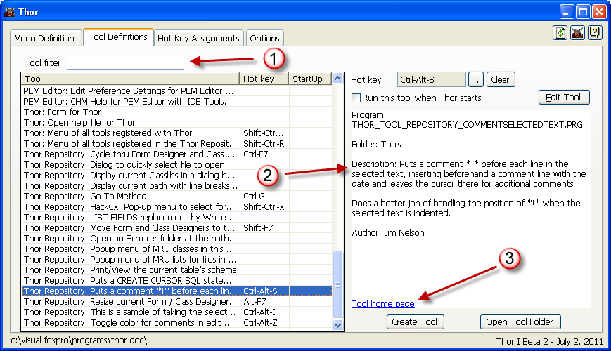

浏览工具列表
===
_本文档由 xinjie 于 2018-04-08 翻译_

Thor表单的第二页（**工具定义**）显示一个表格，其中显示了在 Thor 中注册的所有工具以及分配给它们的快捷键（如果有）。它也可用于指定快捷键，编辑现有工具以及创建新工具。

左侧的表格显示了 Thor 注册的所有工具。 按他们的 _来源_ 进行分组。 因此，建议您在创建自己的工具时，将相同的_来源_分配给所有这些工具，以便将它们全部分在一组（在 Thor 的其他位置上）。

第二列显示您已分配给每个工具的快捷键（如果有的话）。

第三列显示了每次运行 Thor 时选择运行的工具。 虽然这对于大多数工具来说实际上是没有意义的，但是对于那些希望在整个 IDE 会话中保持可见的表单（例如PEM编辑器，文档树视图或对象大小和位置）相当有用。

浏览此页面时还有其他一些功能需要注意：

1. 您可以使用工具过滤来缩减显示的工具列表。 请注意，该过滤仅在您离开该字段时起作用。
1. `PEM 编辑器`和`Thor 仓库`中的大多数工具都有（或将有）更完整的描述出现在右侧的大型编辑框中。 当你第一次使用 Thor 或从`Thor 仓库`获取新工具集合时，一种合理的做法是逐个浏览所有的工具，并阅读各个工具的描述。
1. 许多工具（包括`PEM 编辑器`中的大多数工具）都有（或将要）链接到该工具的主页，以便详细说明其用法。

**参看**
* [为工具指定快捷键](Thor_assign_tool_hot_keys.md)
* [编辑现有工具](Thor_editing_existing_tools.md)
* [创建新工具](Thor_creating_new_tools.md)
* [制作工具的工具](Thor_tools_making_tools.md)
