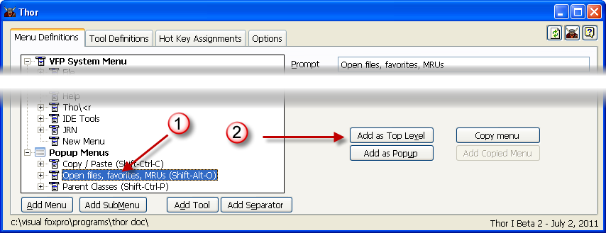
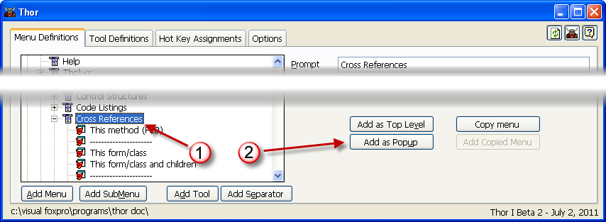
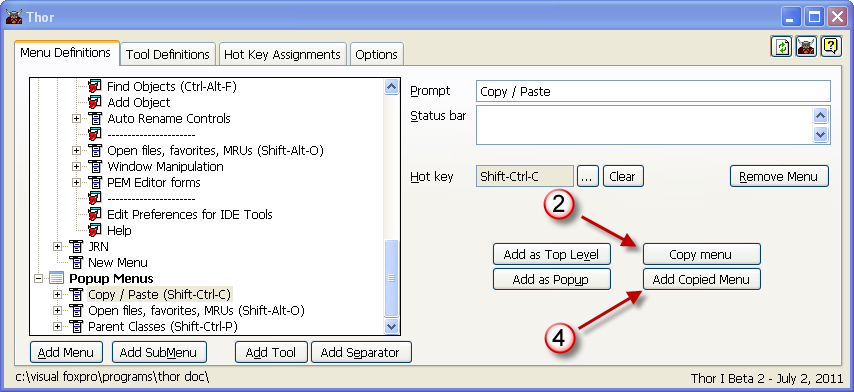

复制菜单
===
_本文档由 xinjie 于 2018-04-07 翻译_

有三种不同类型的菜单（VFP系统菜单，弹出式菜单），并且您创建的任何菜单都可以被多次使用，它可以是这三种类型中的一种或多种。

您只需要清楚，这意味着***同样的***菜单可以出现在多个地方。 在内部，它将是相同的菜单，并且在一个地方对其进行的任何更改也将在所有其他地方被复制。

### 在VFP系统菜单栏上的弹出式菜单或子菜单进入菜单栏

1. 点击菜单（在下面的例子中，选择了一个弹出式菜单;它对任何子菜单都是一样的）。
1. 点击“添加为顶级”

### 使VFP系统菜单或子菜单进入弹出式菜单
1. 点击菜单
1. 点击'Add as Popup'

### 使**任意**菜单添加到子菜单
1. 点击您想要制作的菜单进入子菜单
1. 点击“复制菜单”
1. 点击您想添加子菜单的菜单
1. 点击'添加复制菜单'

