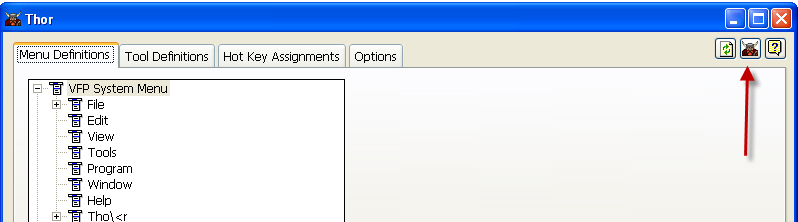

Thor 表单使用说明
===
_本文档由 xinjie 于 2018-04-07 翻译_

使用 Thor 表单时需要注意一些非常重要的事项：

* 表单上没有“保存”，“取消”或“撤消”按钮。 对表单所做的任何更改都会立即发布到基础表中，并且没有办法取消或撤销任何更改。

* 当表单被打开时，它从目录中读取所有的工具，并从那里使用该目录。 因此，对工具或在打开表单时添加的工具所做的更改不会自动包含在目录中。 要将表单与所有工具的目录同步，请使用“刷新”按钮：

* 在表单关闭之前，不会应用对 VFP 系统菜单，弹出式菜单或所制定的快捷键所做的任何更新。 要使 VFP 系统菜单等与表单同步，请使用 Thor 按钮：

