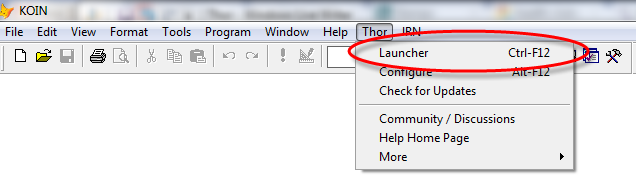
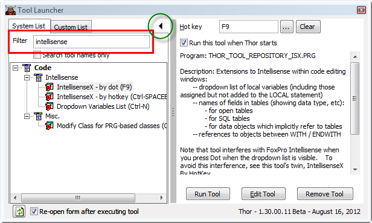
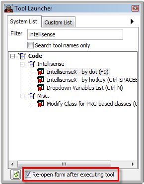
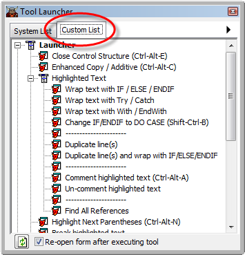

工具启动器
===
_本文档由 xinjie 于 2018-04-07 翻译_

工具启动器是一个 Thor 工具，可以轻松查找和运行工具。 它也可以配置为保存您最喜爱的 Thor 工具列表，以便于访问。

工具启动器可以从 Thor 菜单启动，如下图所示，通过快捷键或每次运行 Thor（如果您有足够的空间让它始终打开）时打开它。

“启动器”表单的布局与 Thor 表单的 Configuration （“工具定义”）非常相似。

左侧的 TreeView 显示了所有的 Thor 工具，当你点击一个工具时，右侧的控件显示工具的描述，工具主页的链接（如果有的话）以及指定工具快捷键或编辑的按钮 工具。

还有一个按钮，用红色突出显示，它可以运行该工具。 当你运行一个工具时，表单会消失，这样焦点可以返回到最后访问的窗口，因为许多工具都在当前窗口上运行。

该工具也可以通过双击 TreeView 中的工具名称来运行。

Thor 工具的列表现在足够长，以至于一次只能浏览一个工具是非常乏味的。 以下红色的过滤器框可用于查找与输入的文本相匹配的工具。 匹配是针对工具名称，描述，类别和作者完成的。 学习 Tho r提供的各种工具的一种方法是使用熟悉的 FoxPro 术语的过滤器，例如“class”，“form”，“object”等。

_注意：过滤使用简单的$搜索完成。 我很赞赏提供更复杂的机制的行为，这使允许 AND 或 OR 功能成为可能，如果您可以提供，我将不胜感激。_

随着工具列表变得更加熟悉，右侧控件的需求就会减少。 显示在上面绿色圆圈中的右箭头可以隐藏这些控件来缩小表单。

在这种配置下，只需点击一下即可启动工具。

如果你有足够的屏幕空间，很多人都想让表格始终可见。 为此，请使用下面以红色突出显示的复选框。

您还可以创建自己的自定义工具列表，以便从启动器中获得，如下图所示。 （*没人*使用所有工具。）

Thor 的作者 Jim Nelson 使用快捷键来运行他一直使用的工具，相关工具组的弹出式菜单（Ctrl + E 代表 “Extract”工具，Ctrl + G 代表 “Go To”工具等） ）以及他保存在工具启动器的“自定义列表”中的最不常用的工具。

按照以下步骤使用 Thor 配置表单将工具保存到自定义列表中：

1.  点击 “Popup Menus”
2.  点击“添加菜单”。 这会创建一个菜单，可以用作弹出式菜单（如果您为其分配热键），启动器中或两者都可以使用。
3.  输入菜单的名称。 这将显示为启动器中的顶级节点。
4.  点击“在启动器中显示”。
5.  要添加每个工具，请点击“添加工具”。 （您也可以点击“添加SubMenu”将您的工具组织到子菜单中，如上图所示。）

