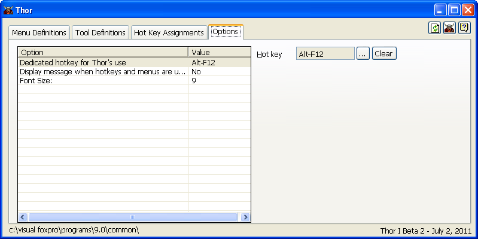

选项
===
_本文档由 xinjie 于 2018-04-07 翻译_

Thor 表单的第四页（**Options**）提供了几个选项设置。 要更改设置，请单击左侧的行，并在右侧显示相应的控件。

第一个选项有一些解释。  

Thor 提供的使用两个或多个 Shift 键（Shift，Ctrl和Alt）的快捷键机制，要求使用由 On Key Label 创建的一个专用键。 该键的默认值是Alt + F12。

第一个选项允许您更改该快捷键。 请注意，它必须是一个可以通过 On Key Label 定义的键，因此它只能使用 Shift，Ctrl 和 Alt 中的一个。 此外，上一个快捷键的 On Key Label 定义不会被删除，所以建议您在更改专用快捷键后立即关闭 VFP 会话。

