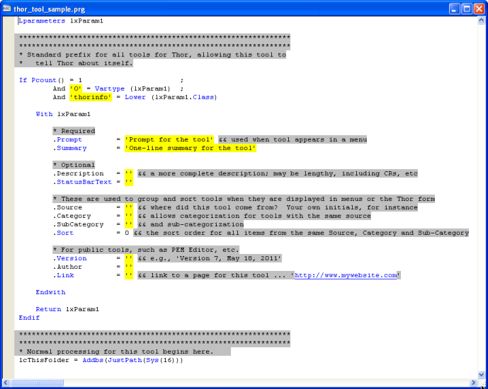
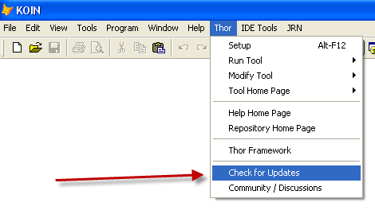

Thor 概述
===
_本文档由 xinjie 于 2018-04-07 翻译_

Thor 是用于管理 IDE 中的附加工具的工具。

它提供了四种访问这些工具的不同方法：

1.  通过分配快捷键给他们
2.  通过创建可通过快捷键访问的弹出菜单
3.  通过在任何 VFP 系统菜单项（文件，编辑，视图等）下添加工具项，
4.  通过在 VFP 系统菜单中创建新的菜单项并将这些工具添加到这些新菜单项下的菜单。

Thor 由四部分组成：

1.  Thor 管理的工具目录。 这些实际上是 PRG （见下文）。
2.  基础自由表，其中包含菜单快捷键分配的定义等。
3.  Thor 表单可以通过快捷键或 VFP 系统菜单上的菜单键访问，该菜单可管理表中存储的所有菜单和快捷键定义。 （请注意，此表单没有保存或取消按钮;对其进行的更改会立即生效。）
4.  一个 APP，从表中获取定义并更新 VFP 系统菜单（如果适用），创建弹出式菜单，并将快捷键分配给弹出式菜单和/或单个工具。 由于这些定义免疫 CLEAR ALL，因此只需在IDE会话开始时运行一次。

#### **什么是“工具”？**

工具是遵循特定结构的 PRG，因此 Thor 可以识别它们。

每个工具的“开始”是一组40行左右的代码，让工具可以告诉 Thor 自己是什么。 当使用Thor表单创建新工具时，它看起来像这样：

该工具的实际代码在该段代码的后面。 与往常一样，浏览其他工具（您也可以在Thor表单中执行的操作）以查看如何正常使用这些属性的示例是有益的。

创建新工具的过程（使用 Thor 表单时）将指导创建该工具到 Thor 识别的文件夹中，该文件夹可以是'Thor'文件夹的特殊子文件夹或路径中的任何文件夹。 新工具的默认文件夹是*Thor\Tools\My Tools*

一个建议是为所有个人工具的 *.Source* 属性分配相同的值，以便 Thor 表单将它们组合在一起。

#### **Thor 仓库**

Thor 设计的初衷是 FoxPro 社区的成员可以拥有可在整个社区共享的有价值的工具。PRG工具的结构使这种共享变得简单。

`Thor 仓库`是这些工具的目录。 目的是随着开发者提交包含的工具，这个资源库会随着时间而增长。 起始库有大约十几个这样的工具。 

有关`Thor 仓库`更新的下载，请参阅：

### [点击此处查看 Thor 仓库的主页](Thor_repository.md)

#### **来自 PEM 编辑器的工具**

PEM编辑器的第7版，现在重新命名为`具有 IDE 工具的 PEM 编辑器`，包含三十多种可通过 Thor 访问的工具。 其中包括一些在`PEM 编辑器 6 `版本中发布的工具，以及大量全新的工具。 这些可以从`PEM 编辑器`页面下载。

`PEM 编辑器`还“发布”了一对儿简化构建工具的对象。 `Thor 仓库`中超过一半的初始工具使用这些对象。 

有关使用IDE Tools下载`PEM 编辑器 7`的更新，请参阅以下部分。

### [点击这里查看带IDE工具的 PEM 编辑器 7 的主页](https://github.com/VFPX/PEMEditor) 

#### **一键更新**   
从 Thor 版本1.1（2011年10月23日发布）开始，`Thor`，`Thor 仓库`，`具有 IDE 工具的PEM 编辑器 7 `以及其他工具的更新都可以通过 Thor 菜单上的单个菜单获得（在 FoxPro 系统菜单中）。 这个新的菜单项“检查更新”，检查是否有更新可用于任何这些工具; 如果有任何找到，它们会自动下载并安装。

从 Thor 版本1.10.019（2011年11月17日发布）开始，当您开始第天第一个打开 IDE 会话时，可能会自动执行一键更新。参看 [运行 Thor](Thor_running.md).

#### **文档**

此处有完整的 Thor 在线文档，Thor 设置表单和 Thor 的其他功能。[点击此处](Thor_help.md)

#### **Thor 社区论坛**

请访问 Thor 的社区论坛 [**http://groups.google.com/group/FoxProThor**](http://groups.google.com/group/FoxProThor) 提出建议或意见，报告问题，并了解其他人如何使用 Thor 及其相关工具。

#### **关于快捷键的注意事项**
Thor 提供了以前不可用的新功能 - 分配使用两个或三个 Shift，Ctrl 和 Alt 键（例如{Ctrl + Alt + A}）的快捷键的功能。 （实际上，使用这三者需要相当的灵活性。） 

键盘宏（使用FKY文件）是唯一识别这些键中两个或三个键的 VFP 功能，但宏不会导致程序执行，它们只能将字符放入键盘缓冲区。
