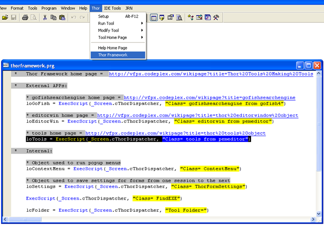

The Thor Framework: 制作工具的工具
===
_本文档由 xinjie 于 2018-04-07 翻译_

Thor 提供了一个工具框架来协助创建工具。

框架中的每个工具都可以从一行代码中获得，如下所示：

    Result = Execscript (_Screen.cThorDispatcher, cParameter)

选择这种非常寻常的方法是因为它要达到两个目标：

1.框架中的工具只有单一依赖项（_Screen 中属性的名称），因此可以通过工具访问，无论安装 Thor 的文件夹如何。 
2.即使在“Clear All”后，框架中的工具仍可用。

请注意，框架中的工具始终可从 VFP 系统菜单中的 Thor 菜单中获得，您可以复制代码行直接访问该工具。 此外，如果可用，可访问该工具的主页。

### 外部 APP：

Thor 的结构提供了可以嵌入其他 APP 文件中对象。 特别是这两个，作为`PEM 编辑器`的一部分开发。

    Result = Execscript (_Screen.cThorDispatcher, cParameter)
**cParameter** |**Result**
---|---
Class= editorwin from pemeditor|访问和修改当前打开的编辑窗口中的文本（选择，剪切，复制，粘贴等）的方法  - 参看 [Thor 编辑窗口对象](Thor_editorwindow_object.md)
Class= tools from pemeditor|各种方法的集合，彼此无关，但具有超越其在`PEM 编辑器`中使用的价值 – 参看 [Thor 工具对象](Thor_tools_object.md)

### 内部工具：
    Result = Execscript (_Screen.cThorDispatcher, cParameter)
**cParameter** |**Result**
---|---
Class= ContextMenu|返回用于创建关联菜单的对象 - 参看 [Thor 关联菜单](Thor_framework_contextmenu.md)
Class= ThorFormSettings|返回一个对象，以便表单可以保存其设置（大小，位置等）并将表单与鼠标或光标位置对齐 – 参看 [Thor FormSettings](Thor_framework_formsettings.md)
Class= FindEXE|（文档尚未提供）
Tool Folder=|返回 Thor 工具文件夹的名称
Thor Register=|返回一个对象，以便 APP 可以自行注册自己的工具， 例如 [GoFish 5](https://github.com/mattslay/GoFish) 和 [PEM 编辑器 7](https://github.com/VFPX/PEMEditor).
Run|运行 Thor 。效果同 Do Thor with ‘Run’  或者  Do RunThor
Edit|打开 Thor 表单。效果同 Do Thor with ‘Edit’
Clear HotKeys|删除所有Thor分配的键盘宏，以便可以保存宏（FKY）文件

### 参看

*   [浏览工具列表](Thor_browsing_tools.md)
*   [为工具指定快捷键](Thor_assign_tool_hot_keys.md)
*   [编辑已有工具](Thor_editing_existing_tools.md)
*   [创建新的工具](Thor_creating_new_tools.md)

