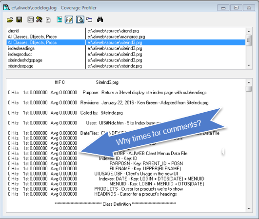
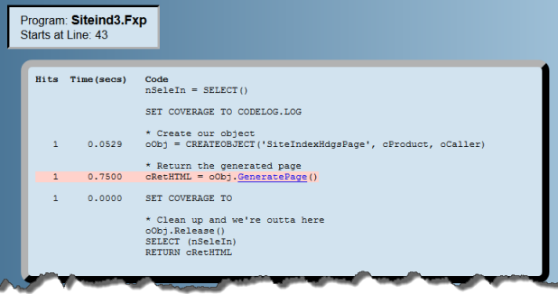
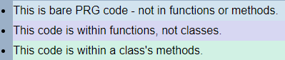
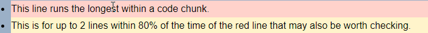

# Coverage Viewer

CvgViewr - Coverage Viewer - by Ken Green at [Advance Data Systems](http://www.AdvanceDataSystems.biz)

Your client says the [your\_beautiful\_process] is taking too long! The Signer-Of-Checks must be kept happy, so you SET COVERAGE TO [logFile], run the process, then turn off coverage. Now what? You have a huge log file. VFP has the coverage profiler whose "Profile Mode" shows us times - but perhaps too much. Here's an example:



Notice that the left side is like a bureaucracy: lots of fuss and noise but of little use. Do average times really help? That's all a bit busy for me to want to wade through (I'm an extremely lazy fellow). Of course, there are tools to show the longest executing lines of code but we know that those lines are the calling lines to lower-level functions/methods/procedures. It's tricky keeping track of all that stuff as we go deep down in the hierarchy to find the few lines that are causing much of the problem.

Coverage Viewer app (CvgViewr.app) analyzes that log for you and creates a web page showing executed code chunks with links so that tracking execution paths to those lower levels is a trivial mouse click away.

We created a sample from real-world code. Here's what its first code chunk looks like:



Note that only relevant code is shown and only hits and times for the lines actually executed. Due to my laziness, color coding quickly shows me the longest line. And, there's a link to go to the called method.

To see this better, click <a href="Docs/Sample.htm" target="_blank">this link</a> and follow along to see how it works (best viewed in a side-by-side window).

1. Click the GeneratePage() link in that first chunk of code.

2. You're now in that GeneratePage() method, its source and location are shown and there's a "called by" link to go back to the caller if needed. Here, the CREATEOBJECT('IndexProduct') line was longest so click the IndexProduct link.

3. That gets you to IndexProduct.Init(). Its longest line is the call to THIS.Setup(); Please click that link.

4. About midway down in Setup(), you can see that the longest call is to CREATEOBJECT('IndexHeadings'). Again, please click the IndexHeadings link.

5. That gets you to IndexProduct.Init(). Its longest line is the call to THIS.Setup(). But, the DODEFAULT() line is colored yellow. Each code chunk can have up to two yellow lines whose execution time is within 80% of the longest line. So, keeping that in mind for later, click on the Setup() link.

6. Setup()'s longest line is LoadOurLinks() but the AddItem() line is close -- that might be worth looking at later. Click the LoadOurLinks() link.

7. There we notice that, very clearly, the longest line is the SELECT \*, ' ' AS MENUROW, ... line of code.

In 7 quick steps we've found the major problem. How painless was that? And, we've even been able to establish a priority of things to look at with the other 2 longish areas. By the way, the log file for Sample.htm was 47,208 lines long - aren't we glad we didn't have to look thru that!

## Comparison To Other Tools

We've already seen that VFP's Coverage Profiler does something similar but it takes a lot of work to get down to the problem. But, for finding the slow areas, CvgViewr has these advantages:

- The web page and larger font is much easier to read
- VFP's tool shows times to 6 decimal places, a precision I've yet to need and one that's harder to read and comprehend
- VFP's tool shows average times. That's good for testing new code but for finding problems in slow processes, it's meaningless.
- VFP's tool shows all code; for code that didn't run you still get a lot of statistics making it much harder to follow
- You have to remember function/method names and file names and do searches just to trace a function call to its components. That just seems to be too much work, which helps you forget your train of thought.

There are other add-ons to improve VFP's Profiler. They allow filtering, sorting, and searching capability. But, to my knowledge, none of them utilize links to quickly navigate to find what's really causing the slowdown nor a larger font and headings to make it more readable.

## Quick Start

1. Just run CvgViewr.exe. A form will appear for entering your log file name. Use the binoculars icon to browse your folders. Click the "Process Log" button and that's that. When done, your Viewer page will open in your browser. (See Command Line Arguments, below to automate the process.)

2. If your code is within an app or an exe, a project file will be needed - otherwise, ignore it. The system will let you know if it needs it.

## Command Line Arguments

Syntax:  
```  
CvgViewr LogFileName [ProjectFile] [Start]
```

Parameters:

- LogFileName - The log file to be processed
- ProjectFile - Optional, this is only needed if the log file is from an app or exe file.
- [Start] - Y or N, optional; it means start processing right away if all entries are OK. This can be either the 2nd or 3rd parameter.

## Color Coding



Your tests will surely have lots of lines of code. So when you look through your code chunks, some lines will be colored as follows:



## Notes

1. After you click the Process Log button, the log analysis starts. It's usually quite fast but I did have a colleague with a PRG with 26745 lines. That did take a bit to process even though it only had 5 methods with times. So, if you have big files - please be patient.

2. Timing Issues: VFPs reported times are actually longer than the code really runs without COVERAGE on. Of course, that's because VFP has to write the log file. But, what IS important is the relative times. Reduce the top few time problems and your code will run much faster.

3. Sometimes a chunk of code will have 0.0000 times. They actually were recorded in the log file as 6 decimal places. But here we only pay attention to 4 decimals. In other words: it's not worth dealing with those very small times that are orders of magnitude below the ones you need to check.

4. The form has a "**Keep Work Tables?**" checkbox. If checked, a LogData folder will be created that will have all of the work tables used to generate the web page. The tables will include:

    - LOG.dbf - The imported log file; 1 record / log line
    - LINES.dbf - Each unique class + function + stack level + lines from LOG.dbf with uses and times summarized
    - SUMMARY.dbf - Unique lines with times summarized
    - CALLS.dbf - Calling hierarchy
    - CHUNKS.dbf - List of unique chunks of code
    - Other tables - These have the same name as a file with executed code and has the complete text of that file along with each line's uses and times.

    These files are normally created and destroyed when running the process. But, they're helpful for debugging.
