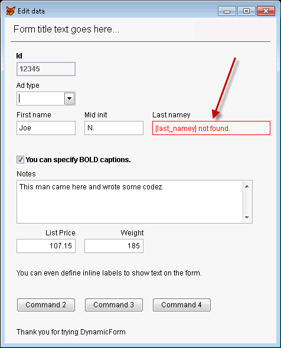

# Dynamic Forms
Dynamically generate UI forms from objects or cursors via a "markup syntax” in your code.

> Note: Matt's original repository is at https://github.com/mattslay/DynamicForms but since he sadly passed away in 2021, this fork is now the one the VFPX project list links to so others can contribute to the project.

Original CodePlex link: https://vfpx.codeplex.com/wikipage?title=Dynamic%20Forms

author: Matt Slay

credits: Jim Nelson, Doug Hennig, Rick Schummer

* * *

**Discussion Group**

[Join the discussion group to post or read usage discussions.](https://groups.google.com/forum/?fromgroups#!forum/foxprodynamicforms)

After joining the group, post through web access in the discussion portal, or email discussion questions (with screenshots) to:

     [foxprodynamicforms@googlegroups.com](mailto:foxprodynamicforms@googlegroups.com)
* * *

**Videos**

* Video #1 – [Introduction and Demos](http://bit.ly/DynamicForms-Video-1)  (8:15)
* Video #2 – [Exploring the class PRG and code sample](http://bit.ly/Dynamic-Forms-Video-2)  (9:09)

* * *

### What are Dynamic Forms?

Dynamic Forms is a new way to create forms based on a "[markup syntax](#markup_syntax)" similar to HTML and XAML, in which you specify both the layout and ControlSources for the various controls to be displayed on the form.

The result will be a dynamically constructed form, specified in code, rather than manually creating it in the Form Designer.

### Source code

The source code for this class is a single PRG file which contains the class definitions needed to create Dynamic Forms in your apps, and also includes as a ready-to-run sample to display a rendered form sample.
 
The procedural code at the top of the source code PRG serves as an example of how to use the DynamicForm class at run time to dynamically render a live FoxPro form to view and edit properties on an object. As listed below, you can also bind to Fields on Cursors/Aliases/Tables/Views as well as defined Private or Public variables.

### Documentation Links

- [Sample](#sample)
- [Basic Usage](#basic_usage)
- [Binding Form Controls to Data](#binding)
- [Markup Syntax – Designing your form layout](#markup_syntax)
- [Field Labels](#field_labels)
- [Header, Body,  and Footer areas on the Form](http://vfpx.codeplex.com/wikipage?title=Dynamic%20Form%20Main%20Form%20Layout)
- [Return Values from the form](#custom_return_values)
- [Restoring data changes  made by the user](http://vfpx.codeplex.com/wikipage?title=Restoring%20Data%20Values)
- [Dynamic Form Class - Properties and Methods](http://vfpx.codeplex.com/wikipage?title=Dynamic%20Forms%20Properties)
- [Additional Markup support for setting Form and Render Engine properties](http://vfpx.codeplex.com/wikipage?title=Dynamic%20Form%20Example%202)

Other references:
- [Dynamic Form Render Engine Class - Properties and Methods](http://vfpx.codeplex.com/wikipage?title=Dynamic%20Forms%20Properties#RenderEngine)
- [Subclassing DynamicForm and DynamicFormRenderEngine](http://vfpx.codeplex.com/wikipage?title=Dynamic%20Forms%20Advanced%20Topics#subclassing)
- [Working with Business Objects](http://vfpx.codeplex.com/wikipage?title=Using%20Dynamic%20Forms%20with%20Business%20Objects)
- [Change Log](http://vfpx.codeplex.com/wikipage?title=Change%20Log)

* * *

### Sample

The following form was generated strictly from markup syntax using the DynamicForm class:

### Code / Markup

Here is the markup syntax that was used to generate the above sample form. It is only a partial display of all the capabilities that the markup syntax brings to declarative form layout.

_(See the [complete markup guide](#markup_syntax) for full details)_

* * *

* * *

### Basic Usage

The source code PRG contains a ready-to-run code sample that follows these 7 steps. Please review it.

The basic flow goes like this:

**Step 1**: Data source(s) for the UI controls

Note: You can mix-and-match any of these data sources when building a form.

>**Working with Cursors** - Open and arrange the cursor(s) that you want to display on the form. You can reference more than one Cursor/Alias/Table/View in your layout. Be sure to locate the record pointer(s) to the correct record(s) before launching the form.
 
>**Working with an Object** – Create or populate an object with various properties (aka oDataObject).

>**Working with Variables** – Declare and define variables as Public or Private variables to bind the form control to.

**Step 2**: Define your layout markup in a text string ([see markup syntax](#markup_syntax) below).

**Step 3**: Create an instance of the DynamicForm class:

  loForm = CreateObject('DynamicForm')

Set the cBodyMarkup property with your markup syntax string from step 2:

      loForm.cBodyMarkup = <your_markup_string>

For cursors, set loForm.cAlias to the alias to which your layout will bind.

For objects, set loForm.oDataObject to the object reference to which you layout will bind.

For Public/Private, no additional settings are required. Just use the variable name in ControlSource field of the layout.

**Step 4**: Set any other options/properties on loForm and/or loForm.oRenderEngine. 

>[Learn more about the main Form layout and properties](http://vfpx.codeplex.com/wikipage?title=Dynamic%20Form%20Main%20Form%20Layout) here.

>[Learn more about the RenderEngine Class Properties](http://vfpx.codeplex.com/wikipage?title=Dynamic%20Forms%20Properties) here.

**Step 5**: Call loForm.Render() to create the controls on the Form:

     llResult = loForm.Render()

Note: Render() is an optional step which can give you a return value to test if everything rendered okay. You can skip this step and go straight to the Show() method per step 6, if you do not wish to take this preliminary step in the process

The return value indicates if everything rendered without errors. (Any errors usually caused by errors in your cBodyMarkup markup string.)

If the Render() methods returns .F., this means there were rendering errors, which you can read from loForm.oRenderEngine.nErrorCount and get details on every error from the loForm.oRenderEngine.oErrors collection, or the error list in a string format by calling loForm.oRenderEngine.GetErrorsAsString().

Learn more about [rendering errors](#rendering_errors) here.

Even with rendering errors, the form can still be displayed to the users (as shown in step 6) if desired. During development, showing the form (even with errors) will help you see where the errors occurred, as it will show a red error container in place of any controls which had rendering errors.

**Step 6**: Call loForm.Show() to display the form to the user:

loForm.Show()

By default, a Modal form is created, but this can be a Modeless form by passing a value of zero as the first parameter to Show().

At this point, the user is interacting with the form, and it will eventually be closed when they click Save, Cancel, or the [X] button. At that time, when using a Modal form, flow will return to the calling code where you can read any property on loForm and loForm.oRenderEngine, and even access the rendered controls, and continue processing per step 7\. For details about Modeless forms, see the Modeless Forms section under the Show() method documentation link below.

Learn more details and options for the the [Show()](http://vfpx.codeplex.com/wikipage?title=Dynamic%20Forms%20Properties#show) method here.

**Step 7**: When using the default Modal form mode, when the form is closed by the user, you can test to see which button was clicked to close the form:

By default, the return values in loForm.cReturn are:

   'Save' if the Save Button was clicked.

   'Cancel' if the Cancel Button was clicked.

   '' (empty) for [X] button.

Alternatively, you can test if the Save or Cancel button was clicked by testing these properties:

loForm.lSaveClicked
loForm.lCancelClicked

If the Cancel button is clicked, of if the form was closed with [X], then all changes to the object properties, cursors, and variables referenced are restored to their original values.

<u>Other notes:
</u>   Need to validate user input? Learn more about [restoring data values](http://vfpx.codeplex.com/wikipage?title=Restoring%20Data%20Values) here.
   Learn more about the [Save and Cancel buttons](http://vfpx.codeplex.com/wikipage?title=Dynamic%20Form%20Main%20Form%20Layout) here.
   Learn more about [Custom Return Values](#custom_return_values) here. 
   Need to use Modeless forms? See the Modeless Forms section the [Show()](http://vfpx.codeplex.com/wikipage?title=Dynamic%20Forms%20Properties#show) method here.

### Binding form controls to data

Besides visual layout, the markup syntax (shown in the next section) first allows you to specify the ControlSource for each control, linking it to table fields, object properties, or Public/Private variables that you want to display and bind to in your dynamically generated form.

> Typical data sources are the same as what you would use in the Form Designer or at run time in your current apps, which can include:
> 
> *   All or selected fields from one or more Cursor/Alias/Table/View
> *   All or selected properties on an object. (I.e. an oDataObject from a table row, or other populated object)
> *   Private or Public variables
> *   Any combination of the above

**Binding to Aliases**
For aliases, set loForm.cAlias to the alias to which your layout fields will bind, or include the alias name in the ControlSource for each field.

If you are working with multiple aliases, you will need to include the target alias names as part of the ControlSource setting in the markup.

MyAlias1.some_field

MyAlias2.other_field

**Binding to Objects**
For objects, set loForm.oDataObject to the object reference to which your layout fields will bind.

**Binding to variables**
For Public/Private, no additional settings are required. Just use the variable name in ControlSource field of the layout.

### Markup Syntax

The form layout is driven by a custom "markup syntax” which is defined in a text string. The markup syntax contains the list of properties/fields/variables that you want to display and bind to in the generated form. It is similar to HTML markup. Once you have defined your form layout, assign it to the cBodyMarkup property on the oRenderEngine.

The syntax for the layout markup string is:

<pre>[controlsource] .attribute1 = value1 .attribute2 = value2 | ...repeat for next field ... |</pre>

[controlsource]

*   [controlsource] is optional, but is used when you want to bind a control to a data value.
*   [controlsource] can contain an explicit alias reference. i.e. MyAlias.some_field. See [Binding](#binding).
*   [controlsource] is not surrounded by any ' or " or [ ], it's just the field, property, or variable name.

Attributes

*   Each attribute corresponds to a native FoxPro property on the UI control, or a custom attribute related to controlling the flow of UI controls on the rendered form.
*   Numeric and Boolean attribute values may be surrounded with single quotes or double quotes, if desired.
*   Expressions can be used in attribute values  if they are surrounded in parentheses, and these will be evaluated at run time to derive the value.
*   There are several  special attributes to adjust the flow or layout of controls on the rendered form. See [special attributes](#special_attributes) section for details.

Executing code from markup during the render cycle:

*   You can also execute single lines of FoxPro code at any point during the rendering of the fields in the markup string. Simply include the code line(s) wrapped in parentheses and separated by the Pipe character delimiter, just like all other field definitions.

Other notes:

*   Commas are optional between each name/value pair in the markup string.
*   Notice that '|' is the default delimiter between each field definition in the cBodyMarkup string.

After you define the layout markup string, assign it to the cBodyMarkup property on the form:

<pre>loForm.cBodyMarkup = lcMyBodyMarkupString</pre>

### Additional supported feature in the Markup syntax

You can also set any property of the Render Engine, Form, or render Container in the markup block. See [this page](http://vfpx.codeplex.com/wikipage?title=Dynamic%20Form%20Example%202) for more details.

This allows you to entirely configure and drive all properties from the markup, without having to do it through your FoxPro code. A nice feature for anyone who wants to store fully configured form definitions in a lookup table, or those who prefer the markup technique better than the code technique.

### Examples

Note: For a complete walkthrough of these markup examples, please watch **Video #1** – [Introduction and Demos](http://bit.ly/DynamicForms-Video-1).

**All Fields/Properties**

By default, ALL fields on the oDataObject or cAlias target will be displayed if no string is assigned to cBodyMarkup. It is the equivalent of:

<pre>lcBodyMarkup = ""    or    lcBodyMarkup = "*"</pre>

**Specifying selected Properties, Fields, or variables**

If you do not want to display ALL fields or properties, then you can specify only the selected ones you want to display:

<pre>lcBodyMarkup = "some_field1  | some_field_2  |some_field_3 | some_field_4 | ... |"</pre>

**Adding styling attributes to the markup**

In addition to specifying the controlsources, you can also include styling attributes to control all native properties on the generated control, or create other effects to control the rendered form view:

<pre>lcBodyMarkup = "some_field1 .width = 100 .caption = 'Some caption' |...|"</pre>

**Specifying alias name(s) within ControlSource**

A global alias name can be set on oRenderEngine.cAlias, but you can override here to specify other aliases as shown:

<pre>lcBodyMarkup = "MyOtherAlias.some_field1 .width = 100 .caption = 'Some caption' | some_field_2 .width = 300 | ... |"</pre>

Note, you can specify [controlsource] in the form of an attribute if you find this format to be more clear:

<pre>.controlsource = 'field1' .attribute1 = value1 .attribute2 = value2 | ...repeat for next field or control...</pre>

or, if you need to specify the Alias name on the controlsource:

<pre>.controlsource = 'MyAlias.field1' .attribute1 = value1 .attribute2 = value2 | ...repeat for next field or control...</pre>

Once you have defined your markup layout, pass it to the RenderEngine like this:

<pre>loForm.cBodyMarkup = "...layout markup text..."</pre>

**Attributes**

Each markup "attribute" maps to a native FoxPro property by the same name and they are applied just as you would do in FoxPro code or in the Properties window. Every native FoxPro property is supported, as well as custom properties if you are using a custom class. Please report any issues if you find one that is not support or interpreted properly.

If you reference a custom class in the :class attribute, you can also specify its .classlibrary attribute (only required if the classlibrary or procedure is not already in place via Set ClassLib or Set Procedure).

**Special Attributes**

Additionally, the following special attributes are supported to control layout and flow of the controls:

<pre>.column 
.margin-bottom
.margin-top 
.margin-left 
.row 
.row-increment 
.render-if
.set-focus</pre>

(Optional) Most forms can be rendered in a single “column”, but you can move the flow to the top of the next “column” by specify a column number to generate the control into. The default column is 1, but the RenderEngine will increment to the next column once the render container reaches the max height specified in the oRenderEngine.nColumnHeight property.
You can also advance the column location yourself by including this attribute on any one control, and then flow of remaining controls continues in the specified column, and will wrap to the next column if oRenderEngine.nMaxHeight is reached.

<pre>.margin-top = n</pre>

Adds additional spacing between the previous row and the current row, so that the current is pushed down from the previous.
'n' is the number of pixels

<pre>.margin-bottom = n </pre>

Adds additional spacing below the current row (after it's rendered), so that the NEXT row will be pushed further down.
'n' is the number of pixels

<pre>.margin-left = n</pre>

Adds additional to the left of the control so as to create more space between the previous control or column left edge.
'n' is the number of pixels

<pre>.row-increment = n</pre>

Instructs the engine to skip down 'n' number of rows (default is 1).
The row height is controlled by the nVerticalSpacing property on the RenderEngine.
'n' is the number of rows to skip down in the render flow.
Tip: To render the current control on the same row as the previous control,
use .row-increment = 0 as shown here:

### Conditional Rendering

<pre>.render-if = </pre>

You can include .render-if = (SomeExpressionOrFunctionCall()) to conditionally render the control.

### Setting Focus

<pre>.set-focus = .t. </pre>

This attribute, when used on a field markup, indicates this control is to have focus when form is shown.

### Absolute positioning

You can achieve absolute positioning of any control using the native FoxPro Top and Left properties as attributes:

<pre>.top = n 
.left = n </pre>

Once a control has been rendered using an absolute position, the next control in cBodyMarkup will resume rendering flow from this last render location.

### Function calls or in attribute values

You can use function calls for any attribute value, as long as the function returns to correct data type for the targeted property. Wrap the expression in parentheses as shown here:

Examples:

<pre>.caption = (GetCaptionForBlah())</pre>

<pre>.enabled = (UserIsAdmin())</pre>

<pre>.tooltiptext = (pcSomePrivateStringVar)</pre>

### Field Labels

Field labels will be automatically added for each UI controls that is bound to an property, field, or variable.

1. The default Caption for each label is the name of the property/field/variables specified in the control source.
2. Underscore characters in the property/field/variable names will be converted to a space for cleaner caption text.
3. You can override the label caption by using  .label.caption = 'Blah' attribute.
4. You can prevent a label from being displayed by setting .label.visible = .f.
5. You can set ANY FoxPro property on the label by using 'label.' a prefix on the attribute:
    i.e:

<pre>.label.Caption = 'My Caption'
.label.FontBold = .t.
.label.Alignment = 1 (Right aligned with input control)</pre>

6. By default, field labels are rendered to the left of the input control (inline with).

Set loForm.oRenderEngine.lLabelsAbove = .t. to render the labels ABOVE the input controls:

### Return values from the form

You can get custom return values from the Dynamic Form using instances of the default “commandbutton” class, which resolves to the custom DF_ResultButton class by default. **Using these command buttons, when the button is clicked, the form will hide and the caption of the command button will be passed to the loForm.cReturn property** (any hotkey characters in the caption will be removed). This allows you to easily test loForm.cReturn to see which of command button was clicked, and you can take the appropriate action as control passes back to the calling program.

Actually, the caption is passed to the Tag property on the button, and the button click event passes its Tag value back to loForm.cResult and then hides the form. So, if needed, you can set the Tag value directly if you do not want to use the caption as the return value.

### Custom UI control classes

By default, native FoxPro baseclasses (textbox, label, checkbox, etc.) are used on the form. If you wish to specify your own custom classes to use instead, the following properties allow you to change the defaults for all instances on the form:

<pre>cLabelClass = 'DF_Label'
cLabelClassLib = ''
cTextboxClass = 'textbox'
cTextboxClassLib = ''
cEditboxClass = 'editbox'
cEditboxCLassLib = ''
cCommandButtonClass = 'DF_ResultButton'
cCommandButtonClassLib = ''
cOptionGroupClass = 'optiongroup'
cOptionGroupClassLib = ''
cCheckboxClass = 'DF_Checkbox'
cCheckboxClassLib = ''
cComboboxClass = 'combobox'
cComboboxClassLib = ''
cListboxClass = 'listbox'
cListboxClassLib = ''
cSpinnerClass = 'spinner'
cSpinnerClassLib = ''
cGridClass = 'grid'
cGridClassLib = ''
cImageClass = 'image'
cImageClassLib = ''
cTimerClass = 'timer'
cTimerClassLib = ''
cPageframeGroupClass = 'pageframe'
cPageframeClassLib = ''
cLineClass = 'line'
cLineClassLib = ''
cShapeClass = 'shape'
cShapeClassLib = ''
cContainerClass = 'container'
cContainerClassLib = ''
cClassLib = '' && General classlib where controls can be found, if not specified above.</pre>

You can also specify :class and :classlibrary inline on each control in the field .

<pre>SomeValue .class = 'MyTextBoxClass' .classlibrary = 'MyClassLib.vcx'</pre>

### Rendering Errors

A return value from calling loForm.Render() indicates if everything rendered without errors. Any rendering errors are usually caused by errors in your cBodyMarkup markup string. The error messages and rendered form should help you identify which control(s) had the errors.

If the Render() methods returns .F., this means there were rendering errors, which you can read from the nErrorCount property:

<pre>loForm.oRenderEngine.nErrorCount</pre>

and you can get details on each error from the oErrors collection:

<pre>loForm.oRenderEngine.oErrors</pre>

You can also call the oRenderEngine.GetErrorsAsString() method to get the errors in a string format which can be easier to read than the working with the oRenderEngine.oErrors collection. You can see a sample of the error test and this method call in the source PRG file (in the sample procedural code at the top of the file).

Even with rendering errors, the form can still be displayed, but the error controls on the form are really intended to be a Developer tool to help you find bugs in your markup. It will show a red error container in place of any controls which had rendering errors.

### Release history
 

2017-08-30 = Ver 1.9.1 : Fixed spelling, capitalization, formatting (no functional changes).

2017-08-27 = Ver 1.9.0 Production release, Migrated from VFPx/CodePlex to GitHub

2014-09-29 = Ver 1.8.2 Beta

2013-10-31 = Ver 1.7.0 Alpha

2012-10-18 = Alpha 1.5.0 released.

2012-10-26 – Alpha 1.4.1 released.

2012-10-23 – Alpha 1.4.0 released.

2012-10-08 – Alpha 1.3.0 released.

2012-09-25 – Alpha 1.2.0 released.

2012-09-18 – Alpha 1.0.0 released.

2012-09-04 – Public alpha release 0.9.0 released on VFPx.

2012-08-31 – Dynamic Forms accepted as an official VFPx Project.

2012-08-24 – Project proposal submitted to VFPx admins.

2012-05-08 – Initial concept class created and the first ever Dynamic Form was generated from a few lines of code.

