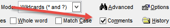

# GoFish FAQ

[What's New / Change Log](ChangeLog.md) 

[Report Issues / Ask Questions / Make Suggestions](https://github.com/VFPX/GoFish/issues)

<!-- <a href="#linkname">linkprompt</a>-->
<!-- <a id="linkname">linkprompt</a>-->
---

- <a href="#newinversion7">What's new in version 7?</a>
- <a href="#resultsscope">What does "Results" mean in the combobox choices for Scope?</a>
- <a href="#customudfScope">What does "Custom UDF" mean in the combobox choices for Scope?</a>
- <a href="#newinversion6">What's new in version 6?</a>
- <a href="#nodebugger">Why is GoFish so sloooow at times?</a>
- <a href="#columnsorting">How do I sort the columns in the grid?</a>
- <a href="#hiddenfeatures">Are there any "hidden" features?</a>
- <a href="#savechangesdialog">Why do I get the "Save Changes" dialog sometimes when I haven't changed anything?</a>
- <a href="#slowwildcardsearch">Why is wild card search sometimes so much slower than plain search?</a>
- <a href="#smartplainsearch">Is GF smart enough to use plain search if possible?</a>
- <a href="#twocommentchecks">Why are there two "Comment" checkboxes at the top of the screen? They seem to be in conflict with each other.</a>

---

### <a id="nodebugger">Why is GoFish so sloooow at times?</a>

GoFish can be ponderously slow if you have the debugger open.

Beyond that there is considerable variability depending on the scope of your search (i.e., the number of files searched) and whether you are using RegEx searching (which may take 3-5 times longer than plain or wildcard searches).

---

### <a id="columnsorting">How do I sort the columns in the grid?</a>

As you might expect, clicking on a column header causes sorting by that column.

However, there's a little more to it.  GF provides multi-level (or cascading) sorts:

- If you have sorted on column A and then sort on column B, column B becomes the primary sort, column A the secondary.  Then, sorting on column C makes C primary, B secondary, and A tertiary.  (There are a maximum of three levels.)

There are also sort-related options in the right-click context menu of column headers.

---

### <a id="resultsscope">What does "Results" mean in the combobox choices for Scope?</a>

The "Results" option allows you to search only the files in the current Results set, that is, the files currently shown in the grid and Treeview (same list in both places), instead of those in a folder or project. This provides a fast and progressive sub-search of the current result set.

Note that after using this new option you will need to reset the scope to its original value.

---

### <a id="customudfscope">What does "Custom UDF" mean in the combobox choices for Scope?</a>

This option provides for the use of a custom UDF to generate the list of files to be searched (instead of files in the scope folder or project). 

This allows for considerable flexibility in defining the scope; for instance. the UDF could use a Windows command like FindStr to pre-filter the files in a very large folder, greatly reducing the number of files GF would need to search.

The UDF has full access to all settings used in GF and updates a cursor which is to contain the list of files.

The sample PRG below shows the parameters supplied to the UDF, how to access some of the more commonly used settings, and how to update the cursor of file names.

You notify GF of the UDF file name in the Options form:

---

### <a id="hiddenfeatures">Are there any "hidden" features?</a>

There are indeed features that are not visible as they are "hidden" either in context menus or described in tooltips.

Here are the places with context menus your should  be aware of:

- Right click on column header in the grid

- Right click on a cell in the grid

- Right click on a node in the treeview

In addition, there is one unexpected feature: if you right-click on the "Search" label at the upper left of the form, it will open up [Object Explorer](https://github.com/VFPX/ObjectExplorer) for the GF form.  

---

### <a id="savechangesdialog">Why do I get the "Save Changes" dialog sometimes when I haven't changed anything?</a>
By default, if you double-click on a row in the grid to edit it and that row corresponds to a control contained in the form/class being edited, GF attempts to select that control (Issue #194).

In doing so, GF may change some properties and then reset them to their original values.  However, this causes VFP to think the form/class has been edited, so the "Save Changes" appears when closing the form/class.

You may disable this feature in the options screen:

--- 

### <a id="slowwildcardsearch">Why is wild card search sometimes so much slower than plain search?</a>

WildCard search has a lot more to do because it looks for matches in the current statement (which may span continuation lines) rather than just the current line. Abstractly:
1. Find a plain match to whatever precedes the first '*' in the search phrase.
2. Determine the entire statement where the match is found.
3. Find a wildcard match to the entire statement.

---

### <a id="smartplainsearch">Is GF smart enough to use plain search if possible?</a>

Plain search and wildcard search are equally effective if no wildcard characters are used.  Thus the only time there is a reason to choose one over the other is if wildcard characters are used and you need to indicate whether they are treated as wildcard characters.

If you use RegEx searching and no wildcard characters are used, then GF uses plain search.

---

### <a ID="twocommentchecks">Why are there two "Comment" checkboxes at the top of the screen? They seem to be in conflict with each other.</a>

This is a historical artifact.

The top one (which has been around for a long time), which can be seen here:

is used during the search phase to exclude comment records from the results grid. If you later decide you actually do want to see the comments, you must re-run the search. (This has been kept for backward compatibility.)

The lower one (new in version 7) is used to filter the grid after the search. Selecting "Code Only" has the effect of filtering out comments.

The suggestion is to leave the top one always checked and use the lower one to filter out comments if desired.

---

### <a ID="newinversion6">What's new in version 6?</a>

The goal of version 6 was to introduce some aspects of the UI for Code References into GF.

First, instead of having a single folder to house all of the settings and search history, it is possible to have a distinct such folder for each resource (FoxUser) file.

Second, the TreeView can have nodes for all the search history (mimicking Code References behavior) and this can be filtered to history just for the current search scope.

The full list of new options for version 6 can be seen in the page "New in V6" in the options form.

---

### <a ID="newinversion7">What's new in version 7?</a>

#### Major Enhancements 
* Wildcard searching now finds matches across continuation lines.
* "Whole Word" searching now applies to each word in the search phrase in wildcard searching.
* Dramatic optimization of RegEx searching -- as much as seven times faster.

#### Code View pane enhancements
* The Code View pane emphasizes the entire statement (that is, including continuation lines) instead of just the line where the match occurred:
    * The entire statement is enclosed in a red box.
    * All matches in the statement are highlighted.
* Colors in the Code View pane match the user's own colors in IDE code windows.
* The Code View pane for matches in MNX files has been enhanced to be more descriptive, showing the `Prompt`, `Command`, `Procedure`, and `SkipFor` fields for the match.

#### Other enhancements

There are numerous other enhancements, most of which do not need to be described other than to say that some behaviors have been improved.

Some, however, need to be noted, as they would not be obvious.

* The normal behavior when you double-click on a row in the grid from a SCX or VCX (that is, opening the method for editing) has been enhanced so that, if possible, the the object will be selected as if you had clicked on the object yourself.
* New right-click context menus:
    * on nodes in the treeview
    * on column headers in the grid
    * on cells in the grid
        * including option to filter on the values in the column 

The full list of new options for version 7 can be seen in the page "New in V7" in the options form.

---

[What's New](ChangeLog.md) 

[Report Issues / Ask Questions](https://github.com/VFPX/GoFish/issues)
