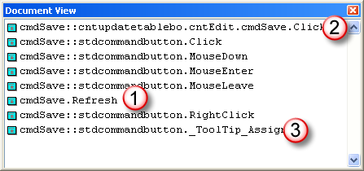

### IDE Tools: Code Listings

Applies to tools:

_Code Listings:_

*   _This control_
    *   _All Code_
    *   _All Code and Inherited Code_
*   _This control and Children_
    *   _All Code_
    *   _All Code and Inherited Code_

There’s not much to explain about these tools; they all pop up a window with method code. 

Some clarifications:

*   ‘This control’ means:
    *   The currently selected control being displayed in PEM Editor (if it is open)
    *   or the currently selected control (as would be displayed in the Property Window).  These two are almost always the same, but will differ at times
*   ‘Children’ means: all the child objects of the control, down through the entire tree of objects.
*   ‘All Code’ means all methods or events with non-default code
*   ‘Inherited Code’ means more than you would expect.  For any object which is a member of a parent class, this shows the code for the object ***in the parent class***. Note that native VFP does not provide any mechanism for seeing this code.  (See the sample below.)
*   The code is displayed in such a way that VFP Document View helps with navigation.

The example below shows Document View for a code listing of a command button ‘cmdSave’ and its inherited code:

1.  There is one event that has non-default code.
2.  This object is a member of the parent class ‘cntupdatetablebo’, and you can see that there is a code for the click event there.
3.  And there are a number of events that have code in the baseclass ‘stdcommandbutton’

