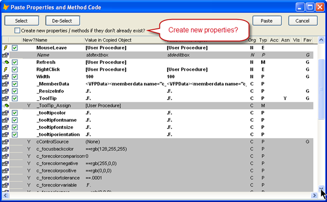

### IDE Tools: Paste properties and methods code

This tool pastes some or all of  the properties and method code that has been copied (see [Copy properties and method code](pemeditor_tools_copy.md)) into another object.  The object being copied into can be in the same form or class, in a different form or class, or into the parent class (more on this last point at the end of this section).

This form shows you which properties or methods cannot be copied because they do not exist in the object (greyed out) and allows you to select which of the remainder you wish to paste.

If pasting into a form or class (rather than into an object contained in a form or class), it is possible to create new properties and events.  In this case, there will be a checkbox where you can indicate whether you want to create new properties or methods if they don't already exist.

As mentioned in the elsewhere, the "clipboard" that the properties and method code gets pasted into survives even if you close PEM Editor; they will survive as long as 'Clear All' is not used, which removes the object containing them from memory.

When **re-factoring**, the following sequence can be used to copy properties and methods to the parent class of an object:

*   Use [Copy properties and method code](pemeditor_tools_copy.md)
*   Use [Edit Parent Class](pemeditor_tools_edit_parent_class.md) 
*   Use this tool to paste the desired properties/methods into the parent class.
*   Close the parent form/class and re-open the original form/class.
*   Use [Compare with Parent Class](pemeditor_tools_compare_with_parent_class.md) to reset to default any properties or methods which are now identical to the properties or methods in the parent class.  
