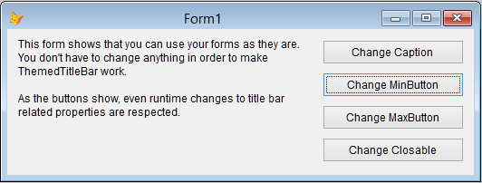
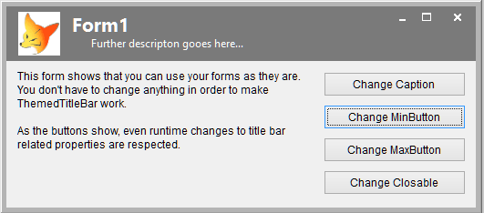

# ThemedTitleBar

Project Manager: Markus Winhard 

The TitleBar of a VFP form displayed ‘In Screen’ or ‘In Top-Level Form’ looks a bit outdated nowadays. At least running in Win8 and compared to Office 2013 or Visual Studio 2013. This project provides a modern drop-in replacement for the default TitleBar, requiring no code changes to existing forms.

Before adding ThemedTitleBar:

After adding ThemedTitleBar:

How to:

* Include ThemedTitleBar.vcx and ThemedTitleBarBase.vcx in your project.
* Drop the ThemedTitleBar class on every form where you want to use it.
That's it.

Run the form ThemedTitleBarSample.SCX to see an example.

Tweaks:
* Performance is better if all your forms use the same ThemedTitleBarSettings instance. To do so, write this line in your main program: _Screen.NewObject( "ThemedTitleBarSettings", "ThemedTitleBarSettings", "ThemedTitleBar.vcx" )
* If you want to change default behavior or property values, feel free to overwrite methods and properties of the classes in ThemedTitleBar.VCX. This way you can use later versions of my ThemedTitleBarBase.VCX and don't lose your settings.
* Change ThemedTitleBarSettings.nTitleBarBackColor and .nTitleBarforeColor to use different colors.
* Write Thisform.ThemedTitleBar1.BackColor=RGB(...) in your form's Init() to give a special form a different TitleBar BackColor.
* ThemedTitleBar.lAutoMoveFormControls=.T. (default) moves the controls on your form downward to make room for itself. This happens between first Form.Show() and first Form.Activate(). Set to .F. to suppress this behavior.
* Add properties ThemedTitleBarDescription and ThemedTitleBarImage to your form base class. Set them at the form level. The sample form shows how to use it.
* If you don't like the property names ThemedTitleBarDescription and ThemedTitleBarImage you can change them in the ThemedTitleBar class. Please see it's properties cDesciptionProperty and cImageProperty.
* ThemedTitleBarSettings checks if a font listed in it's properties cCaptionFontFamily and cDescriptionFontFamily is available. The list of fonts is comma separated. The first available font is used.
* If you're using a resizer on your form and don't want it to change ThemedTitleBar's height, try setting Thisform.ThemedTitleBar1.lFixedHeight = .T.
* If you want all your forms to use ThemedTitleBar, write code like this in your form baseclass' Init():
 Thisform.NewObject( "ThemedTitleBar1", "ThemedTitleBar", "ThemedTitleBar.vcx" )
 Thisform.ThemedTitleBar1.Visible = .T.
