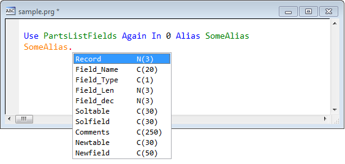
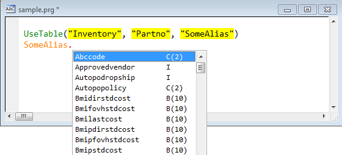
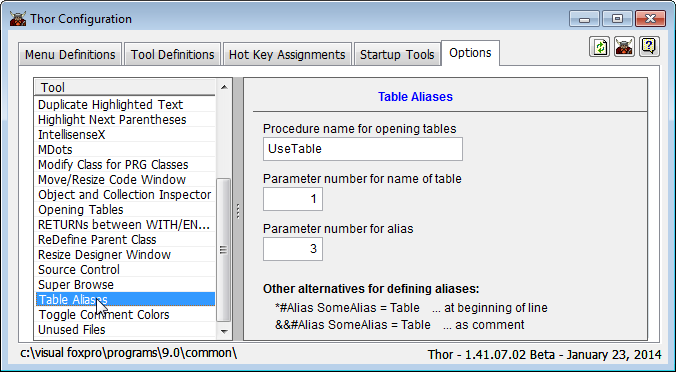
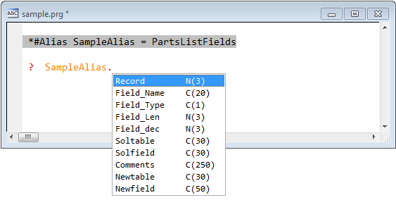

Thor TWEeT #11: <a href="https://github.com/VFPX/IntelliSenseX" target="_blank">IntellisenseX</a>: Aliases for VFP Tables
===

Last week’s [TWEeT #10](Tweet_10.md) demonstrated that IntellisenseX recognizes aliases for tables used within SELECT statements.

IntellisenseX now also recognizes aliases used for VFP tables, in three different varieties:

*   In procedures where the table is opened using either USE or by a UDF.
*   Where the alias is a constant alias used throughout an application and can be opened by a [Plug-In](../Thor_add_plugins.md).
*   By specifying an special directive in your code that identifies the file that an alias refers to

**Procedures where the table is opened using either USE or by a UDF**

IntellisenseX now recognizes aliases of tables opened by USE (when referenced in the same procedure). This happens automatically and is not dependent on the order of the phrases in the USE command.

Similarly, IntellisenseX recognizes aliases of tables opened by a UDF as long as the name of the table and its alias are passed as parameters to the UDF. In the following example, the UDF `UseTable` is called with the first parameter being the name of the table and the third being the alias.

In order for this to work, you must record the name of your UDF, etc., in the Thor Configuration form:

1.  Open the Thor Configuration form
2.  Go to the Options page
3.  Click on “Table Aliases” on the left
4.  Fill in the name of the UDF and the positions in the parameter list for the name of the table and the alias.

#### Where the alias is a constant alias used throughout an application

IntellisenseX also supports the case where an alias refers to the same table throughout an application.

_In my own environment, tables are never referred to by name. They are always opened by a UDF (called with the alias), which uses a meta-table to determine the name and folder for the table. Thus the alias name can always be used to open the table._

This is handled by creating the [Plug-In](Thor_add_plugins.md) “OpenTable”. This plug-in works very simply – it is called with a single parameter, the (potential) alias.

If that alias can be used to open the desired table, do so, and return the alias as a result; if not, return a logical or empty result

All of this work is done in the (originally empty) procedure OpenMyTable.  Just modify to fit your own environment.

#### Directives to specify the table than an alias refers to.

This last alternative is the least satisfying – you can add directives in you code to indicate the table than an alias refers to.  You might use this, for instance, where a table is opened in one procedure or method and referenced in another.

There are two (very similar) directives:

    *#Alias SomeAlias = MyTable  … at the beginning of a line
    &&#Alias SomeAlias = MyTable  … at the end of a line

For instance,

See also [History of all Thor TWEeTs](../TWEeTs.md) and [the Thor Forum](https://groups.google.com/forum/?fromgroups#!forum/FoxProThor).
