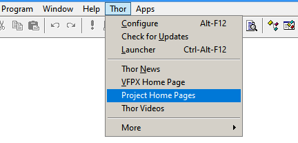
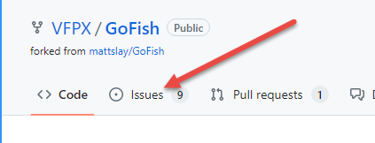
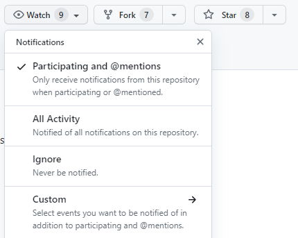
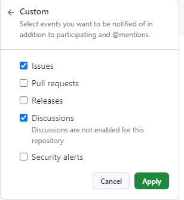

# Thor News

**Got Comments, Suggestions, or Bug Reports?** 
---

### #49, 2023-04-08

Do you know where to go if you have questions, comments or bug reports for Thor or any of the projects available from Thor?

> For many years we posted issues or comments on the Thor or GoFish Google Groups forums.  However, those forums have been deprecated. The preferred location now is the Issue tabs in the GitHub repository for the project your issue relates to.

Thor provides two different ways to get to the GitHub repository for a project, both available from the Thor menu:

1. Item "VFPX Home Page" takes you to the VFPX home page ( http://vfpx.org ).  The Projects page there is the most used page; it lists the projects alphabetically (providing a link to the home page for it) and has separate columns for a brief description, category, and status.  This list also includes many VFPX projects that are not available from Thor's Check For Updates as well as some other VFP open-source projects that aren’t considered to be part of VFPX.

2. Item "Project Home Pages" opens up a form listing all projects that Thor can download along with their status; the project name is a link to the home page.

To add or review issues for a project, click on "Issues" at the upper left of the project home page:

You're encouraged to watch activity for projects you're interested in. Click on "Watch" at the upper right of the home page. You'll receive notifications via email, enabling you to learn more from the comments of others.

You can also consider using the "Custom" option to filter which events you are interested in.

---

### **[News Archives ](Archives.md)** 

### **[Thor Videos ](Thor_videos.md)** 

### **[VFPX Home Page ](http://vfpx.org)** 

---

