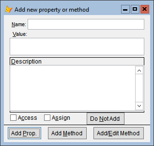
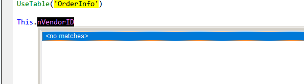

# Thor News

**More Go To Definition Enhancements** 
---

### #50, 2023-04-15

#### Searching for variable assignments

**GTD**, when used on a variable name, will find the statement where the variable was last assigned (or index assigned), as long as it's in the same procedure.  Repeated uses of **GTD** when used on the same variable name will take you through all places where the variable is assigned.  This is much like using Ctrl-F, searching backwards for 'whole word', but ignoring statements that reference but do not assign the variable.

#### Searching for cursor creation

**GTD**, when used on a cursor name, will locate the `Into Cursor` or `Create Cursor` statement where the cursor was created, as long as it's in the same procedure.

#### Resolving Name Conflicts

In some cases, a name being searched for may not be unique.  You might, for instance have a table named "Admin", as well as a form, report, class, and class library of the same name.  **GTD** will stop searching after the first one it finds.

Such conflicts can be avoided in those instances where the name you are searching for is part of a statement that uses VFP Keywords.  You can point **GTD** in the right direction by clicking on the first keyword in statements like these:
   - DO Admin
   - DO FORM Admin
   - REPORT FORM Admin
   - NEWOBJECT (Admin, 'Admin.vcx')
   - CREATEOBJECT (Admin)
   - LOCAL loObject as Admin of 'Admin.vcx'
   - DEFINE CLASS classname as Admin of 'Admin.vcx'
   
Note that you can open the class library in the examples above by clicking on the file extension or by highlighting the entire file name (with or without quotes).

#### Creating Properties and Methods

**GTD** provides a number of different ways to add PEMs to a form or class that is being edited:
* `Thisform.newpropertyormethod`
* `Thisform.NewMethod(param1, param2, ...)` && this works if you click immediately after the right parenthesis.  The method is created with the supplied parameters.
* **GTD** when the cursor is in white space in a code window (that is, not on a word)
* **GTD** when not in code window (the form or class being edited, the command window, property window, project manager, and so on)
			
	

**GTD** also works in conjunction with [IntelliSenseX](https://github.com/VFPX/IntelliSenseX).  When you have entered the name of the new property or method, you can use **GTD** directly to go the form for adding the property or method.

 
---

### **[GoToDefinition Home Page ](https://github.com/VFPX/GoToDefinition)** 

### **[News Archives ](Archives.md)** 

### **[Thor Videos ](Thor_videos.md)** 

### **[VFPX Home Page ](http://vfpx.org)** 

---

