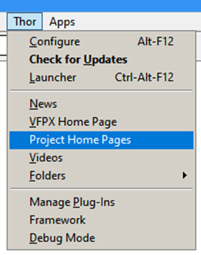
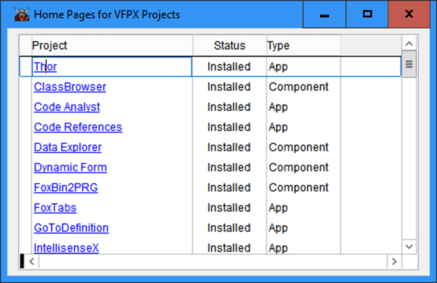
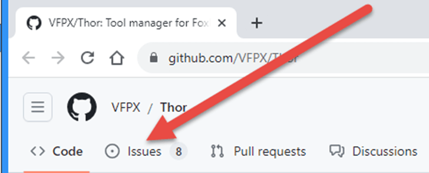

# Thor News

**Bug Reports and Suggestions** 
---

### #51, 2023-08-19

### Reporting bugs, making suggestions or other comments

Your thoughts, comments, suggestions, and bug reports are all welcomed; we want to hear what could be done to improve these tools as well as what is not working correctly.

The standard way to do this is on the issue page in GitHub for the tool in question.  (If it’s unclear to you which GitHub page to go to, your best bet is to use the page for Thor Repository.)

#### When reporting a bug, please provide as much information as possible.
Please imagine what you, as a developer, would like to receive when notified of an error. If possible, please provide screenshot(s) of the following:
* The error message itself
* Windows from the debugger:
    * Trace
    * Code Stack
    * Locals

#### Not familiar with GitHub?
If GitHub is not familiar territory, follow these steps:

1. From the Thor menu pad, execute “Project Home Pages”
 

2. From the form that shows the home pages for all VFPX projects, click on the home page of the project for your comment (or Thor Repository, if unsure).
 

3. Click on the Issues button on the home page:
 
Figure 7. Click on the Issues button.
 

---

### **[News Archives ](Archives.md)** 

### **[Thor Videos ](Thor_videos.md)** 

### **[VFPX Home Page ](http://vfpx.org)** 

---

