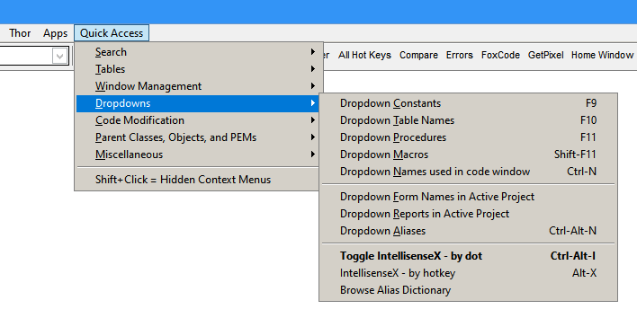
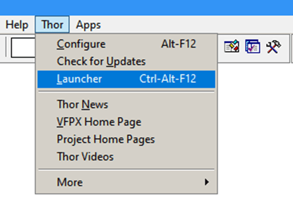
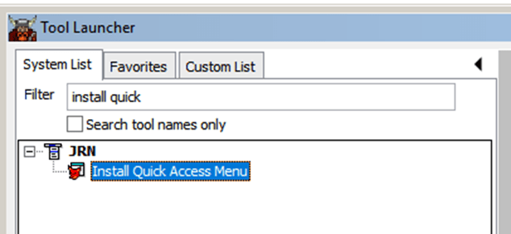
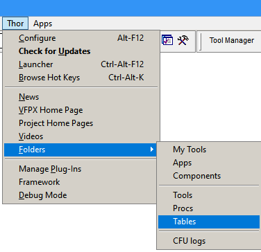

# Thor News

**Quick Access Menu** 
---

### #52, 2023-09-02

The Quick Access Menu is a personal list of favorite tools, developed over time, in the dev shop where Jim Nelson and Steve Howie work.

It is installed by Thor tool "Install Quick Access Menu" and provides easy access to a host of the most used Thor tools, all accessible from one place.  The tools are grouped into convenient categories that make them easy to find and make it easy to find related tools.

The Quick Access Menu is accessed from either the system menu pad (as shown below) or from a user-assigned hot key.
 

### Installing the “Quick Access Menu”

To install the Quick Access menu, run the Thor Launcher:

Enter "Install Quick" in the filter box, and then double-click on "Install Quick Access Menu"

Doing so will:
* Create a backup of all Thor tables involved in case there is need to restore to the previous state. If this is needed, see the following section.
* Create the "Quick Access" menu pad in the system menu.
* Assign a hot key so that the same menu can be accessed as a pop-up, if desired.
* Assign hot keys to the most common tools.  This will NOT change any existing hot key assignments - tools already having hot keys will not be changed and no hot key in use will be re-assigned.

Installing this is a one-time event.  There will not be any updates to it, so the Quick Access menu can re-configured as desired by using the Thor Configuration Form (Alt+F12).  Using it will enable you to:
* Change the name of the system menu pad (or remove it).
* Change the hot key used to access it.
* Add, rename, or remove sub-menus.
* Add, rename, or remove tools used in sub-menus.
* Add, change, or remove hot keys assigned to sub-menus and tools.

### Un-installing the "Quick Access Menu"

When "Quick Access Menu" is installed, a new sub-folder is created in Thor's Tables folder with copies of all the files in that folder.

To un-install, copy all the files from that sub-folder back into the Tables folder. 

*Be aware that this will reverse all changes made in Thor since the backup was created, including menus, hot keys, and other Thor settings.  In other words, it best to make this determination without any other intervening work in Thor.*

The Tables folder can be opened here:

---

### **[News Archives ](Archives.md)** 

### **[Thor Videos ](Thor_videos.md)** 

### **[VFPX Home Page ](http://vfpx.org)** 

---

