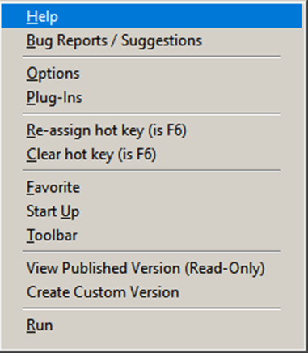

# Thor News

**The Hidden Context menu** 
---

### #53, 2023-09-16

### Why a context menu for individual Thor Tools?
One of the difficulties working with Thor, a sprawling application that's more than a dozen years old, is how to find the documentation for any its many tools (now numbering close to 200).  Until now, Thor has not provided a consistent or reliable way to do so.

A context menu, applicable to a single Thor tool, has been developed to address this issue.  The context menu provides direct access to the available documentation for the tool, as well as a host of other features applicable to the tool, including how to best report bugs and make suggestions, assign hot keys, and so on.  

The context menu is available for all menu items that appear in *any* menu created by Thor, including those in “Thor Tools”, "Quick Access Menu", any others in the system menu pad, and any custom pop-up menus. It is called the Hidden Context Menu because, as you will see, it is not accessed the usual way by right-clicking on an item.

### Using the hidden context menu
Normally, the only thing you can do with items that appear in a FoxPro menu is to choose one of the items to execute.  You can do so by
* clicking on an item
* using the access key for an item (the underlined character)
* or navigating to the item and pressing [Enter]

FoxPro does not provide any mechanism for creating a context menu for the items in a menu, so using right-click on a menu item has no effect.

However, Thor provides context menus for all menu items that appear in *any* menu created by Thor, including those in “Thor Tools”, "Quick Access Menu", any others in the system menu pad, and any custom pop-up menus. 

This context menu is accessed by pressing the shift key when selecting an item from a menu.  To be clear, you can access the context menu for an item in any Thor menu by **holding down the shift key** and
* clicking on an item
* using the access key for an item (the underlined character)
* or navigating to the item and pressing [Enter]

The context menu contains items that relate specifically to the selected tool. While all of these features are available elsewhere in Thor, they are concentrated here to make them all visible and readily accessible in a single place.

Here's a sample context menu.  Note that some of the items shown here might not appear, depending on the tool selected.

#### Help
This option displays the available documentation for the selected tool. Many tools will take you to the web page for that tool and the remainder will use a simple form.

#### Bug Reports / Suggestions 
This option opens the issue page in GitHub for the project that the tool belongs to so that you can report bugs, add suggestions, or read and comment on any current issues.

#### Options
Opens the Options tab on the [Thor Configuration Form (Alt+F12)](https://github.com/VFPX/Thor/blob/master/Docs/Thor_help.md) for this tool.  

#### Plug-Ins
Opens the Plug-Ins management form, showing only those plug-ins that apply to this tool.

#### Assign (or Re-Assign) Hot Key
Allows you to assign the hot key for this tool.

#### Clear Hot Key
Allows you to remove the hot key assigned to this tool.

#### Favorite
Toggles whether the tool is a Favorite.  Favorites appear in bold in Thor menus (Thor Tools, Quick Access or any others) and also in the second page of the Thor Launcher.

#### Start Up
Toggles whether the tool is run when you start Thor.  There are very few tools for which this makes sense; PEM Editor and IntellisenseX, but few others.

#### Tool Bar
Allows you to control whether the tool appears in the Thor toolbar and the caption used if it is to appear.  Tool bar items appear in alphabetical order.

#### View Published Version (Read-Only)
Opens the PRG for the tool in read-only mode.  You are prevented from modifying this PRG because later Check For Updates will wipe out any changes you make.  Use the next option instead.

#### Create Custom Version
This opens a copy of the published PRG so that you can modify it for your own needs. By default, it will be saved in Thor’s “My Tools” folder, although you can save it in any folder in your path.  Thor uses the custom version, if available, instead of the published version.

### Using Ctrl key to go directly to Help

If you are interested in help for a tool, you can bypass the hidden menu by using the Ctrl key instead of the Shift key, by using either:
* Ctrl + Click
* or Ctrl +  [Enter]

---

### **[News Archives ](Archives.md)** 

### **[Thor Videos ](Thor_videos.md)** 

### **[VFPX Home Page ](http://vfpx.org)** 

---

