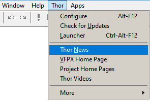

# ThorNews

Version 1 Released 2023-04-06

## Introduction

This simple project contains all of the Thor News items.  There are three files of interest:
1. The most recent news item (named 'Item_NNN.md'), where NNN is assign sequentially.
2. The text file containing the number of the most recent new item ('CurrentItemNumber.txt')
3. The list of all news items, with links to them ('Archives.md')

News Items are accessed two different ways:
1. Each time Check For Updates ("CFU") is run, it checks for to see if there is a new item; if so, it opens it.
2. From the Thor menu in the system menu:

---
### **[News Archives ](NewsItems/Archives.md)** 

### **[Thor Videos ](NewsItems/Thor_videos.md)** 

### **[VFPX Home Page ](http://vfpx.org)** 

---

## Helping with this project
See [How to contribute to ThorNews](.github/CONTRIBUTING.md) for details on how to help with this project.

Last changed: _2023-04-07_ 

