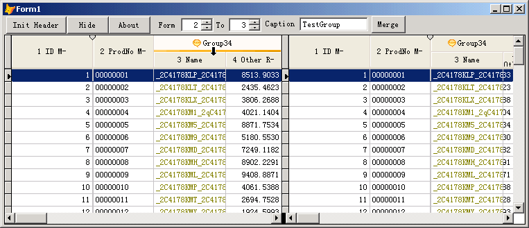

# VFP Grid ManyHeader

**Custom container class for replacing and extending the VFP header class**

The goals of this project are:

* Allow 2 or more levels of headers per column. These custom headers can also be merged with one another.

* Provide a more intuitive operation and interface for the grid's lock columns feature.

* Address the flaw: a column can't be moved after having been locked.

* Resolve the problem: user can unlock columns by right clicking with their mouse.

* Support Theme (new for ver 2.1 or later)

## Version 2.13 update history

-- 2008-07-06  
Add14-1: MergeHeader method can Designated new header height. If value Equivalent to -1 or not designated, The average allocation grid's headerheight.

Add14-2: If change header height in runtime, try move mouse to The bottom left corner
Note: When you restore header height to the average allocation grid's headerheight. Hold down the adjustment of the high and move up, and let the mouse out of from grid. If you want to adjust the merger is all out of the height, please release the mouse before the press the Ctrl keyboard letting go, until the completion of adjustment.

Add14-3: Use \n as the line breaks. If you need the characters, use \\n.

Add14-4: Add property FontName, FontSize, FontStyle, BackColor, ForeColor And Align, When you combined the head when the head table will default to this property,Cancel the original header from the first row of the set.

Thanks to JimRNelson