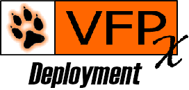

# VFPX Deployment - Best practice
   
These document gives an idea how to set up a VFP project for VFPX and  Thor - and some general points to publish on a remote server.

See the great article [Anatomy of a VFPX Project](https://doughennig.blogspot.com/2023/05/anatomy-of-vfpx-project.html) by Doug Hennig.
It shows the setup of *VFPX related data* and *Thor* in two chapters.

See https://vfpx.github.io/newproject/

There are endless informations about the problem on the web.   
This document only gives a brief one about some tasks not usual for VFP developers. It focus on github, using for gitlab is not that different.

See [VFPX Templates](./vfpx_templates.md) what VFPX Deployment can do to support with this.

----
## Table of contents
- [Structure documentation](#structure-documentation)
- [Documentation](#documentation)
  - [Project Documentation](#project-documentation)
  - [Contribution](#contribution)
- [Thor](#thor)
- [VFP binary sources](#vfp-binary-sources)
- [Community Standards](#community-standards)

## Structure documentation
If possible place a README.md into each folder of your project. Give a brief idea what the folder is about. Don't miss the project name.   

For the root folder of your project there is more work to do. This is the primary entry point to your project, that is:
- describe the goal of the project
- brief information about the project managers
- gives information about recent version and release date
- points to deployment (for example: *Use Thor ...*)
- points to documentation, this is project documentation, changelog as well as contribution

For the root README.md, this VFPX Deployoment will create a brief version from template. The file need to be altered to your needs.   
Each run of VFPX Deployoment will auto update Version number and release date.

Notable exclusion. <u>.github\\README.md</u>.
This file would be used by github as product documentation on the root of your project instead of the *README.md* placed there.
This is a bit unusual.

## Documentation
### Project Documentation
Usualy in the docs folder a documentation how to use your project is given. It also contains a changelog.

### Contribution
The .github folder usualy stores stuff that is used by to give gitub access to some information.   

This typically a CONTRIBUTION.md visible on githubs *Insights* telling other people if and how they might contribute to a project.

It also contains templates to create issues.

VFPX Deployoment create a CONTRIBUTION.md and two simple issue templates. They need to be altered to your needs

## Thor
The more complex creation of Thor deployment is discussed in [Documentation](./Documentation.md).

## VFP binary sources
Using git, VFP binary sources are pain.
- No way to diff
- No way to merge
- Bloat of the repository

Consider to only store a text file for your binary sources to git.
[FoxBin2Brg](https://github.com/fdbozzo/foxbin2prg) does a great work here. See there   

It might look like you end up with extra work, and it requires some attention, but it is worth it.
The tool does reliable work on only-text for a long time.

At least provide text version, so you got at least a chance to diff.

## Community Standards
On your github repository, *Insights -> Community Standards*, you will find some stuff that some think is usefull for a project. 

VFPX Deployment set up the most basic - root folder README.md and .github\\CONTRIBUTING.md - to work with a project.
Look up [Community Standards](https://opensource.guide/) for more information.

----
Last changed: 2023-05-18

