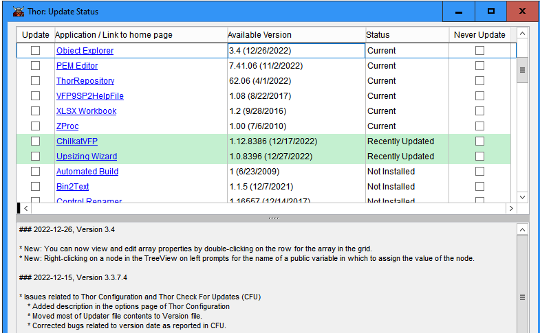
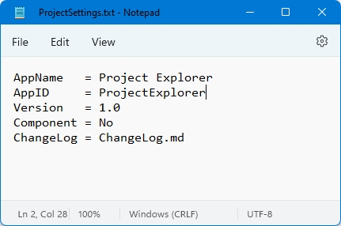
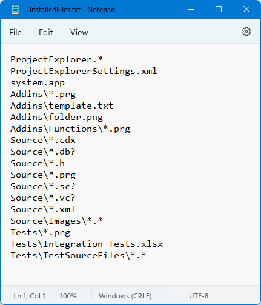

# VFPX Deployment

## Version <!--VERNO-->1.7.08750<!--/VerNo-->

These instructions describe how to use VFPX Deployment to include your project in the Thor *Check for Updates* (CFU) dialog so users can easily install your project and update to the latest version without having to clone your project's repository or manually download and extract a ZIP file.   
It also sets a minimum of community standards as used for VFPX and github.



See the great article [Anatomy of a VFPX Project](https://doughennig.blogspot.com/2023/05/anatomy-of-vfpx-project.html) by Doug Hennig.
It shows the setup of *VFPX related data* and *Thor* in two chapters.
This version of VFPX Deployment combines both to one tool, but the principles remain. (Remember, set up **.github\\CONTRIBUTING.md**)

A brief idea how to give your project a standard look is discussed in [BestPractice.md](./BestPractice.md).

----
## Table of contents
- [Using this document](#using-this-document)
- [Prerequisites](#prerequisites)
- [Overview](#overview)
- [Setup Guide](#setup-guide)
- [Configuration](#Configuration)
  - [Folder](#folder)
    - [BuildProcess](#buildprocess)
    - [InstalledFiles](#installedfiles)
    - [ThorUpdater](#thorupdater)
    - [.github](#github)
    - [docs](#docs)
    - [docs\\images](#docsimages)
    - [Root folder](#root-folder)
  - [Settings](#settings)
  - [Public variables](#public-variables)
  - [Placeholders](#placeholders)
- [Setting up the build process](#setting-up-the-build-process)
  - [git](#git)
  - [Download the VFPX Deployment tool](#download-the-vfpx-deployment-tool)
  - [Customize the project settings for your project](#customize-the-project-settings-for-your-project)
  - [Specify what files are to install on the target computer](#specify-what-files-are-to-install-on-the-target-computer)
    - [InstalledFiles.txt](#installedfilestxt)
      - [Target](#target)
      - [Excludes](#excludes)
  - [Customize the version template](#customize-the-version-template)
  - [Customize the build tasks](#customize-the-build-tasks)
    - [BuildMe](#buildme)
    - [BeforeZip](#beforezip)
    - [AfterBuild](#afterbuild)
  - [Customize documentation](#customize-documentation)
    - [Templates substitution](#templates-substitution)
    - [File substitution](#file-substitution)
      - [README.md](#readmemd)
      - [Substitute.txt](#substitutetxt)
  - [VFPX Deployment process](#vfpx-deployment-process)
- [Running the build process](#running-the-build-process)
- [First time task to deploy](#first-time-task-to-deploy)
- [Checking for updates](#checking-for-updates)
- [Test your project](#test-your-project)
- [Example](#example)
- [See also](#see-also)
- [Set up for existing projects](#set-up-for-existing-projects)
  - [Limitations](#limitations)

## Using this document
- Paths are relative to your projects root folder. This is the toplevel folder of the local git repository you can get invoking `git rev-parse --show-toplevel`.
- Strings like {This} must be replaced with the value of the entry from the [Settings](#settings) file.
Example:  
Settings contains `AppID = VFPXDeployment`, then *Thor_Update_{AppID}.prg* is *Thor_Update_VFPXDeployment.prg*
- Strings like \[This\] must be replaced with a user set value.
- Links to example files are in general the files used to create VFPX Deployment.   

Note: For Placeholder, { and } are literals.

## Prerequisites
- you should know how to use git in one or the other way
- you should be familiar with MarkDown
- optional you should know how to work with FoxBin2Prg

## Overview
To make it easier to create the files necessary to support Thor CFU, an automated build process is used. The main component of this process is Thor_Tools_DeployVFPXProject.prg, a generic program that works with any project. After doing the necessary set up (discussed later), you'll run Thor_Tools_DeployVFPXProject.prg whenever you release a new version of your project.

In addition to whatever subdirectories your project root folder contains, it will also contain BuildProcess, InstalledFiles, and ThorUpdater subdirectories, and if enabled, some folders and files used for documentation in VFPX community standard.

## Setup Guide
This is the step-by-step guide to set up your VFPX / Thor project. Some information is identical to [VFPX Deployment process](#vfpx-deployment-process).
See [Setting up the build process](#setting-up-the-build-process)

In it's most simple way the setup for a project works like:
1. First run of VFPX Deployment - Create the [BuildProcess](#buildprocess) folder
2. **User now must fill in [BuildProcess\ProjectSettings.txt](#settings).**
3. Second run of VFPX Deployment
   - As soon as *Include_VFPX* is enabled. Create additional VFPX community structure, see [VFPX Templates](./vfpx_templates.md).
   - otherwise as like all following runs of VFPX Deployment.
4. **If created, user must fill in information for VFPX community structure. Alter .gitignore**
5. Proceed with [First time task to deploy](#first-time-task-to-deploy)
5. Second and any following run of VFPX Deployment will create a new version of your project to push.

More detailed:
1. Install Thor
2. Download [VFPX Deployment](#download-the-deployment-tool) from Thors *Check for Update* (CFU)
3. If not already done, create a **remote** git repository for your project, for example at github. See [VFPX Add a Project](https://vfpx.github.io/newproject/)
4. If not already done, create a **local** git repository for your project root folder. Just init, do not add files.
   - or clone the remote, that's up to your choice and level of git knowledge.
5. Open your pjx or CD into your project (anywhere) or simple
6. Run *VFPX Project Deployment* from Thor/Applications menu
  - The program tries to figure out your project root (this is the top level folder git uses) from information provided by git in the following order:
    1. The recent path in VFP
    2. Home of `_VFP.ACTIVEPROJECT` if there is one (user will be prompted to use it, if found)
    3. User prompt for folder
7. If the folder [BuildProcess](#buildprocess) exists, proceed to step 10, else it's a first run. VFPX Deployment copies some files into that folder and quits
8. Now you need to set your basic project information in [BuildProcess\\ProjectSettings.txt](#settings)
   - AppName - Mandatory
   - AppID - Mandatory
   - Version - Mandatory
   - Component - Mandatory
   - Repository or the pair Repository_URL + Repository_Branch- Mandatory if remote repository is not at github.com/VFPX/{AppID}/master
   - Others, see [ProjectSettings](#settings)
9. Rerun 
10. The [ProjectSettings](#settings) will be read
11. Additional processing and tests run
12. If *Include_VFPX* is set, the program checks and creates several [Folders and files](#folder).
If something is missing, the file or folder is created, and some [Placeholders](#placeholders) like {AppName} name are substituted.
See [VFPX Templates](./vfpx_templates.md)
13. Fill in documentation, .gitignore etc
14. [Test your project](#test-your-project)
15. See [First time task to deploy](#first-time-task-to-deploy) to publish your project to Thor.
16. To run VFPX Deployment for production, one need to set up some information, documentation etc.
What to do should be noted step by step into **.github\\CONTRIBUTING.md** so everybody know what to do.
17. push

## Configuration
### Folder
This shows the use of folders in a project **using VFPX Deployment**. For the use of folders in the **VFPX Deployment project** see
[VFPX Deployment](./vfpxdeployment.md).

#### BuildProcess
This folder is mandatory.   
BuildProcess contains the files for the build process:

- [ProjectSettings.txt:](#settings) contains project settings, such as project name and version number.
- VersionTemplate.txt: contains the template for the Thor CFU version file. Although it has a TXT extension, it actually contains VFP code.
This will be used to create the version file for the remote *ThorUpdater\{AppID}Version.txt* file
- [BuildMe.prg:](#buildme) contains custom code you write to do whatever is necessary for the build process. It can use public variables created by VFPX Deployment (discussed later). This program is optional.
- [BeforeZip.prg](#beforezip) contains custom code that is intended to alter the staging folder just before zipping.
For example to create filelist to uninstall. It can use public variables created by VFPX Deployment (discussed later). This program is optional.
- [AfterBuild.prg:](#afterbuild) contains custom code you write to do whatever is necessary after the build process. It can use public variables created by VFPX Deployment (discussed later). This program is optional.
- [Substitute.txt](#substitutetxt) contains a list of files or folders that will be processed like [README.md](#readmemd) on each run to substitute Version and date. This file is optional.
- Thor_Update_{AppID}.prg (where *AppID* is the value of the AppID setting in ProjectSettings.txt): the Thor CFU update program, which contains the URLs for Thor to use to download the version and ZIP files to install the tool. This file is created the [first time](#first-time-task) you use the VFPX Deployment process and then not updated again after that.
- [InstalledFiles.txt](#installedfilestxt): staging folder, contain the paths for the files to be installed by Thor CFU. This file is optional.
  - Files
  - File skeletons
  - Paths (ending with \\)
  - Files to exclude (starting with !)
- Thor_Update_{AppID}.prg: The file to control the update process in Thor. See [First time task to deploy](#first-time-task-to-deploy).

#### InstalledFiles
This folder is mandatory.   
This is a staging folder that contains only the files Thor CFU should install, not other files related to your project (such as git-related files, README.md, etc.). There are two options for copying the necessary files into this folder:
- You can manually create the InstalledFiles folder and copy the necessary files into it.
- If [InstalledFiles.txt](#installedfilestxt) exists, in the BuildProcess folder, VFPX Deployment copies the files listed in it to the InstalledFiles folder (creating that folder and any subdirectories of it if they don't exist).
  - If [InstalledFiles.txt](#installedfilestxt) exists, the *Clear_InstalledFiles* settings controls if all files will be removed from this folder to create an empty folder to copy to.
- If the gitIgnore_InstalledFiles setting is "YES", a .gitignore file will be added to this folder to keep it out of the repository. Note: If already in the repo, this will not remove the files!


> Note: you can specify a different folder name using the InstalledFilesFolder setting in [ProjectSettings.txt](#settings).

#### ThorUpdater
This folder is mandatory.   
This contains the Thor CFU files generated by the build process (VFPX Deployment creates this folder if necessary):
- {AppID}.zip (*AppID* is the AppID value specified in ProjectSettings.txt): the zip file downloaded by Thor CFU to install the project. This file is created by VFPX Deployment by zipping the contents of the staging InstalledFiles folder.
- {AppID}Version.txt: the Thor version file downloaded by Thor CFU to decide if a newer version is available (it compares the version number specified in this file with the version number in the copy of the file on your system) and also to contain other information such as the text displayed for the selected project at the bottom of the Thor CFU dialog.
**Note** The file used might be changed with the *VersionFile_Remote* setting. This is usefull for old projects.

> for the following points, see [VFPX Templates](./vfpx_templates.md)

#### .github
Optional, only created if *Include_VFPX* is set.   
Folder to store some files to interact with github.

Those files should be changed to the need of the project
- *CONTRIBUTING.md* A file telling how to participate on the project, and what to do before running this program.
- *ISSUE_TEMPLATE/\*.md* Templates to create issues

#### docs
Optional, only created if *Include_VFPX* is set.   
Folder to store documentation.

Those files should be changed to the need of the project
- *documentation.md* Anchor for documentation, target of links from other documents.
- *ChangeLog.md* File to list your changes, might be substituted into {AppID}Version.txt if set as *ChangeLog* setting.
- *topic1.md*,*topic2.md* Example files.

#### docs\\images
Optional, only created if *Include_VFPX* is set.   
Folder to store images for documentation etc.
- Picture used in some templates and README.md

#### Root folder
Optional files, only created if *Include_VFPX* is set.   
This is the project root. Some files will copied on first run, if they are not existing.
- *README.md*: Basic information about your project, the main information on git server pages.
  - Fit to your needs
  - The second run on your system use [ProjectSettings.txt:](#settings) to set the project with the value of AppName
  - [All following runs](#readmemd) will merge the values of *pdVersionDate* and *pcVersionDate* into this file. There are comments as place holder.
- *.gitignore*: File to control what to exclude from git, for example executables and backups.
  - There are two ways to do this, this is the conventional *exclude* one.
  - If you like the more secure *include* way, you need to copy the *[L.gitignore](../InstalledFiles/Apps/VFPXDeployment/VFPXTemplate/L.gitignore)* file. The idea here is to only include what you are sure of, so private keys will not be included by accident.
  - Fit to your needs
  - The second run on your system use [ProjectSettings.txt:](#settings) to mark this file as belonging to AppName
- *.gitattributes*: Depending how you install or config git, it might transform  CRLF &lt;&gt; LF on add / checkout - or not. This creates havoc if different developers set there system different. This file forces to keep CRLF - the idea is VFP, i.e. DOS, not LINUX.
  - There is no need to alter this file
  - The second run on your system use [ProjectSettings.txt:](#settings) to mark this file as belonging to AppName
- *NoVFPXDeployment.txt* If the file exists, VFPX Deployment will not process.

### Settings
Those are the settings available in the *[BuildProcess\\ProjectSettings.txt](../BuildProcess/ProjectSettings.txt "Example file")* file.
| Setting | Usage |
| ------ | ------ |
| **AppName** | The display name for the project. |
| **AppID** | Similar to appName but must be URL-friendly (no spaces or other illegal URL characters). |
| **Version** | The version number, such as 1.0 (optional; see below).<br />There is a special value *pjx*. If this is set, the version number will be read from the project provided by PJXFile. |
| web information | Most will like to set up there own repository.<br/>When VFPX Deployment generates Thor_Update_{AppID}.prg, it assumes the project repository is github.com/VFPX/{AppID}/master. If your project exists in a different location (for example, github.com/\[YourName\]/{AppID}/main), add a repository. Use one of the both following ways to adress your repository on the web. |
| **Repository** | Give the full URL to your remote repository, like<br/>`Repository = https://github.com/DougHennig/SFMail`. Branch uses *master* |
| Alternative<br/> **Repository_URL** <br/> **Repository_Branch** | Use the pair "Repository_URL" and "Repository_Branch" for use in github repositories.<br/>github repositories are definied in the form `https://github.com/Project/Repository/Branch` "Repository_URL" is Project/Repository, "Repository_Branch" the Branch part of the URL. This allows finer control.<br/>For the example `https://github.com/DougHennig/SFMail/master`:<br/>`Repository_URL = DougHennig/SFMail`<br/>`Repository_Branch = master`<br/>If used, both fields must be defined. **Repository** will take precedence. |
| optional part | You can also add the following optional settings if you wish: |
| **VersionDate** | The release date formatted as YYYY-MM-DD; if omitted, today's date is used. |
| **Prompt** | Yes (default) to prompt for Version if it isn't specified; No to not prompt. Not required if Version is specified. If *Version* isn't specified, your code in [BuildMe.prg](#buildme) can set the public *pcVersion* variable (for example, by reading a value from an INI or include file), so set Prompt to No in that case. If Version isn't specified, Prompt is No, and your code doesn't set pcVersion, a warning message is displayed and the build process terminates. |
| **ChangeLog** | The path for a file containing changes (see below). |
| **Component** | "Yes" for Components (default), else "No" (exactly so) for Apps.<ul><li>Apps create Thor tools for use in your IDE (e.g., GoFish, PEMEditor).</li><li>Components are not called directly from Thor tools but are used indirectly in either your IDE (FoxBin2PRG) or in production applications (Dynamic Forms)</li></ul> |
| **Category** | The category to use when adding to the Thor menu. If this is omitted, "Applications" is used. This is only used when Component is No. |
| **PJXFile** | The relative path to the PJX file to build an APP or EXE from. Omit this if that isn't required.<br />The version number of this project can be auto-used, see Version setting.  |
| **AppFile** | The path to the APP or EXE to build from the project (specified with the extension; for example, MyApp.app builds an APP and MyApp.exe builds an EXE). If PJXFile is specified and AppFile is omitted, VFPX Deployment automatically builds an APP file in the same folder and with the same file name as the PJX file specified in the PJXFile setting.<br />If ProjectSettings.txt specifies that an APP or EXE is part of the VFPX project, VFPX Deployment ensures it's built using VFP 9 and not VFP Advanced because the APP/EXE structure is different. While VFP Advanced can run APP/EXEs created in VFP 9, VFP 9 cannot run APP/EXEs created in VFP Advanced. |
| **Recompile** | By default, VFPX Deployment builds the project specified in PJXFile without the RECOMPILE clause. Add _Recompile = Yes_ to force recompilation upon building. |
| **Bin2PRGFolder** | A comma-separated list of relative paths to which [FoxBin2PRG](https://github.com/fdbozzo/foxbin2prg) is to be applied. If this is specified, FoxBin2PRG is run on all VFP binary files (SCX, VCX, PJX, etc.) in the specified folders to create their text equivalents. This is important because Git cannot do diffs on binary files. Also git is bad on binaries, it's made for text files.<br />FoxBin2PRG: is automatically run on the project file specified in the PJXFile setting. If PJXFile is specified and the only files that need to have FoxBin2PRG run on them are included in the project, you can omit the Bin2PRGFolder setting. The use of FoxBin2Prg can be turned off, see *RunBin2Prg*. |
| **InstalledFilesFolder** | By default, the staging folder VFPX Deployment uses to generate the ZIP file from is called InstalledFiles. This setting allows you to specify a different name. |
| **Clear_InstalledFiles** | "Yes" to remove all files from the staging folder, if the InstalledFiles.txt](#installedfilestxt) file exists. If "No" (default), the files / folders defined in InstalledFiles.txt are copied on top of the existing files.<br />Will be ignored if InstalledFiles.txt file is not existing. |
| **gitIgnore_InstalledFiles** | "Yes" to autocreate a .gitignore file in the staging folder to keep the whole folder out of git repository. |
| **RunBin2Prg** | "Yes" to auto run FoxBin2prg (Default), else "No" to not run. |
| **RunGit** | "Yes" to auto run git (Default), else "No" to not run. |
| **Include_VFPX** | "Yes" to create community files, else "No" to not create. (Default)<br />This will create some files if missing, but not overwrite existing files.<br />See [VFPX Templates](./vfpx_templates.md) for the use of this. |
| **Include_Thor** | "Yes" to create Thor files (Default), else "No" to not create.<br />This will create the content of the ThorUpdater folder and zip it, if enabled.|
| **VersionFile_Remote** | The file used to control the update stored on projects remote repository (github). Default is {AppID}Version.txt<br />This setting is to allow VFPX Deployment to work for projects inherited.<br />This is the file created by VFPX Deplayment on local computer to be pushed to remote repository.<br />Check existing property *.VersionFileURL* set in existing Thor_Update_{AppId}.prg |
| **Debugging** | Used to debug the appication on different web location. Creates a Thor_Update_{AppId}_Test.prg in the BuildProcess directory to be used in Thors *My Updates* directory.<br/>The file will be rebuild on every run, while Thor_Update_{AppId}.prg is only created once.<br/>This works best with an altered URL via the *Repository_URL* / *Repository_Branch* or *Repository* setting. |

If both *Include_VFPX* and *Include_Thor* are disabled, [File substitution](#file-substitution) will be processed and FoxBin2prg may run. Also the optinal programs [BuildMe](#buildme), [BeforeZip.prg](#beforezip) and [AfterBuild](#afterbuild) may run.

### Public variables
Public variables read from the  BuildProcess\\ProjectSettings.txt file,
that might be modified or used in [BuildMe.prg](#buildme) preprocessing,
[BeforeZip.prg](#beforezip) program,
or in the [AfterBuild.prg](#afterbuild) postprocess program.   
A lot of these variables may be used by [templates substitution](#templates-substitution)
and [file substitution](#file-substitution).

| Variable | Usage | in substitution |
| ------ | ------ | ------ |
| **pcAppName**: | the AppName setting | Yes |
| **pcAppID** | the AppID setting | Yes |
| **pcVersion** | the version number (the Version setting but can also be set in code; see the next section) | Yes |
| **pdVersionDate** | the release date (the VersionDate setting or the current date if not specified) | No |
| **pcDate** | the release date *pdVersionDate* as a string (YYYYMMDD) | Yes |
| **pcVersionDate** | the release date *pdVersionDate* as a string (YYYY-MM-DD) | Yes |
| **pcThisDate** | the release date `DATE`as a string (DATE(YYYY, MM, DD)) | Yes |
| **pcJulian** | the release date as string as days since 2000/01/01 | Yes |
| **pcChangeLog** | the ChangeLog setting | Yes (The file name, not the file content) | No |
| **plContinue** | Return of [BuildMe.prg](#buildme) and [BeforeZip.prg](#beforezip). .T. to continue the deployment process after running or .F. to stop | No |
| **plRun_Bin2Prg** | .T. to auto run FoxBin2prg (default) | No |
| **plRun_git** | .T. to auto run git (default) | No |
| **pcFullVersion** | The version as it should look like to replace in README.md on each run. Default: pcVersion | Yes |
| **pcRepository** | The URL of the remote repository (for web, not git access) | Yes |
| **pcRepository_Branch** | The branch part of the remote repository (for web, not git access). Defaults to *master* if not defiened via Repository_Branch setting | Yes |
| **pcVersionFile_Remote** | The name of the remote version file, *VersionFile_Remote*  | Yes |
| **pcPJXFile**: | The PJXFile setting **Read only**| No |

### Placeholders
Placeholders that will be substituted.  
There are two ways of substitiution. 
1. Create files from templates, called [templates substitution](#templates-substitution), that will fill in a value that will never be changed in the result file. Most of those replaces will only be use once. The version file {AppID}Version.txt will be created on each run from VersionTemplate.txt. Those substitutions exist as **{Placeholder}**
2. Alter files on each run by [file substitution](#file-substitution). Those are sections like **\<!--VERNO--\>*content*\<!--/VERNO--\>**, where *content* will be substituded.


For Thor_Update_{AppID}.prg and VFPX documentation on first run, for {AppID}Version.txt on each run.
| Placeholder | Substituted by | Usage | In [Templates substitution](#templates-substitution) | In [File substitution](#file-substitution) |
| ------ | ------ | ------ | ------ | ------ |
| **APPNAME** | pcAppName | substituted with the value of *pcAppName*. | Yes | Yes |
| **APPID** | pcAppID | substituted with the value of *pcAppID*. | Yes | Yes |
| **CURRDATE** | pcThisDate | substituted with the value of *pcThisDate* | Yes | Yes |
| **VERSIONDATE** | pcDate | substituted with the value of *pcDate*, this is  the value of *pdVersionDate* formatted as YYYYMMDD. | Yes | Yes |
| **CVERSIONDATE** | pcVersionDate | substituted with the *pcVersionDate*, this is  the value of *pdVersionDate* formatted as YYYY-MM-DD. | Yes | Yes |
| **VERSION** | pcVersion | substituted with the value of *pcVersion*. | Yes | Yes |
| **JULIAN** | pcJulian | substituted with the value of *pcJulian* as a numeric value: the release date as string as days since 2000/01/01. | Yes | Yes |
| **REPOSITORY** | pcRepository | substituted with the value of *pcRepository*. | Yes | Yes |
| **BRANCH** | pcRepository_Branch | substituted with the value of *pcRepository_Branch*. | Yes | Yes |
| **VERNO** | pcFullVersion | substituted with the value of the *pcFullVersion* variable. |
| **CHANGELOG_F** | pcChangeLog | substituted with **value** of *pcChangeLog*.| Yes | Yes |
| **CHANGELOG** | \[pcChangeLog\] | substituted with the **contents** of the file specified in *pcChangeLog*.<br/>Only for {AppID}Version.txt, each run. | Yes | No |
| **CATEGORY** | Category | substituted with the value of the *Category* setting in ProjectSettings.txt.<br/>Only for {AppID}Version.txt, each run. | Yes | No |
| **COMPONENT** | Component | substituted with the value of the *Component* setting in ProjectSettings.txt.<br/>Only for {AppID}Version.txt, each run and<br/>Thor_Update_{AppID}.prg, first run. | Yes | No |
| **VERSIONFILE** | VersionFile_Remote | substituted with the value of the *VersionFile_Remote* setting /  *pcVersionFile_Remote*.<br/>Only for Thor_Update_{AppID}.prg, first run. | Yes | No |

## Setting up the build process

This looks like a lot of steps but most of it is simple and you only have to do it once.   
See [Setup Guide](#setup-guide).

### git
In order to work with VFPX Deployment, your project must be under git control, and a remote repository should exist.
- Create a **remote** git repository for your project, for example at github. See [VFPX Add a Project](https://vfpx.github.io/newproject/)
- Create a **local** git repository for your project root folder. Just init, do not add files.
  - or clone the remote, that's up to your choice and level of git knowledge.

### Download the VFPX Deployment tool
- Choose *Check for Updates* from the Thor menu and install VFPX Deployment. It's automatically added to the Thor Tools menu under Applications, VFPX Project Deployment.

### Customize the project settings for your project
Start VFP, CD to the folder containing your project, and invoke the VFPX Deployment tool (from the Thor Tools, Application, VFPX Project Deployment menu item or using ```EXECSCRIPT(_screen.cThorDispatcher, 'Thor_Tool_DeployVFPXProject')```. The first time you do that, it'll create a BuildProcess subdirectory of the project root folder, copy some files to it, and terminate.

Edit *[BuildProcess\\ProjectSettings.txt](../BuildProcess/ProjectSettings.txt "Example file")* to specify your project information (the case of these settings is unimportant):



See [Settings](#settings) for details.

### Specify what files are to install on the target computer

There are two ways to determine what to install
- Copy all what you need to the [staging](#installedfiles) folder.
- Use the *BuildProcess\\InstalledFiles.txt* file to determine the files that should be copied to the staging folder by the build process.   

#### InstalledFiles.txt
Edit *[BuildProcess\\InstalledFiles.txt](../BuildProcess/InstalledFiles.txt "Example file")* and list each file to be copied to the [staging](#installedfiles) folder on a separate line. **All paths should be relative to the project root folder.**   



The file may contain
- Comments: Lines starting with **#** will be ignored
- Empty lines will be ignored
- Single files
- File skeletons
- Directories; If a directory is given in the form `SomeDirectory\` the **whole structure** including subdirectories will be copied.
- Excludes: Lines starting with **!** will hold a skeleton or file to exclude

**Note** The *Clear_InstalledFiles* settings defines, if files will be removed from the [staging](#installedfiles) to create an empty folder to copy to.

##### Target
Each line may contain a target, if the folder / file in the staging folder should be named different then the source.   
The form is `Source||Target`. If both source and target are folders, the syntax must be `Source\||Target\`.
- lines with empty Sources will be ignored
- empty Target is read as staging folder
- Target == "\\" is read as staging folder

##### Excludes
Each line starting with **!** holds a *file name pattern* to be excluded from the staging files.
This is a post-processor, the files will be first copied to the staging folders, and then removed.
The idea is to remove stuff like *bak* or FoxBin2Text *\*.??2* files, and not name each and any file in the source lines.   
**Note:** This is a pattern over all files in the staging folder and it's subfolders.

### Customize the version template
This is an optional task.

*[BuildProcess\\VersionTemplate.txt](../BuildProcess/VersionTemplate.txt "Example file")* already has the code most projects would use. However, you may wish to edit it to customize the behavior; see comments in the provided file for possible customization points. Also note the use of @@@ and \\\\\\\: text between those delimiters is for you to read but is removed in the {AppID}Version.txt file that's generated from the template.

The code in this file must accept a single parameter, which is a Thor CFU updater object. The code typically sets properties of that object to do whatever is necessary.

The template file should have [Placeholders](#placeholders) for project settings (the case of the placeholder isn't important):

The format of AvailableVersion in VersionTemplate.txt&mdash;the project name, a dash, the version number, a dash, some text, a dash, and the release date formatted as YYYYMMDD&mdash;is required by Thor (Thor actually only uses the version number and release date and ignores the rest).

See comments in VersionTemplate.txt about how to use different types of version numbers.

### Customize the build tasks
This is an optional task.

#### BuildMe
If you need to perform specific tasks as part of the build process, such as updating version numbers in code or include files, edit *[BuildProcess\\BuildMe.prg](../BuildProcess/BuildMe.prg "Example file")* to perform those tasks. It can use the [Public variables](#public-variables) created by VFPX Deployment (discussed earlier). If the Version setting isn't specified in ProjectSettings.txt and the prompt setting is N, set the pcVersion variable to the appropriate value.

If no specific tasks are needed beyond what the VFPX Deployment process does, you can delete BuildMe.prg.

The program may set the public variable **plContinue** to .F. to cancel the build process.

####  BeforeZip
If you need to perform specific tasks as part of the build process after the creation of the files in the staging folder, such as creating a list of files to remove files from older installs, edit 
*[BuildProcess\\BeforeZip.prg](../BuildProcess/BeforeZip.prg "Example file")* to perform those tasks. It can use the [Public variables](#public-variables) created by VFPX Deployment (discussed earlier).

If no specific tasks are needed beyond what the VFPX Deployment process does, you can delete BuildMe.prg.

The program may set the public variable **plContinue** to .F. to cancel the build process.

#### AfterBuild
If you need to perform specific tasks after the build process, such as running your own idea of git, like add ., tag, push, etc, edit *[BuildProcess\\AfterBuild.prg](../Source/Apps/VFPXDeployment/AfterBuild.prg "Example file")* to perform those tasks. It can use the [Public variables](#public-variables) created by VFPX Deployment (discussed earlier). 

If no specific tasks are needed beyond what the VFPX Deployment process does, you can delete AfterBuild.prg.

For example you might use [Bin2Text](https://github.com/lscheffler/bin2text) to both process FoxBin2Prg for your project and create a snapshot git commit (turn of *RunBin2Prg* and *RunGit*):
```
*AfterBuild.prg
try
  do Pjx2Commit in (_screen.gcB2T_App)
 catch
  messagebox('Failed to invoke "Bin2Text" to create text files and commit.',16,'{Your project} Bin2Text')
endtry

return
```

### Customize documentation
This is an optional task.

All substitution will run before the files get copied to the [staging](#installedfiles) folder.

#### Templates substitution
Some documentation files allow to be automatic substituted to deplyoment information using [placeholders](#placeholders)
on second run of VFPX Deployment or as soon as *Include_VFPX* is enabled. See [VFPX Templates](./vfpx_templates.md). The list of placeholders available is on placeholders topic.

A placeholder looks like **{Placeholder}**, and will be substituded with the value in the placeholder table.

The template may hold comments *available while not substituted* like `@@@ Comments \\\`. They will be removed after created in project folder. Normal comments like <!--comment--\> will remain. 

See this *[example.](../source/apps/vfpxdeployment/VersionTemplate.txt "Example file")*

#### File substitution
On each run of VFPX Deployment, some files will be substituted by [placeholders](#placeholders). See there for the list of placeholders available. The substitution works like: 
- All space between *\<!--placeholders--\>* and *\<!--/placeholders--\>* will be replaced with substitution named in placeholders.   

---
A special will be *\<!--DeploymentDate--\>*content*\<!--/DeploymentDate--\>*. This is inherited from older version and is no longer valid. **DeploymentDate** will be replaced by **CVERSIONDATE** placeholder. To avoid to look up any file, this version will silently rename, so the files *working* will be updated. This is not true for your templates like *VersionTemplate.txt*. While the templates will work now, the rename may be removed with in later versions. Please rework.
<!--You know, the kind way is like *Would you mind to remove it while you merge, since I have no time yet.-->

---
This substitution will run independent of *Include_VFPX* and *Include_Thor* settings.   
Example: Check the source of this file
##### README.md
On each run of VFPX Deployment, *[README.md](../README.md "Example file")* will be processed. This is automatically active.

##### Substitute.txt
This is a list of files to substitute.   
The file *[BuildProcess\\Substitute.txt](../BuildProcess/Substitute.txt "Example file")* is optional. The file may contain:
- lines starting with # will be ignored
- single files
- file skeletons
- directories If a directory is given in the form `SomeDirectory\` the **whole structure** including subdirectories will be processed.   
On each run, all files defined by this list will be substituted like README.md from above. 

### VFPX Deployment process
The VFPX Deployment process does the following:

- Creates the BuildProcess subdirectory of the project root folder and copies the files listed above to it.
- Reads the settings in [ProjectSettings.txt](#settings) into the [Public variables](#public-variables) so BuildMe.prg can read from or write to them if necessary:   

This is he step-by-step walk through the Deployment process. Some information is identical to [Setup Guide](#setup-guide).
Special task on set up are provided on the [Setting up the build process](#setting-up-the-build-process) topic.

If you run VFPX Deployment for production, you need to set information, documentation etc.
What to do you should note step by step into **.github\\CONTRIBUTING.md** so everybody know what to do.

1. Run *VFPX Project Deployment* from Thor/Applications menu
  - The program tries to figure out your project root folder from information provided by git in the following order:
    1. The recent path in VFP
    2. Home of `_VFP.ACTIVEPROJECT` if there is one (user will be prompted to use it, if found)
    3. User prompt for folder
2. If the folder [BuildProcess](#buildprocess) exists, proceed to step 5, else it's a first run. VFPX Deployment copies some files into that folder and quits
3. Now you need to set your basic project information in [BuildProcess\\ProjectSettings.txt](#settings)
   - AppName - Mandatory
   - AppID - Mandatory
   - Version - Mandatory
   - Component - Mandatory
   - Repository - Mandatory if remote repository is not a github.com/VFPX/{AppID}
   - others, see [ProjectSettings](#settings)
4. Rerun 
5. The [ProjectSettings](#settings) will be read
6. Additional processing and tests run
7. If no Version number could be determined, the user will be prompted.
8. If found, [BuildProcess\\BuildMe.prg](#buildme) runs user defined code to pre-process and gather other information to the [Public variables](public-variables). Some ideas are provided in the file.
9. If enabled, run [FoxBinb2Prg](https://github.com/fdbozzo/foxbin2prg)
10. If a pjx (*PJXFILE*)is provided, compile the PJX, depending on *APPFILE*
11. Now the program checks for the existence of several [Folders and files](#folder).
If something is missing, the file or folder is created, and some information like {AppName} name is substituted.
12. If a [ InstalledFiles.txt](#installedfilestxt) file is provided, copy all files listed to the [staging](#installedfiles) folder
13. Run, if available, [BeforeZip.prg](#beforezip) to modify the staging folder
14. Check for [ThorUpdater](#thorupdater) folder and create if missing.
15. Create Thor files
    - {AppID}Version.txt (or the file defined by *VersionFile_Remote* setting) from BuildProcess\\VersionTemplate.txt
    - Zips the contents of the staging folder into {AppID}.zip in the [ThorUpdater](#thorupdater) folder.
16. If enabled, run git
17. If found, [BuildProcess\\AfterBuild.prg](#afterbuild) runs user defined code to post-process. Some ideas are provided in the file.

## Running the build process

After doing all of the tasks in the previous section, you're ready to create the files Thor needs to download and install or update your project. This is the normal deployment process you'll use each time there's a new release for your project:

1. Make whatever changes to your project files are necessary.
2. Update [ProjectSettings.txt:](#settings) with a new version number if necessary. For example, if you use the Version setting as the version number, increment it. If you use Version as the major version number and the Julian date as a minor version number, and this is just a minor release (e.g. going from 3.2.1234 to 3.2.1245), you don't need to change Version at all. Or, if you provide a pjx, you can automatic use the version number of the project.
3. If you've specified the ChangeLog setting in ProjectSettings.txt, update the specified file to describe the changes.
4. Start VFP 9 (not VFP Advanced) and CD into the project or make the pjx the active one.
5. Invoke the VFPX Deployment tool from the Thor Tools, Application, VFPX Project Deployment menu item or using ```EXECSCRIPT(_screen.cThorDispatcher, 'Thor_Tool_DeployVFPXProject')```.
6. Commit and push to the remote repository.

The steps required for a project should be found in **.github\\CONTRIBUTING.md** so everybody know what to do. Or on your github repository, *Insights -> Community Standards ->  Contributing*

### First time task to deploy

In order for Thor to know about your project, it needs a Thor updater program named Thor_Update_{AppID}.prg. The build process creates that PRG in the BuildProcess folder if missing and then doesn't update it again after that.

**Note:** If you use a recent version of git, your default branch may not be "master". Edit the file and change *lcDownloadsBranch* to your default branch. If you are in doubt, open bash or cmd, navigate to your project and enter `git rev-parse --abbrev-ref HEAD`.

You can test that the updater PRG works by copying it to Thor\Tools\Updates\My Updates under your Thor installation folder. Then choose *Check for Updates* from the Thor menu. The tool should appear in the CFU dialogue in italics, and installing it should work.

Once you confirm the update process works, zip Thor_Update_{AppID}.prg and email it to the VFPX administrators (<a href="mailto:projects@vfpx.org">projects@vfpx.org</a>). They'll add it to the Thor repository so Thor knows about your project.

> Note to admins: see [How to contribute to Thor](https://github.com/VFPX/Thor/blob/master/.github/CONTRIBUTING.md) for instructions to handle the new Thor_Update_{AppID}.prg.

### Checking for updates
Now that Thor knows about your project, the next time a user chooses *Check for Updates* from the Thor menu in VFP, Thor will download {AppID}Version.txt (the file in .VersionFileURL in *Thor_Update_{AppID}.prg*) from the ThorUpdater folder of your repository, see that the project is available to be installed or a new version is ready for download, and display it to the user in the update dialogue.

If the user chooses to install the project or the update, Thor downloads {AppID}.zip from the ThorUpdater folder of your repository and unzips it in the appropriate folder on your machine (the {AppName} subdirectory of either the Thor\Tools\Apps or Thor\Tools\Components, depending on the Component setting in ProjectSettings.txt, subdirectory of the main Thor folder) and creates {AppID}VersionFile.txt in that folder so it knows what version the user has so they aren't prompted about an update until the next release.

## Test your project
To test your project, push to your remote repository. Add the file *Thor_Update_{AppID}.prg* to the `"Thor\Thor\Tools\Updates\My Updates"` subdirectory in Thor folder, and run Thors *Check for Updates*.   
See [Anatomy of a VFPX Project](https://doughennig.blogspot.com/2023/05/anatomy-of-vfpx-project.html)  by Doug Hennig around around 57:00 for more information.

## Example
There is no explicit example project provided.
Anyway, [VFPX Deployment](https://github.com/VFPX/VFPXDeployment) in itself is a VFPX Deployment project, so it might be a good idea to understand this project.
A brief help is given in [VFPX Deployment](./vfpxdeployment.md)

## Set up for existing projects
This is a stub.   
It is posible to set up VFPX Deployment for projects already running under Thor.
### Limitations
- The project must push to Thor with a [ThorUpdater](#thorupdater)
- The old settings of *Thor_Update_{AppID}.prg* must be checked against the values in [ProjectSettings.txt](#setting-up-the-build-process). 

## See also
- https://git-scm.com/
- https://vfpx.github.io
- https://github.com/VFPX/Thor
- https://github.com/fdbozzo/foxbin2prg
- https://github.com/VFPX/Thor/blob/master/Docs/Thor_Check_For_Updates.md
- http://mattslay.com/how-thor-checks-and-distributes-new-versions-of-tools-in-foxpro/
- https://github.com/fdbozzo/git_training
- https://github.com/fdbozzo/foxbin2prg/blob/master/docs/FoxBin2Prg_git.md
- https://doughennig.blogspot.com/2023/05/anatomy-of-vfpx-project.html

----
Last changed: <!--CVERSIONDATE-->2023-12-16<!--/CVERSIONDATE-->


