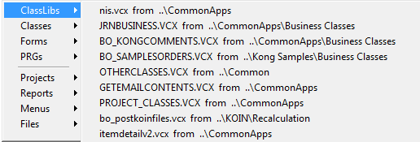

Thor TWEeT #3: 记忆 MRUs?
===
_本文档由 xinjie 于 2018-04-08 翻译_

还记得你以前住在命令窗口，你会用 MRU 列表打开窗体，文件，类等吗？ 

当你开始依赖于其他工具，如项目管理器和类浏览器时，你不能再使用 MRU 列表，因为这些其他工具没有更新 MRU 列表，也没有任何方式可以使用除命令之外的其他任何方式 窗口。

但是现在是时候恢复使用 MRU 了，因为 Thor 工具可以恢复它们，维护它们并提供访问它们的新方法。

首先，所有 Thor 工具，最值得注意的是 **[GoFish](https://github.com/mattslay/GoFish),[Finder](https://github.com/VFPX/Finder)** 和 **[PEM 编辑器](https://github.com/VFPX/PEMEditor)** ，以及所有其他打开文件的 Thor 工具，在打开文件时总是更新相应的MRU列表（无论是表单，类，表，报表 等）。 另外，他们还提供了两个其他功能：

*   他们为打开的所有*类库*保留一个新的 MRU 列表。
*   他们使用与磁盘上的文件名相同的大小写打开每个文件，这样文件名的大小写不会改变。

> _注意：如果您从项目管理器或类浏览器打开文件，看起来这并不会对您有所帮助，但您可以进行简单的修改，以达到与所有其他 Thor工具相同的效果。请参阅此消息的结尾。_

用于访问MRU列表的主要 Thor 工具简称**MRUs**，它显示所有不同 MRU 列表的弹出式菜单（包括顶部的 Thor 特有的 MRU 类库的列表）。

还有许多其他 Thor 工具可以访问这些相同的 MRU 列表：

*   **MRU class libraries** -- 仅提供MRU类库的列表（上面菜单中的第一项）
*   **HackCX4 from MRU forms or classes** -- 创建一个弹出菜单，显示表单和类库的 MRU，以便它们可以被 HackCX4 打开，（需要单独安装 HackCX4 [WhiteLightComputing](http://www.whitelightcomputing.com/prodhackcxpro.htm))
*   [Finder](https://github.com/VFPX/Finder) -- 通过右键单击屏幕顶部的“文件搜索”或“类搜索”按钮可以获得列表。
*   [PEM Editor](https://github.com/VFPX/PEMEditor) -- 列表可从屏幕顶部的“打开文件”按钮获得。

还有两个 Thor 工具的名称稍有误，因为它们实际上是根据时间戳而不是 MRU 列表来引用最新近更改的类和文件。 请注意，**Finder**也可用于查找最近更改的类和文件

*   **MRU classes in this project** - 请注意，这将在 VCX 内部使用内部时间戳，以用于上次更新类时的时间，而不是 VCX 文件本身的时间戳。
*   **MRU files in this project**

***从项目管理器或类浏览器更新 MRU 列表***

Thor 提供了可以安装的文件，以便从项目管理器或类浏览器中打开的文件将适当地更新您的 MRU 列表。 这些文件位于Thor\Tools\Samples文件夹中。

> _注意：MRU列表仅在您运行Thor时更新。 如果你还没有，项目管理器和类浏览器仍然可以正常工作。_

*   要更改项目管理器，请使用 BaseProjectHooks.VCX 的 BaseProjectHook 类中的代码
    *   如果您没有使用 ProjectHooks，请修改该项目以使用此类（我建议将类库复制到其他文件夹）
    *   如果您已经使用 ProjectHooks，只需将该类中唯一方法的代码复制到您的项目钩子文件中即可。
*   要更改类浏览器，将文件 Browser.APP 复制到 FoxPro 的主文件夹 - Home(1)

参看 [所有Thor TWEeTs的历史](../TWEeTs.md) 和 [Thor 社区](https://groups.google.com/forum/?fromgroups#!forum/FoxProThor).

