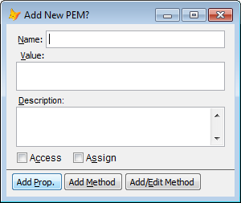

Thor TWEeT #6: 创建属性和方法（第1部分）
===
_本文档由 xinjie 于 2018-04-08 翻译_

Thor 提供了相当多的工具来创建新的属性和方法。 

有一些常用工具使用熟悉的技术来创建新的属性和方法： 

*   **[PEM 编辑器](https://github.com/VFPX/PEMEditor)** (关于这个工具不需要更多的说明了)
*   **添加属性/方法**，**[PEM 编辑器](https://github.com/VFPX/PEMEditor)** 的小小后代，它使用这种简单的形式：

这两种工具都提供了标准“新建属性”和“新建方法”中不具备的功能：

*   该表单无模式，您可以轻松切换添加属性和方法。
*   如果名称包含任何大写字符，MemberData 将自动更新。
*   如果你正在创建一个新的属性：
    *   有一个选项可以根据属性名称的第一个字符（'c'= Character，'n'= Numeric等）设置属性的初始值。 Default = ON
    *   您可以创建一个[Plug-In](../Thor_add_plugins.md) 来使用其他方法来分配初始值（例如使用第二个字符）
*   如果你正在创建一个新的方法：
    *   您可以立即打开它进行编辑。
    *   您可以创建一个[Plug-In](../Thor_add_plugins.md)，它将填充新创建的方法的开始部分。
    
当您使用这些工具时，您将遵循早已建立的两步模式，其中创建新属性/方法的过程不同于使用对它的引用。

在下周关于此主题的 TWEeT 中，我将演示建立新模式的工具：您可以在引用它时创建属性或方法。 使用这些工具可以减少对编程流程的干扰，因为您可以“即时”创建新的属性和方法。

参看 [所有Thor TWEeTs的历史](../TWEeTs.md) 和 [Thor 社区](https://groups.google.com/forum/?fromgroups#!forum/FoxProThor).
