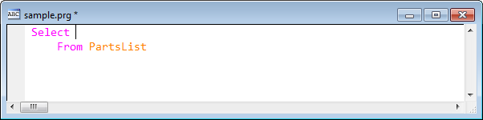
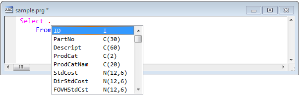
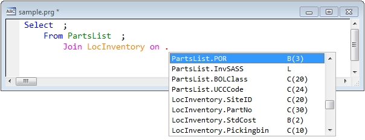
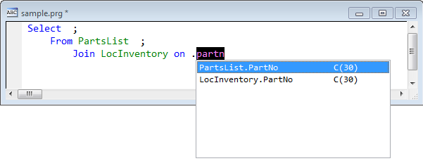
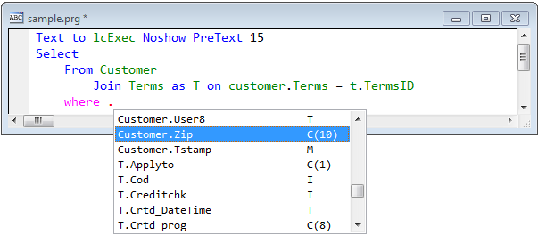

Thor TWEeT #13: 新的（隐藏的） IntellisenseX 功能
===
_本文档由 xinjie 于 2018-04-08 翻译_

在之前的 TWEeT （[IntellisenseX：SQL Server表中的字段名](Tweet_10.md)）中，我演示了如何以某种方式创建 SELECT 语句，从而使 IntellisenseX 的某些功能处于活动状态 - 即 ，如果您在引用任何字段之前首先创建您的 FROM 和 JOIN 短语。 当你这样做的时候还有另一个功能可用（如果你不知道它的存在，你不可能发现它）。

考虑这个简单的例子：

一旦你已经指定了你正在选择的表，IntellisenseX 提供了一个简单的方法来从表中的字段进行选择 - 只需按“.”（或[快捷键](Tweet_12.md)）像往常一样调用IntellisenseX 即可。

当您指定了任何 JOIN 时，下拉列表将显示所有表中的所有字段，如下所示（列表已滚动，以便您可以看到每个表中的一些字段）。

_注意在第一行中必需的';' - IntellisenseX向后查看代码，以确定您正在处理的整个语句，并识别行延续。 如果在SELECT之后没有那个';'，IntellisenseX根本不会将其视为SELECT语句的一部分。_

如果您使用“Match anywhere”（匹配任何地方）选项（请参阅 Thor Configuration表单的 Options 页面上的“IntellisenseX”），当您开始输入字段名称时，列表将会过滤：

这个新的 IntellisenseX 功能

*   适用于 VFP 表（如图所示）和 SQL Server 表。(参看  [IntellisenseX: SQL Server 表中的字段名](Tweet_10.md))
*   适用于 SELECT 语句中任何位置的字段名称的引用，只要这些表已在 FROM 和 JOIN 短语中引用。
*   适用于表别名

参看 [所有Thor TWEeTs的历史](../TWEeTs.md) 和 [Thor 社区](https://groups.google.com/forum/?fromgroups#!forum/FoxProThor).
