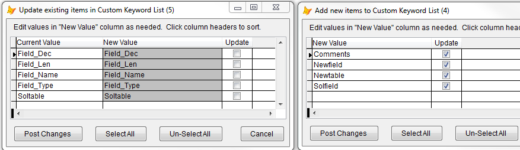
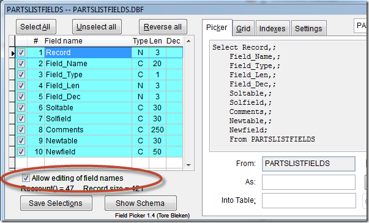

Thor TWEeT #16: 字段名的自定义关键字列表
===
_本文档由 xinjie 于 2018-04-08 翻译_

字段名称的自定义关键字列表的新功能已在早期的TWEeT（包括下文中的[IntellisenseX：VFP 表的别名](Tweet_11.md)）中的许多图中显示，这里不再进行描述。

您是否注意到某些字段名称中间使用大写字母（例如“Field_Type”）？ 自定义关键字列表允许您定义要用于字段名称的大小写。

#### 这是如何完成的？

Thor 维护了一个**全局**定义的字段名称表（以及其他名称，在另一个 TWEeT 中，[自定义关键字列表 - 所有其他名称](Tweet_19.md)）中都有解释。 该表具有单个字段，其中包含您希望表示的字段名称。 您可以通过使用 Thor 工具**浏览自定义关键字列表**来打开表格进行编辑，尽管这不是一个建立表格的非常方便的方法。

相反，您可以使用多种 Thor 工具：

*   **添加突出显示的词** – 将当前突出显示的单词添加到 KCL。 如果该单词已经在列表中，则突出显示的单词将替换它。
*   **从当前表中添加字段名称** – 为列表中新增的单词打开单独的表单，或者可能会替换列表中的现有单词。 您可以在“新值”列中编辑值（但不能更改拼写，只能更改字母的大小写）。

*   [**超级浏览器**](../Thor_superbrowse.md) – 如果您将在字段名称列表下方复选框标记，则该列表变为可编辑，允许您更改哪些字母为大写。 只需点击任何字段名称并进行编辑，以便按照您的喜好显示。 您更改的任何字段名称都会立即发布到“自定义关键字列表”中，并且将在任何时候为*任意*表引用此字段名称时使用，而不仅仅是当前名称。 （不，你*不能*以这种方式修改文件的结构 - 你可以改变的是哪些字符是大写。）

*   **添加文件夹或项目中的所有单词** – 它将所有代码中的所有名称（不仅是字段名称）添加到 KCL 中。 一旦处理完成（可能需要几分钟），它将显示与上面显示的相同的两种表单，即**从当前表添加字段名称**（仅仅添加了更多的记录）。 这在[自定义关键字列表 - 所有其他名称](Tweet_19.md)中有更详细的描述。

#### 自定义关键字列表中的这些字段名称在哪里使用？

自定义关键字列表中的这些字段名称用于 IntellisenseX 中引用该表（VFP 表和 SQL Server 表）以及上述超级浏览器中显示的每个位置。

参看 [所有Thor TWEeTs的历史](../TWEeTs.md) 和 [Thor 社区](https://groups.google.com/forum/?fromgroups#!forum/FoxProThor).

**译者注：KCL - 自定义关键字列表**
