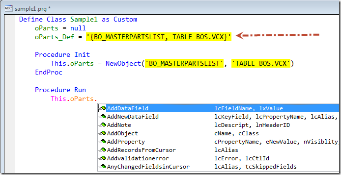

Thor TWEeT #18: 嵌套对象的 <a href="https://github.com/VFPX/IntelliSenseX" target="_blank">IntellisenseX</a> 
===
本文档由 xinjie 于 2018-04-09 翻译

[IntellisenseX](https://github.com/VFPX/IntelliSenseX) 为嵌套对象提供下拉列表。 这些下拉列表可在整个表单或类中使用，如下例所示：

使这成为可能的关键是定义一个属性，IntellisenseX 可以使用该属性来确定下拉列表。

该属性的名称是嵌套属性的名称（上例中为“oParts”），并将“_Def”添加为后缀。

该属性的值基本上与用于局部别名（仅适用于当前过程;请参阅[在IntellisenseX中使用局部别名](Tweet_17.md)）或全局别名（适用于任何地方;请参见[别名字典](Tweet_15.md)）的一样。 它可以表或对象中的任何一种。

*   表名、游标名或视图名
*   表的完整或相对路径名称
*   SQL 表名
*   对类库的引用; 像这样，“`{class，class library}`” _请参阅下面有关表单和 VCX 类的注释._
*   对类使用与 LOCAL 命令相同的语法的引用; 像这样,  “`Local loPAL as PAL of BO_PAL.VCX`“
*   对对象的引用; 像这样,  “`Thisform.oParts` “
*   一个可执行表达式，它返回一个对象或表，光标或视图的名称。 这个可执行文件必须以“=”开头;像这样, “`= MyGetObject(‘Parts’)` “.  _有关Forms和VCX类，请参阅下面的注释。_

> _当使用属性页或PEM 编辑器设置上述两项的值时，会出现意外问题 – 大括号内的值将转换为日期，并且以=符号开头的值将保存为表达式。 为避免这些问题，请使用&&前缀值 - 因此：_
> 
> *   “`&& {class, classlibrary}`“
> *   “`&& = MyGetObject(‘Parts’)` “

该表显示了可用于“_Def”属性值的许多不同值：

值|描述
---|---
“PartsList”|路径中，表单的数据环境，打开的DBC中，表的MRU列表中的表名或 SQL Server 数据库中的表名。 它也可以通过插件“Open Table”打开。
“..\Tables\PartsList”|表的绝对路径或相对路径。
“{NISDetailsForm, NIS.VCX}”|VCX 或 PRG 中的类
“Local loPAL as PAL of BO_PAL.PRG”|另一种引用类的方法。 选择了此语法，以便您可以直接从一行代码复制 LOCAL 命令。
“ = GetBusinessObject(‘TableName’)”|调用返回对象的 UDF; 例如，如果您使用代理来返回对象而不是直接引用，则使用此方法。

嵌套对象可以采用多种形式，包括：

*   `ThisForm.oBusObj`
*   `This.oData`
*   `This.oPartsList.oData`
*   `This.oBusObj.oPartsList.oData`

嵌套对象可能出现在表单，基于 VCX 的类和基于 PRG 的类中，并且可能有多层嵌套。

此 TWEeT 到此已解决了适用于整个表单或类（VCX 和 PRG）的别名。 此前的 TWEeT 解决了[局部别名](Tweet_17.md)和[别名词典](Tweet_15.md)涉及的全局别名。

即将发布的 TWEeT 将描述用于处理这些特性的插件。

参看 [所有Thor TWEeTs的历史](../TWEeTs.md) 和 [Thor 社区](https://groups.google.com/forum/?fromgroups#!forum/FoxProThor).
