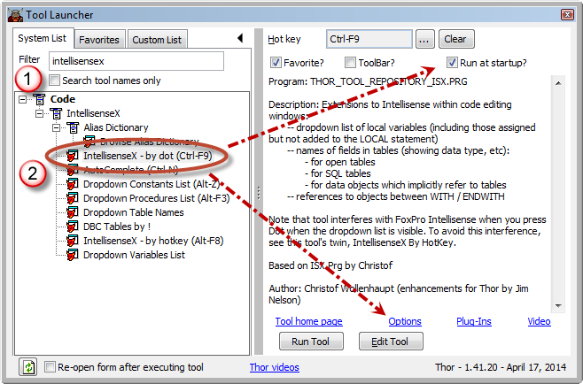
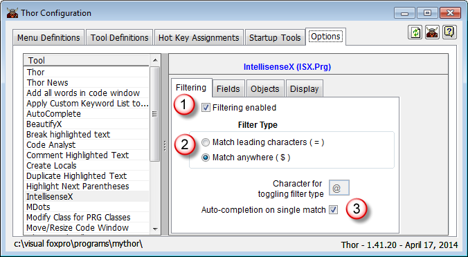
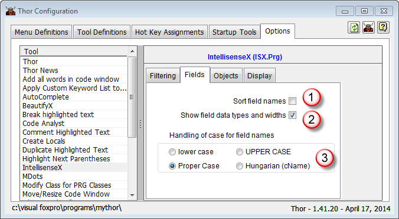
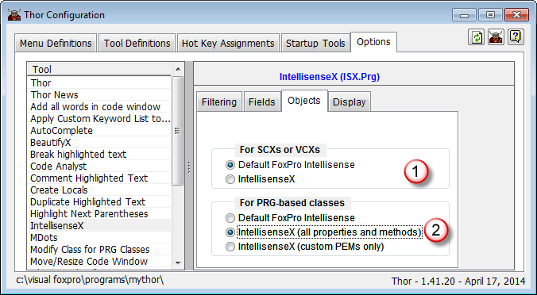
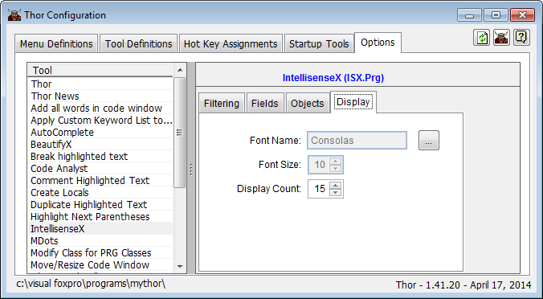

Thor TWEeT #20: [IntellisenseX](https://github.com/VFPX/IntelliSenseX) 快速入门指南
===
本文档由 xinjie 于 2018-04-09 翻译

当我开始编写关于[IntellisenseX](https://github.com/VFPX/IntelliSenseX)的TWEeT时，我绝不会猜到这个话题到现在还没完没了。但是编写这些TWEeT会产生讨论和新的想法，所以最近TWEeT中所描述的大部分内容都不是当初设想的内容。

在重新阅读这些TWEeTS时，我意识到有一个明显的环节缺失 - 他们解释了 IntellisenseX 如何工作以及如何定制它，但他们从未触及第一步 - 如何从头开始。 所以，Let's Go!

#### 开始使用 [IntellisenseX](https://github.com/VFPX/IntelliSenseX)

启动IntellisenseX只需几个步骤即可为本地FoxPro Intellisense提供大量扩展。 设置完成后，您会发现使用点（无论是在对象引用还是表引用之后）可以在很多不同的地方生成有用的下拉列表，这些地方立即感觉很自然。 还有一些您可以制作的更多的自定义功能，其中最小的功能允许IntellisenseX以许多令人惊讶的方式提供帮助。

首先，请打开`工具启动器`，在过滤器框中输入“IntellisenseX”，然后在左侧的 TreeView 中点击工具“IntellisenseX - by Dot”。

选择“启动时运行”。 这会导致 IntellisenseX 每次在 IDE 中启动 Thor 时都会被启用。 （“IntellisenseX - by Dot”工具实际上是一个切换键，可以启用/禁用IntellisenseX;但是，希望禁用它的场合已经不存在了，因此你可以打开并一直让它随时待命。）

然后，单击选项链接打开 Thor Configuration 表单中的 IntellisenseX 选项页面。

在 IntellisenseX 页框的第一页（“**过滤**”）上，选择下面显示的三个选项。 前两者结合起来形成 IntellisenseX 的重要增强功能之一 - 下拉列表在您键入时进行过滤，只显示匹配的条目，而匹配可以位于每行的任何位置，而不仅限于前导字符。

第二页（“**Fields**”）控制字段名称在下拉列表中的显示方式。 我建议设置如前所示的前两个选项，并根据自己的风格设置第三个（“字段名称的情况”）。 还有更多的定制可供使用，稍后将予以解决。

第三页（“**Objects**”）确定 IntellisenseX 何时显示可视类（THISFORM 或 THIS）或基于 PRG 的类中对象的下拉列表。 最初，您会希望为 SCX 和 VCX 使用默认的FoxPro智能感知。 如果没有一些额外的配置，IntellisenseX 对于 SCX 和 VCX 中的对象来说运行过于缓慢。 但是，一旦您创建了自定义关键字列表（请参阅[TWEeTs ＃19：IntellisenseX中的缺陷（以及如何避免它们）...自定义关键字列表](Tweet_19.md)），您就希望选择第二个选项（IntellisenseX）。

第四个和最后一个页面（“**Display**”）控制IntellinsenseX中使用的下拉列表的显示。 小心不要将显示计数设置得太大，因为如果下拉列表无法在当前屏幕位置的上方或下方放置，您可能会收到不良行为。 但是，随着您对IntellisenseX的熟悉，此设置无关紧要，因为过滤（在第一页上设置）会将您的列表快速减少到仅有的几个条目。

设置了这几个选项后，你就足够可以开始使用 IntellisenseX 了。 以前的 TWEeT 中描述的功能立马可用：

*   IntellisenseX 识别以多种不同方式创建的 VFP 表的别名。 请参见[＃11 IntellisenseX：VFP表的别名](Tweet_11.md).
*   独特的 IntellisenseX 功能，为SQL语句中的 FROM 和 JOIN 语句中引用的所有表中的所有字段提供了一个下拉列表。 请参见[#13 新的（隐藏的）IntellisenseX 功能](Tweet_13.md).
*   IntellisenseX以各种格式识别代码中引用的对象，并为它们提供下拉列表（包括熟悉的本地LOCAL ... AS ...命令）。 请参见[＃14 IntellisenseX for Objects](Tweet_14.md).

另外，在进一步配置之后，还可以使用其他一些重要的增强功能。

*   创建“自定义关键字列表”消除了引用VCX和SCX中的对象时出现的问题（前面在“**Objects**”页面的描述中提到），并创建了整个应用程序中使用的统一的单词列表（覆盖选择 字段名称在“**Fields**”页面中描述）。 请参阅TWEeTs [＃19：IntellisenseX中的缺陷（以及如何避免它们）...自定义关键字列表](Tweet_19.md) 和 [#16 字段名的自定义关键字列表](Tweet_16.md).
*   创建 SQL 语句（包括 TEXT / ENDTEXT 块中的那些语句）时，可以从 SQL Server 表中获取字段名称列表。 请参见[＃10 IntellisenseX：SQL Server表中的字段名称](Tweet_10.md).
*   您可以为在整个特定过程中应用的表或对象名称创建局部别名（这些别名与本地变量具有相同的范围）。 请参阅[＃17：在IntellisenseX 中使用局部别名](Tweet_17.md) .  (另请参阅下面的注释。)
*   您可以使用 _Alias Dictionary_ （一个自由表）为所有应用程序中的表或对象名称创建全局别名。请参见[＃15 别名字典](Tweet_15.md).  (另请参阅下面的注释。)
*   您可以创建在表单或类中应用的别名，为嵌套对象创建下拉列表，例如“This.oBusObj”和“This.oBusObj.oData”和“This.oBusObj.oJobs.oData”。 请参阅[＃18：嵌套对象的 IntellisenseX](Tweet_18.md).  (另请参阅下面的注释。)

_Note:_ IntellisenseX仅将表（不论是 VFP 表还是 SQL Server 表）视为一种特殊类型的对象，其中每个成员都有一个数据类型和（可能）宽度。 因此，在上述任何参考文献中阅读“对象”的所有情况下，请理解该对象可能是实际的 VFP 对象或表中引用的字段。 上面最后一个项目中对“oData”的引用实际上可以是对与业务对象相关的字段名称的引用。

参看 [所有Thor TWEeTs的历史](../TWEeTs.md) 和 [Thor 社区](https://groups.google.com/forum/?fromgroups#!forum/FoxProThor).
