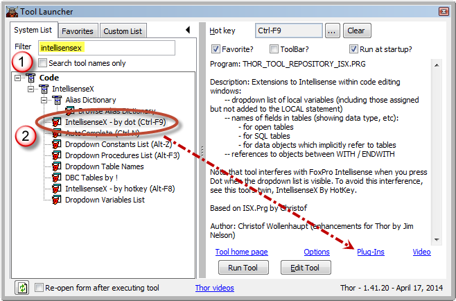
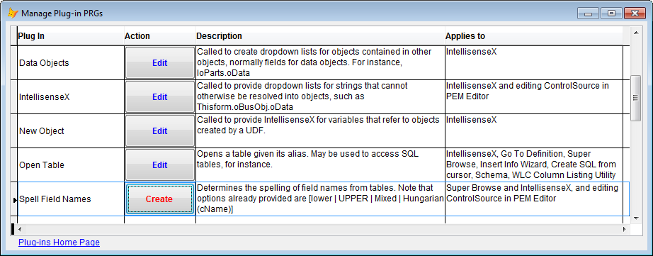

Thor TWEeT #21: 高级功能：用于 [IntellisenseX](https://github.com/VFPX/IntelliSenseX) 的插件
===
本文档由 xinjie 于 2018-04-09 翻译

有五个[Plug-Ins](../Thor_add_plugins.md) 提供[IntellisenseX](https://github.com/VFPX/IntelliSenseX)的定制. 尽管起初他们看起来很模糊，但他们每个都可以提供相当强大的增强功能，远远超出您的预期。 这里提供了一些个人示例来说明如何使用它们（尽管这些示例当然不是它们可以使用的唯一方式）。

要访问它们，请按照下列步骤操作：

1.  打开工具启动器
2.  在过滤器框中输入“IntellisenseX”
3.  点击左侧TreeView中的工具“IntellisenseX - by Dot”。
4.  点击插件链接打开插件表单。

插件表单（以这种方式访问时）仅显示适用于 IntellisenseX 的插件：

这些插件没有自然顺序（它们之间确实没有关系），因此按照它们按字母顺序排列的顺序进行探索。 但是，请注意，对于其中一些而言，它们的使用情况随时间而改变，因此名称不一定是他们所做工作的明确解释。

每个插件都包含解释（或者至少应该解释）传入的参数和结果形式的注释。 因此，这里的解释说明了它们使用的一般概念。

将这些插件视为事件处理程序会非常有帮助。 在熟悉 IntellisenseX 的使用之前，它们的相关性可能很难看出，正如很多事件处理程序对于 FoxPro 对象的相关性起初可能很难看出一样。 但最终，您可能会遇到 IntellisenseX 不提供下拉列表的情况，这时你会是束手无策。 那时，可以通过插件列表来查看哪些可能适用，打开它并挖掘示例代码。

您不必担心何时调用插件，就像您不关心何时触发事件处理程序一样。 插件将在适当时被调用。

#### “数据对象”插件

该插件允许您识别以某种形式的嵌套用法引用的对象（或表），例如：

*   This.oCustomers
*   ThisForm.oBusObj
*   ThisForm.oBusObj.oData
*   Thisform.oJob.oCustomers.oData
*   loJob.oData

当IntellisenseX已经能够将部分名称（例如，“Thisform”或“Thisform.oBusObj”）解析为真实对象而不是成员名称（例如，“oData”或“oParts”）时，调用该插件。 并用对象（在一个独特的结构中 - 请参阅注释）和成员名称作为参数调用。 如果适用，插件可以返回适当的对象或表引用。

一点扩展：

*   This.oCustomers – 如果一致的命名约定用于对象（例如这里的“oCustomers”），则插件可以将字符放在“o”之后，并查看是否有业务对象处理该名称，并返回该对象。
*   ThisForm.oBusObj – 与前一项类似，但插件可以查找标识正在引用的业务对象的表的属性（“cAlais”）。
*   ThisForm.oBusObj.oData – 与前一项类似，但不是返回被引用的业务对象，而是返回属性中引用的别名（“cAlias”），导致下拉列表显示该表中的字段。
*   Thisform.oJob.oCustomers.oData – 插件可能被多次调用以获得单个下拉列表; 在这种情况下，首先解析“Thisform.oJob”，然后解析“Thisform.oJob.oCustomers”，最后解析“Thisform.oJob.oCustomers.oData”。 然而，这对你来说是透明的。
*   loJob.oData – 可以提供loJob表中字段的下拉列表 - 如果loJob已经被解析为对象。 这可以通过下一个插件“IntellisenseX”来完成。

#### “IntellisenseX”插件

该插件允许您根据您输入的点之前的整个文本标识对象（或表）。 整个文本作为参数传递。 

该插件与“数据对象”插件密切相关，并且在“数据对象”插件无法返回可用结果的所有情况下都会调用该插件。 两者之间的差异是传入的参数。

但它也可以处理获取“loJob”作为参数（在这种情况下，不会调用“数据对象”插件）。 如果可以通过此插件将“loJob”解析为对象，则会有loJob的下拉列表。

当您设置属性值时，该插件也会被PEM编辑器调用，允许您在设置控制源时获取数据对象表的下拉列表。

#### “新的对象”插件

使用 UDF 创建对象时使用此插件，而不是 NEWOBJECT（） 或 CREATEOBJECT（） 。 在下面的示例中，我个人使用插件允许 IntellisenseX 识别我使用名为 NewSessionObject 的 UDF （恰好使用与 NEWOBJECT 相同的参数，但这不是必需的）。

#### “打开表”插件

当 IntellisenseX 在点之前遇到单个（非嵌套）名称时，它将检查名称是否与现有别名相对应，或者（可选） SQL Server 数据库中的表名称或路径中文件的名称 ，在数据环境或打开的DBC中，或（可选）在MRU列表中。 所有这些都由该插件的默认版本处理。

该插件将以潜在表名作为其参数进行调用。 在我的环境中，所有表名和它们所在的文件夹本身都存储在一个表中，其中别名用作表的键。 这些表只能由一个将别名作为参数的单个 UDF 打开。 我的这个插件的个人版本调用这个 UDF 来打开表格。

示例代码的注释中有其他用途的示例。

#### “拼写字段名称”插件

该插件基本上已被[自定义关键字列表](Tweet_19.md)取代，但可用于未使用“自定义关键字列表”的情况，或自定义关键字缺少，或者有其他字段名称的规则（例如项目或客户特定的规则）。

******其他 IntellisenseX 工具******

当您使用“IntellisenseX”进行过滤时，还会在工具启动器中显示其他一些与 IntellisenseX 相关的工具。 这些工具使用相同的框架开发，以便在按下点时显示下拉列表，但提供以不同方式激活的其他功能。 他们将在下一个TWEeT中进行介绍。

参看 [所有Thor TWEeTs的历史](../TWEeTs.md) 和 [Thor 社区](https://groups.google.com/forum/?fromgroups#!forum/FoxProThor).
