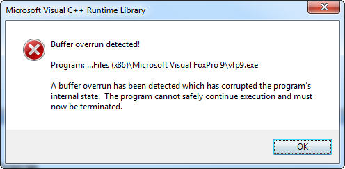
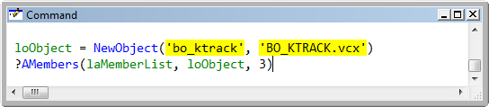
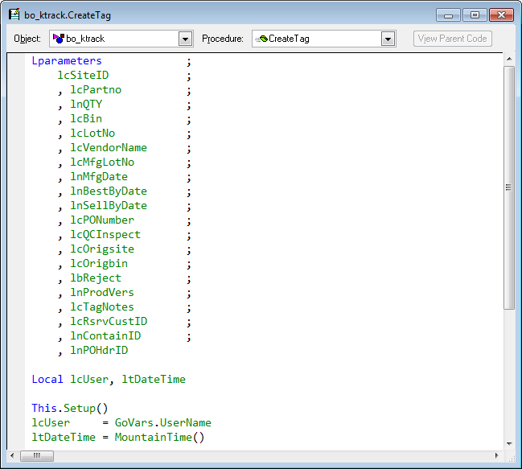

Thor TWEeT #23: 检测到缓冲区溢出！
===
本文档由 xinjie 于 2018-04-09 翻译

有一个令人讨厌的错误，“缓冲区溢出”，这是PEM编辑器和智能感知的一小部分用户的噩梦：

这个错误是已知的C5错误的一个近亲：它摧毁你的FoxPro会话，所有未保存的更改都将丢失。 但是，与C5不同， _vfp9err.log_ 文件中没有提示。

当这个错误在2009年第一次被报告时，原因不明，尽管据悉这种错误只发生在某些特定类别（总是发生在这些类别中）。 此外，确定该错误在PEM编辑器之外是可再现的，如下所示：

PEM编辑器中添加了解决方法，其中对 AMembers 的这种调用避免了在为此用途创建的表中找到名称的类。 虽然麻烦，但这个解决方案总比没有好。

最近，我第一次在自己的代码中遇到了这个问题，并能够找出问题的根本原因。 奇怪的是，这是因为这里显示的无害代码发生的：

经过一些测试（并且多次遭遇 FoxPro 的嘲笑）后，我得知这个问题与 LParameters 声明的长度有关。 限制是255个字符（不是一个惊喜），但字符数包括所有的空格，分号，回车和换行符。 当我修改该语句以适合所有行，删除所有额外的不必要的空间时，错误消失了。

过去一周，Tore Bleken 就基于 FoxInCloud 类的课程中的缓冲区溢出问题与我联系。 他报告说，改变父类中的 LParameters 语句可以解决问题。

参看 [History of all Thor TWEeTs](../TWEeTs.md) 和 [Thor 社区](https://groups.google.com/forum/?fromgroups#!forum/FoxProThor).
