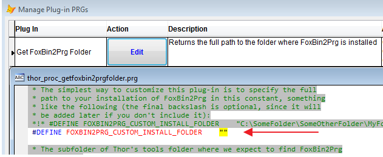
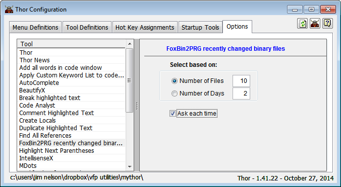
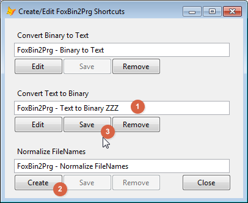
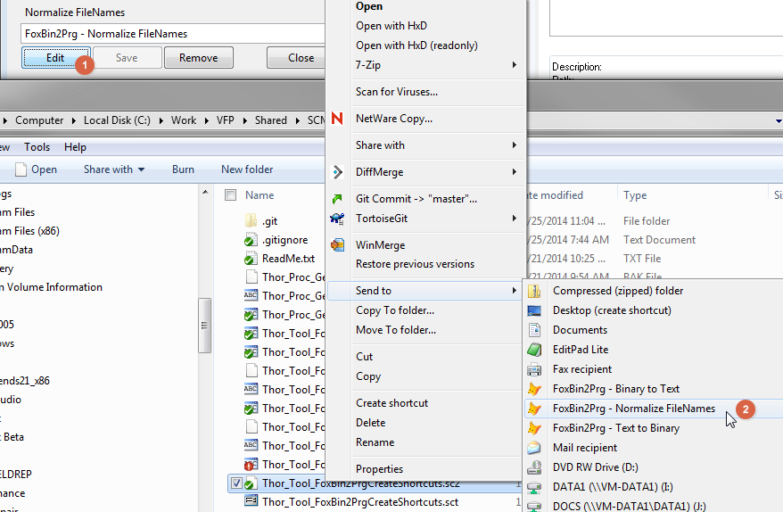
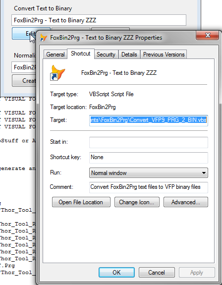

Thor TWEeT #25: FoxBin2PRG的五个新Thor工具
===
本文档由 xinjie 于 2018-04-09 翻译

**Thor 仓库**中新增五个与 FoxBin2PRG 一起工作的工具。

其中四种工具分别提供了不同的方法将项目中的二进制文件（“X”文件）转换为相应的文本文件或将文本文件转换为二进制文件：

*   _[Convert all binary files to text files](#T1)_
*   _[Convert files with changed internal timestamps](#T2)_
*   _[Convert most recently changed binary files](#T3)_
*   _[Generate binary files from all text files](#T4)_

这些工具中的每一个都与项目相关，因为它们使用活动项目（如果有的话），或者提示要使用的项目名称。

另一个工具在资源管理器中创建“SendTo”快捷方式，以便在资源管理器中工作时可以转换为文本文件。

*   _[Create/Edit FoxBin2Prg "SendTo" shortcuts](#T5)_

所有这些工具都假定您已经下载并安装了 FoxBin2PRG。 如果您使用 Thor 的 _检查更新_ 进行下载，它会自动运行，因为他们知道在哪里查找它。 否则，您可以修改 [Plug-In](../Thor_add_plugins.md) “Get FoxBin2PRG Folder” 以指向您安装 FoxBin2PRG 的文件夹。



感谢Mike Potjer编写了其中三种工具，这激发了另外两个基于文件和内部时间戳的工具创作。

### <a name="T1"></a>Convert all binary files to text files

工具 _Convert all binary files to text files_ 将VFP .PJX文件和项目中的所有二进制文件转换为FoxBin2Prg文本格式。 此转换通过FoxBin2Prg.EXE完成，因此所有FoxBin2Prg配置设置都将得到遵守。

对于大型项目，这可能需要一段时间，所以存在一个进度条来证明它是正在工作的。

您也可以以编程方式运行此工具。

```foxpro
ExecScript(_Screen.cThorDispatcher, ‘Thor_Tool_Repository_FoxBin2PrgConvertProjectToText’)
```

### <a name="T2"></a>Convert files with changed internal timestamps

工具 _Convert files with changed internal timestamps_ 转换二进制文件行内部时间戳发生更改的所有二进制文件。 当您使用任何设计器（表单，类，报表等）或使用GoFish进行替换时，这些时间戳会发生变化，所以效果是转换只针对自上次运行此工具以来更改过的少量文件。

通过在每个文本文件上设置时间戳以匹配相应二进制文件中任何行上的最新时间戳，可以达到此效果。

对于大多数文件未被更改的项目，此工具可以比将所有二进制文件转换为文本文件快得多。 （例如，对于我最大的项目，运行 _Convert all binary files to text files_ 大约需要40秒，而当我仅更改少量文件时，只需2或3秒即可运行此工具。）

但是，请注意，如果您通过 HackCX 或手动更改文件，则可能不会自动创建文本文件，因为二进制文件行中的内部时间戳不会发生更改。 有很多方法可以解决这个问题

*   使用工具 _Convert most recently changed binary files_ (参看后面介绍).
*   在其设计器中打开二进制文件，稍作修改并保存。
*   手动清除文本文件。

您也可以以编程方式运行此工具。

```foxpro
ExecScript(_Screen.cThorDispatcher, ‘Thor_Tool_Repository_OptimizedFoxBin2PrgConvertProjectToText’)
```

### <a name="T3"></a>Convert most recently changed binary files

工具 _Convert most recently changed binary files_ 转换最近更改的外部时间戳（例如您在资源管理器中看到的）。 您可以指定“最近更改”的定义，以基于更改的文件数量或更改后的天数为基础：



此工具最初是作为解决前述问题的解决方案而创建的，可能存在已被手动更改二进制文件而没有重新创建文本文件。但这也不是它的唯一用途。

您也可以以编程方式运行此工具。

```foxpro
ExecScript(_Screen.cThorDispatcher, ‘Thor_Tool_Repository_ConvertMostRecentToText’)
```

### <a name="T4"></a>Generate binary files from all text files

工具 _Generate binary files from all text files_ 在反方向工作，从文本文件创建二进制文件。

这个工具目前假设您使用PJ2扩展名作为您的项目文本文件，但这很容易通过工具代码中的常量进行更改。 也许将来可以通过增强工具来获得选项设置的扩展或读取  FoxBin2Prg 配置设置。 这是因为所有其他扩展都根据 FoxBin2Prg 配置设置进行处理。

由于 VFP 将 VCX 文件保存在内存中的方式对此工具有限制，因此它会尝试执行“CLEAR ALL”，这只有在从菜单或通过快捷键调用时才可能发生。 该工具仍然可以从工具启动器或 Thor 工具栏运行，但会收到警告，并且在某些情况下，FoxBin2Prg 可能会给您一条错误消息，并且不会重新生成 .VCX 文件。

您也可以以编程方式运行此工具。

```foxpro
ExecScript(_Screen.cThorDispatcher, ‘Thor_Tool_Repository_FoxBin2PrgConvertTextToProject’)
```

### <a name="T5"></a>Create/Edit FoxBin2Prg "SendTo" shortcuts

工具 _Create/Edit FoxBin2Prg "SendTo" shortcuts_ 会显示一个对话框，便于设置或删除 Windows FoxBin2Prg 附带的 VB 脚本的“发送至”快捷方式。 如果您已经在标准用户“发送至”文件夹中手动创建了快捷方式，该工具可以找到它们并允许您编辑它们。



1.  快捷方式的默认名称显示在文本框中，允许您直接在此表单中编辑名称。 当您完成编辑名称时，使用 TAB 移出文本框，然后再进行其他编辑
2.  单击“创建”按钮以添加快捷方式（如果尚不存在）或
3.  单击保存按钮以更新已存在的快捷方式名称。



点击创建按钮后，

1.  标题将更改为“编辑”，允许您编辑快捷方式的任何其他设置
2.  此快捷方式现在将出现在 Windows 资源管理器的“发送到”关联菜单下。

编辑按钮打开 Windows 文件属性对话框，您可以在其中编辑快捷方式的任何设置。



删除按钮只是删除快捷方式，将其移动到回收站。 Thor_Tool_FoxBin2PrgCreateShortcuts.PRG 中有一个非可视类，它执行此工具的所有实际工作，因此如果要使用不同界面创建自己的工具版本，或者根本没有界面，它应该非常容易做到。 .PRG 中有一些代码已注释，它演示了如何以编程方式创建所有快捷方式。

参看 [所有Thor TWEeTs的历史](../TWEeTs.md) 和 [Thor 社区](https://groups.google.com/forum/?fromgroups#%21forum/FoxProThor).
