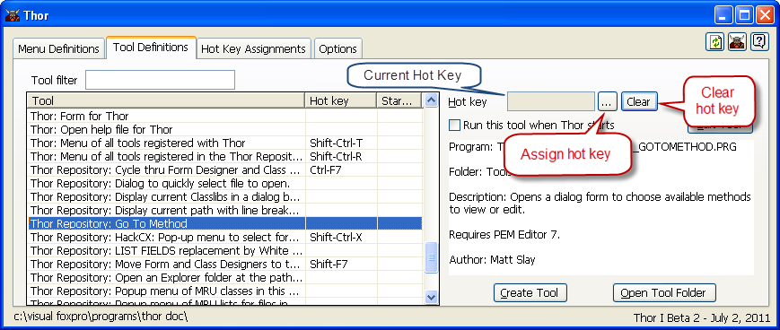

为工具指定快捷键
===
_本文档由 xinjie 于 2018-04-08 翻译_

您可以将快捷键分配给 Thor 表单的第二页上的工具（**工具定义**）。

当你点击一个工具时，当前分配给它的快捷键出现在表单右上角的控件中。（如果已经分配了一个，可以使用“清除”按钮将其删除。）

然后你可以点击'...'按钮依据提示输入新的快捷键。这将打开一个小的表单，要求您按下组合键作为快捷键。 您可以使用Shift，Ctrl和Alt的任意组合。

请注意，并非所有组合键都可以被捕获，并且其中一些组合不会被接受，因为它们被 Windows 或 FoxPro 自己预先占用（例如，Alt-F10）。

您也不能将同一个快捷键分配给多个工具。

要查看所有指定的快捷键（包括键盘宏和 On Key Label 定义），请参阅表单的第三页([指定的快捷键](Thor_hot_key_list.md))。您也可以更改该页面上的快捷键定义。

### 参看：
* [浏览工具列表](Thor_browsing_tools.md)
* [编辑现有工具](Thor_editing_existing_tools.md)
* [创建新工具](Thor_creating_new_tools.md)
* [制作工具的工具](Thor_tools_making_tools.md)
