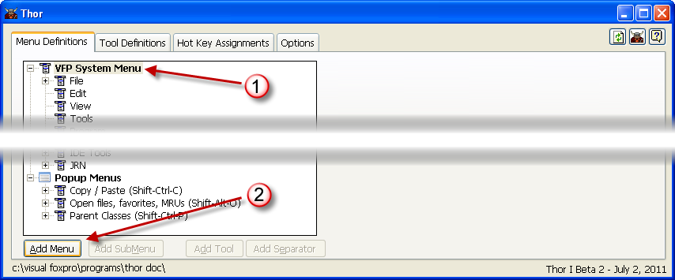
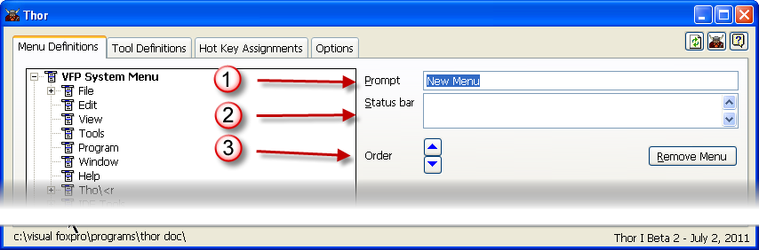

创建新的菜单
===
_本文档由 xinjie 于 2018-04-08 翻译_

要在VFP系统菜单栏中创建新的菜单项，请执行以下操作：
* 点击TreeView顶部的**VFP系统菜单**节点
* 点击添加菜单命令按钮

你现在可以：

* 为新菜单指定提示信息
* 指定将出现在状态栏中的文本
* 将新菜单移至您想要显示的位置。参看 [移动菜单](Thor_moving_menu_pads.md).

您也可以使用现有的菜单（弹出菜单或子菜单）并将其添加到VFP系统菜单栏。参看 [复制菜单](Thor_duplicating_menus.md).
